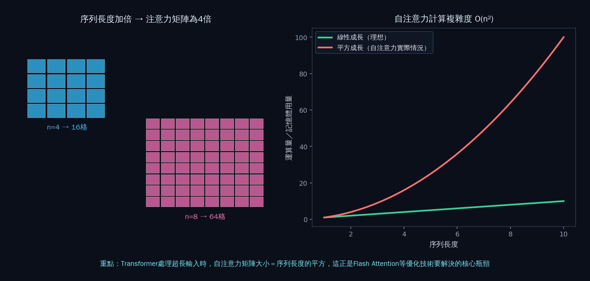

<h1 align="center">📙 第三章 iPAS考古題精析｜深度學習</h1>

對應教材：CH3（3-1 ~ 3-4）　｜　題庫來源：114年第四次、115年第一～三次，共4屆　｜　34題完整解析

---

## 📖 本章使用說明

- 與前兩章相同的格式：每題列出完整題幹與四個選項，✅標示正解，逐選項解析對錯原因。
- 本章題量相對較小，但內容承先啟後——從神經網路基礎，延伸到CNN電腦視覺、RNN序列處理，再到Transformer與注意力機制，直接銜接第15、16週的LLM主題。
- 🔗 標示可延伸閱讀連結；📌 標示口訣型重點提醒。

---

## 3-1／3-2　深度學習簡介、類神經網路（9題）

本節題目較分散，涵蓋RNN基礎挑戰、災難性遺忘、感知器網路、Softmax函數、以及幾題延伸到No-Code/AutoML與鑑別式/生成式AI判斷的綜合題。

### 〔114年第四次・第一科・Q16〕
> 某團隊想採用循環神經網路（RNN）建構長期氣候數據的預測模型，以下哪一項敘述最符合使用RNN可能會遇到的挑戰？

- (A) RNN無法處理可變長度的序列輸入，因此在實務上限制極大
- (B) ✅ RNN在長序列訓練中可能出現梯度消失，影響模型效果
- (C) RNN無法捕捉時間上的依賴關係，因此預測準確度低
- (D) RNN只能用於分類任務，不能應用於時間序列預測

**逐選項解析**
（呼應課程第11週學過的RNN長期依賴問題）
- **(B) 正確**：長序列訓練中的梯度消失，是RNN最經典、最核心的挑戰——長期氣候資料屬於長序列時間資料，早期資訊在反覆乘上權重後會快速衰減，難以影響後期預測。
- **(A) 錯誤**：RNN的設計初衷正是為了處理**可變長度**的序列輸入，這是RNN相對於固定輸入尺寸模型的優勢，不是限制。
- **(C) 錯誤**：RNN的核心價值正是**能夠**捕捉時間上的依賴關係（透過隱藏狀態傳遞），只是在「長」序列時捕捉能力會減弱，不是「無法捕捉」。
- **(D) 錯誤**：RNN廣泛應用於時間序列預測（正是題目情境本身），不是「只能用於分類任務」，這個敘述明顯錯誤。

### 〔114年第四次・第一科・Q26〕
> 在深度學習模型的微調過程中，可能出現所謂的「災難性遺忘（Catastrophic Forgetting）」。此現象最可能造成哪種情況？

- (A) 由於計算資源或訓練步驟不足，模型在微調過程中無法完整收斂
- (B) 微調後模型的表現變得隨機，無法有效記憶新學到的模式與知識
- (C) 微調後模型的部分權重產生偏移，導致模型無法針對較長的文字進行回應
- (D) ✅ 模型過度適應微調的資料分佈，逐漸遺忘先前預訓練所獲得的廣泛知識，在原有任務或廣泛領域上表現變差

**逐選項解析**
- **(D) 正確**：災難性遺忘的核心定義——模型在針對**新任務**（微調資料）進行學習時，過度適應新資料分佈，導致原本在**預訓練階段**學到的廣泛知識被覆蓋、遺忘，在原有任務上表現反而變差，這正是「先學會的東西被新學的東西覆蓋掉」的現象。
- **(A) 錯誤**：計算資源或訓練步驟不足導致「無法收斂」，是**訓練不足**的問題，與災難性遺忘「學會新東西卻忘記舊東西」的性質不同。
- **(B) 錯誤**：災難性遺忘不是「無法記憶新知識」，恰好相反——模型是**過度**記住了新知識（微調資料），才因此排擠掉舊知識，這個選項把現象講反了。
- **(C) 錯誤**：「無法針對較長文字回應」是特定的技術限制描述，與災難性遺忘「遺忘廣泛預訓練知識」的核心定義不符，答非所問。

### 〔115年第一次・第一科・Q2〕
> 某智慧城市專案導入AI技術，以優化垃圾收集路線調度並即時監測空氣品質變化。系統需持續蒐集環境數據與設備狀態。下列何種技術最直接支援上述需求？

- (A) 專家系統（Expert System）
- (B) 決策支援系統（Decision Support System）
- (C) 啟發式決策引擎（Heuristic Decision Engine）
- (D) ✅ 感知器網路（Sensor Network）

**逐選項解析**
- **(D) 正確**：題目強調「**持續蒐集**環境數據與設備狀態」——這是資料**蒐集**層面的需求（透過各種感測器持續收集PM2.5、垃圾桶滿溢度等數據），感測器網路正是支援這種持續性資料蒐集的基礎設施技術。
- **(A) 錯誤**：專家系統是**推理與決策**技術（第1週學過的if-then規則推理），不是資料蒐集技術，層次不同。
- **(B) 錯誤**：決策支援系統是協助**決策制定**的系統，同樣是資料蒐集之後的**應用**層次，不是題目強調的「持續蒐集數據」這個基礎需求。
- **(C) 錯誤**：啟發式決策引擎是用於**優化決策路徑**的技術（如路線規劃演算法），與「持續蒐集環境數據」的感測需求不同層次。

### 〔115年第一次・第一科・Q9〕
> 某影音串流平台建立神經網路模型，用於預測使用者最可能感興趣的影片類型。模型輸出層需將結果轉換為各類別的機率分佈，以便系統依機率高低推薦內容。下列哪一種函數最適合用於模型輸出層？

- (A) ✅ Softmax函數
- (B) Sigmoid函數
- (C) 線性函數
- (D) ReLU函數

**逐選項解析**
（呼應課程第9週學過的激活函數）
- **(A) 正確**：Softmax函數的核心功能，就是把多個數值轉換成**總和為1的機率分佈**（每個類別各自的機率），完全對應題目「將結果轉換為各類別的機率分佈」的需求，是**多類別分類**輸出層的標準選擇。
- **(B) 錯誤**：Sigmoid函數輸出範圍是0~1，常用於**二元分類**（單一機率值），但題目是「各類別」的多類別機率分佈，Sigmoid無法讓多個類別的輸出總和為1（每個類別的Sigmoid輸出是獨立計算的），不適合這種多類別機率分佈需求。
- **(C) 錯誤**：線性函數的輸出沒有範圍限制，不會自動形成0~1之間、總和為1的機率分佈，不適合作為機率輸出層。
- **(D) 錯誤**：ReLU函數輸出範圍是0到正無窮，同樣不會形成正規化的機率分佈，通常用於**隱藏層**而非需要輸出機率分佈的**輸出層**。

### 〔115年第一次・第二科・Q33〕
> 某醫療院所希望改善行政效率，規劃讓各科室人員可自行建立行政回報與內部申請表單，並導入AI功能以自動判讀與分類填寫內容，同時需兼顧流程調整彈性與降低系統開發維運負擔。下列哪一種技術組合最適合？

- (A) ✅ Low-Code平台 × 預訓練語言模型API
- (B) No-Code平台 × 規則式自動化（Rule-based Automation）
- (C) 傳統程式開發 × 自建深度學習模型
- (D) 試算表工具 × 手動資料標記分析

**逐選項解析**
- **(A) 正確**：題目要求「各科室人員**自行**建立表單」（低技術門檻）＋「AI自動判讀分類」（需要語言理解能力）＋「兼顧彈性與降低維運負擔」——Low-Code平台能滿足彈性建置表單流程的需求，搭配**預訓練**語言模型API（不需要自建訓練模型）則能快速取得AI判讀分類能力，同時降低開發維運負擔，是最平衡的技術組合。
- **(B) 錯誤**：規則式自動化仰賴人工設定規則，對於「判讀與分類填寫內容」這種涉及語意理解的任務，彈性與準確度通常不如語言模型，且規則維護成本會隨情境增加而提高，不符合「降低維運負擔」的要求。
- **(C) 錯誤**：傳統程式開發＋自建深度學習模型，需要高度的技術投入與維運成本，與題目「降低系統開發維運負擔」的要求直接衝突。
- **(D) 錯誤**：試算表工具搭配手動資料標記分析，完全不符合「AI自動判讀分類」的自動化需求，效率與彈性都嚴重不足。

### 〔115年第三次・第一科・Q21〕
> 某交通局計劃預測未來1小時的路口車流量，以最佳化號誌時制配置。系統需要分析過去24小時的車流量資料。若模型設計著重於模擬「前一階段的壅塞狀況會延續並影響下一階段」，下列哪一種深度學習架構最適合作為此預測模型的核心？

- (A) 卷積神經網路（CNN）
- (B) 生成對抗網路（GAN）
- (C) 前饋神經網路（Feedforward）
- (D) ✅ 循環神經網路（RNN）

**逐選項解析**
- **(D) 正確**：「前一階段的狀況會延續並影響下一階段」正是時間序列資料的**時序依賴**特性，RNN透過隱藏狀態把前一時間步的資訊傳遞到下一時間步，完全對應這種「前後階段相互影響」的建模需求。
- **(A) 錯誤**：CNN擅長處理具有**空間局部性**的資料（如影像），不是專門為時間先後依賴關係設計的架構。
- **(B) 錯誤**：GAN是用於生成擬真資料的架構，與時間序列的前後依賴建模無關。
- **(C) 錯誤**：前饋神經網路的資訊只單向流動（輸入→輸出），沒有「記憶前一階段狀態」的機制，無法捕捉題目描述的時序延續效應。

### 〔115年第三次・第一科・Q49〕
> 某金融機構計劃開發一套智慧理賠防詐欺與自動化審查系統。運作流程為：先由模型A分析診斷書與收據影像，評估並輸出「正常理賠」或「疑似詐欺」的機率值；確認為正常案件後，再由模型B根據診斷書內容進行語意推理，自動撰寫客製化的理賠通知信函與案件摘要報告。下列關於兩個模型的敘述，何者最正確？

- (A) ✅ 模型A負責判斷案件風險，屬於鑑別式AI；模型B負責產生通知信與摘要內容，屬於生成式AI
- (B) 模型A會產生風險分數，因此屬於生成式AI；模型B負責解讀與鑑定內容，因此屬於鑑別式AI
- (C) 兩個模型皆採用深度學習技術，因此皆屬於生成式AI
- (D) 兩個模型皆以分析資料內容為主，因此皆屬於鑑別式AI

**逐選項解析**
（再次驗證「判斷/分類→鑑別式；生成/撰寫→生成式」的判斷口訣）
- **(A) 正確**：模型A是「**評估並輸出機率值**（正常/疑似詐欺）」——這是**判斷/分類**任務，屬於鑑別式AI；模型B是「**自動撰寫**通知信函與摘要報告」——這是**產生新內容**的任務，屬於生成式AI，兩者判斷完全正確。
- **(B) 錯誤**：把模型A、B的鑑別式/生成式屬性完全講反了——「產生風險分數（機率值）」是判斷任務不是生成任務；「撰寫信函」才是真正的生成任務。
- **(C) 錯誤**：「都用深度學習技術」不代表「都是生成式AI」——深度學習是廣泛的技術基礎，鑑別式AI與生成式AI都可能建立在深度學習之上，不能用技術基礎來判斷是鑑別式還是生成式，要看任務本質（判斷vs.生成）。
- **(D) 錯誤**：模型B的任務是「自動撰寫」，明顯是生成新內容而非單純分析既有資料，這個選項忽略了模型B的生成性質。

### 〔115年第二次・第一科・Q21〕
> 關於深度學習，下列敘述何者最為正確？

- (A) 深度學習模型通常需要人工設計特徵，以提升模型表現
- (B) 深度學習主要應用於資料壓縮與特徵轉換，較少用於預測任務
- (C) ✅ 深度學習透過多層神經網路，能自動從大量資料中學習抽象特徵
- (D) 深度學習模型通常不需要大量資料即可達到良好效果，適合資料量有限的情境

**逐選項解析**
（呼應課程第9週學過的「特徵學習」核心概念）
- **(C) 正確**：深度學習與傳統機器學習最核心的差異，正是深度學習能透過多層神經網路**自動學習**抽象特徵，不需要人工事先設計特徵，這是深度學習的定義性特性。
- **(A) 錯誤**：這句話講反了——深度學習的優勢正是**不需要**人工設計特徵（自動特徵學習），需要人工設計特徵的是傳統機器學習方法。
- **(B) 錯誤**：深度學習廣泛應用於**預測任務**（分類、迴歸、生成等），不是「較少用於預測任務」，這個敘述明顯與深度學習的實際應用範圍不符。
- **(D) 錯誤**：深度學習模型通常**需要大量資料**才能發揮效果（這也是深度學習的已知限制之一，第1週學過），「不需要大量資料」與深度學習的實際特性相反。

### 〔115年第二次・第二科・Q11〕
> 某中小企業行銷部門主管希望在不需高度依賴IT支援的情況下，快速建立一套能自動分析顧客問卷回饋並進行情緒分類的系統。他評估了AutoML平台與自行開發機器學習模型兩種方案。下列何者最能說明AutoML在此情境下的核心優勢？

- (A) AutoML仍需使用者熟悉Python與深度學習框架，否則無法進行模型訓練
- (B) ✅ AutoML可自動完成模型選擇、特徵處理與訓練流程，使非技術背景人員也能快速建立並上線模型
- (C) AutoML僅適用於文字情緒分析，若應用於其他預測任務需重新開發系統
- (D) AutoML產出的模型無法直接應用於實務場景，仍需完全重寫程式才能使用

**逐選項解析**
（呼應第二章2-2-G學過的AutoML概念）
- **(B) 正確**：AutoML的核心優勢正是**自動化**整個機器學習流程（模型選擇、特徵處理、訓練），讓不具備深厚技術背景的使用者也能快速建立並上線模型，完全對應題目「不需高度依賴IT支援」的訴求。
- **(A) 錯誤**：AutoML的設計目的正是**降低**對Python/深度學習框架專業能力的要求，「仍需熟悉」與AutoML的核心價值主張矛盾。
- **(C) 錯誤**：AutoML是**通用型**工具，可應用於多種預測任務類型（分類、迴歸、情緒分析等），不是僅限於文字情緒分析的專用工具。
- **(D) 錯誤**：AutoML產出的模型通常可以直接部署應用（許多平台甚至提供一鍵部署功能），「需要完全重寫程式才能使用」誇大了使用AutoML的後續工作量。

## 3-3　卷積神經網路（CNN）（15題）

本節題目雖以CNN為主題分類，但實際涵蓋範圍延伸到電腦視覺技術、RNN/Transformer延伸應用、生成模型優化技巧、No-Code工作流程、RAG防幻覺等多元主題，拆成6個子題群方便對照。

### 3-3-A　CNN與電腦視覺技術（3題）

呼應課程第1週學過的電腦視覺演進（YOLO→ViT→CLIP→SAM），這裡進一步考「影像分類／物件偵測／影像分割」三種技術的辨析。

### 〔115年第一次・第一科・Q32〕
> 某環保局想建立AI系統監測空氣品質，透過分析監測站攝影機拍攝的影像來識別煙霧。系統需要在影像中找出煙霧區域並標示其位置和範圍。這個應用主要屬於電腦視覺的哪個技術領域？

- (A) 影像分類，判斷影像中是否有煙霧
- (B) 物件偵測，找出煙霧位置並用方框標示
- (C) ✅ 影像分割，精確標示出煙霧的像素區域
- (D) 人臉辨識，識別煙霧來源

**逐選項解析**
- **(C) 正確**：題目關鍵字是「標示其**位置和範圍**」——不只是用方框粗略標示位置（那是物件偵測），而是要精確標示出煙霧的**像素級**範圍（因為煙霧是不規則形狀，用方框無法精確呈現其真實範圍），這正是影像分割的定義：對每個像素進行分類標示。
- **(A) 錯誤**：影像分類只回答「有沒有煙霧」，不涉及位置與範圍的標示，題目要求明顯超出影像分類的能力範圍。
- **(B) 錯誤**：物件偵測用方框標示大致位置，但煙霧是不規則、擴散性的形狀，用方框無法精確呈現「範圍」，題目要求的「精確標示範圍」更適合用影像分割處理。
- **(D) 錯誤**：人臉辨識是識別人臉身份的技術，與煙霧偵測完全無關，是明顯的干擾選項。

### 〔115年第一次・第一科・Q48〕
> 某物流公司想導入AI以提升營運效率，評估不同資料型態與模型架構。下列哪一種應用情境最適合採用CNN作為主要模型架構？

- (A) 依據包裹每日掃描紀錄的時間序列，預測下週各倉庫的進貨量波動
- (B) 根據客服對話逐句內容的先後順序，判斷客訴是否可能升級為申訴案件
- (C) ✅ 根據倉庫監視器影像，自動辨識貨架是否缺貨並標示缺貨區域位置
- (D) 依據車隊GPS路徑點的連續軌跡，預測下一段可能行駛路線

**逐選項解析**
- **(C) 正確**：辨識「監視器**影像**中貨架是否缺貨並標示區域位置」是典型的影像辨識/物件偵測任務，CNN是處理這類空間局部特徵擷取任務的標準架構。
- **(A)、(B)、(D) 錯誤**：分別是時間序列進貨量預測、對話序列先後順序判斷、GPS路徑軌跡預測，三者都是**序列型**資料（依時間或順序排列），更適合用RNN/LSTM/Transformer這類序列模型處理，不是CNN的強項（CNN擅長處理具**空間**局部性的資料，如影像）。

### 〔115年第三次・第一科・Q37〕
> 某市政府建置智慧城市巡檢系統，希望利用路面監視器影像，自動分析道路、人行道及綠地等公共設施的分布情形，並進一步統計各類設施受損區域所占面積。系統需將影像中的每個像素標示其所屬類別。請問最適合採用下列哪一種電腦視覺技術？

- (A) ✅ 影像分割（Image Segmentation）
- (B) 影像分類（Image Classification）
- (C) 物件偵測（Object Detection）
- (D) 人臉辨識（Face Recognition）

**逐選項解析**
與前面Q32（煙霧偵測）是同一考點的重複驗證，題目更直接點名「**每個像素**標示其所屬類別」。
- **(A) 正確**：「每個像素標示其所屬類別」正是影像分割的教科書定義，且要「統計受損區域**所占面積**」，這也需要像素級的精確範圍資訊，只有影像分割能提供。
- **(B) 錯誤**：影像分類只能回答整張影像屬於哪個類別，無法逐像素標示或計算面積。
- **(C) 錯誤**：物件偵測用方框標示物件大致位置，無法精確到像素級別，也無法準確計算不規則區域的面積。
- **(D) 錯誤**：人臉辨識與道路、人行道等公共設施的分析完全無關。

📌 **重點提醒（電腦視覺三技術辨析口訣）**：**影像分類＝這張圖是什麼（單一標籤）；物件偵測＝東西在哪裡（方框標示大致位置）；影像分割＝精確到每個像素屬於哪一類（可計算精確面積/範圍）**，題目若提到「標示範圍/面積/精確位置」，優先考慮影像分割。

---

### 3-3-B　RNN／LSTM／Transformer延伸應用與提示工程（4題）

### 〔115年第一次・第一科・Q33〕
> 某公車系統想預測各站點的到站時間，需要考慮歷史班次資料、即時路況、天氣等因素。由於路況變化複雜，傳統RNN在建模時可能難以保留較早期的重要資訊。下列哪種架構最能解決這個問題？

- (A) CNN，利用卷積層捕捉局部特徵
- (B) 自編碼器（AE），先進行資料壓縮再重建
- (C) 全連接神經網路（FCNN），增加隱藏層數量
- (D) ✅ 長短期記憶網路（LSTM），改善RNN的長期記憶問題

**逐選項解析**
（呼應課程第11週學過的RNN長期依賴限制）
- **(D) 正確**：題目明確點出「傳統RNN**難以保留較早期的重要資訊**」（即梯度消失問題），LSTM正是為了改善這個問題而設計的RNN改良架構，透過「記憶閘」機制選擇性保留或遺忘長期資訊。
- **(A) 錯誤**：CNN擅長空間局部特徵，不是為了解決「長期記憶」問題設計的架構。
- **(B) 錯誤**：自編碼器的目的是資料壓縮重建，與「保留長期序列資訊」的需求無關。
- **(C) 錯誤**：單純增加全連接神經網路的隱藏層數量，並不能解決RNN特有的「長期依賴、梯度消失」問題，這是架構本質的問題，不是層數多寡的問題。

### 〔115年第三次・第一科・Q32〕
> 某證券公司開發AI輔助分析系統，需要分析長篇的法人說明會逐字稿。系統須有效建立逐字稿前後段落之間的長距離語意關聯，並在處理長篇文本時，能直接關聯相距較遠的文字內容，而無須依序傳遞前文資訊，以提升分析效率與準確性。下列哪一種模型架構最適合？

- (A) LSTM
- (B) RNN
- (C) ✅ Transformer
- (D) CNN

**逐選項解析**
（呼應課程第15週將深入的Transformer自注意力機制）
- **(C) 正確**：題目關鍵字是「**無須依序傳遞前文資訊**」就能「**直接**關聯相距較遠的文字內容」——這正是Transformer自注意力機制的核心優勢：能直接計算任意兩個位置之間的關聯權重，不需要像RNN/LSTM那樣依序逐步傳遞隱藏狀態，效率與長距離關聯能力都優於RNN家族。
- **(A)、(B) 錯誤**：LSTM與RNN都需要**依序**傳遞隱藏狀態才能將前文資訊傳遞到後文，與題目要求的「無須依序傳遞」直接矛盾，且LSTM雖比RNN改善了長期記憶問題，但本質上仍是序列依序處理，不如Transformer的直接全域關聯能力。
- **(D) 錯誤**：CNN擅長空間局部特徵，不是為長距離語意關聯設計的架構。

### 〔115年第三次・第二科・Q16〕
> 某金融機構欲建立內部法規問答系統。試行階段發現，大型語言模型有時會生成看似合理、但實際上並不存在的法規條文編號與內容，員工若未經查證直接引用，恐衍生合規風險。技術團隊評估後，應優先導入下列何種技術架構，以有效緩解此一問題？

- (A) 使用主成分分析（PCA）降低員工輸入問題的特徵維度
- (B) ✅ 導入檢索增強生成（RAG）技術，讓模型於生成回覆前，先從企業內部真實的法規文件中檢索相關內容，再依據檢索結果作答
- (C) 提高模型生成時的溫度參數（Temperature）至最大值，讓模型輸出更具創意與多樣性
- (D) 利用CNN過濾員工輸入問題中的錯別字

**逐選項解析**
（呼應課程第2、16週學過的RAG概念）
- **(B) 正確**：題目描述的「生成看似合理但實際不存在的內容」正是LLM的**幻覺（Hallucination）**問題，RAG技術透過先從**真實**的企業內部文件中檢索相關內容，再依據檢索結果生成回答，能有效降低模型憑空捏造不存在條文的風險，這是緩解幻覺問題最直接有效的技術架構。
- **(A) 錯誤**：PCA是降維技術，用來降低員工輸入問題的特徵維度，與「模型生成內容是否真實存在」的幻覺問題完全無關。
- **(C) 錯誤**：提高溫度參數會讓模型輸出**更具隨機性、更有創意**，這與題目要解決的問題（減少捏造不存在內容）方向完全相反——溫度越高，模型越可能產生更多樣但也更不可靠的內容，會讓幻覺問題更嚴重而非改善。
- **(D) 錯誤**：CNN是影像處理相關技術，不是用來過濾文字輸入錯別字的合適工具，且錯別字過濾與「生成內容真實性」的幻覺問題也是不同層次的議題。

### 〔115年第三次・第二科・Q14〕
> 某紡織製造公司想使用生成式AI工具協助撰寫布料瑕疵檢測的標準作業程序（SOP）文件。品管部門提供了現有的檢測流程要點，希望AI能將這些要點擴展成完整的作業手冊。以下哪一種做法最能有效運用生成式AI工具完成此任務？

- (A) 直接將品管要點輸入，不提供任何文件格式、撰寫要求或其他提示，直接依賴零樣本學習產生完整SOP
- (B) ✅ 提供現有檢測要點，並指定文件格式、專業術語及安全注意事項要求
- (C) 先重新訓練或微調模型，使其具備公司專屬的紡織知識後，再撰寫本次SOP
- (D) 啟用RAG功能，讓AI即時連網搜尋網路上所有的公開紡織標準，並完全以搜尋結果取代品管部門提供的流程要點

**逐選項解析**
（呼應課程第15週會深入的提示工程技巧）
- **(B) 正確**：這正是有效提示工程的實踐——提供現有素材（檢測要點）作為基礎，並**明確指定**輸出所需的格式、術語與注意事項要求，讓生成式AI在有明確引導的情況下產出高品質、符合企業需求的完整SOP文件，不需要額外訓練模型或依賴不受控的網路搜尋。
- **(A) 錯誤**：完全不提供格式與撰寫要求的零樣本方式，生成結果的格式與品質難以掌控，不符合「有效運用生成式AI工具」的訴求，呼應第15週學過的「提示工程能大幅提升輸出品質」的核心觀念。
- **(C) 錯誤**：為了撰寫**單一份**SOP文件就重新訓練或微調模型，成本與時間投入完全不成比例，是「殺雞用牛刀」的過度工程，不符合實務效益。
- **(D) 錯誤**：「完全以搜尋結果**取代**品管部門提供的流程要點」是嚴重的錯誤做法——題目希望AI是根據**品管部門提供的現有要點**進行擴展撰寫，而不是捨棄企業自身的專業流程，改用網路上的公開標準，這樣寫出來的SOP可能完全不符合公司實際的檢測流程。

---

### 3-3-C　生成模型與深度學習優化技術（3題）

### 〔114年第四次・第二科・Q42〕
> 某金融機構導入RAG模型，用於客服文件查詢與自動回覆。由於大型模型運算成本過高，若考慮引入知識蒸餾（Knowledge Distillation, KD）技術，下列何者為帶來的主要效益？

- (A) ✅ 讓小型模型學習大型模型的知識，在降低運算成本的同時維持檢索與生成品質
- (B) 只能應用於語音或影像辨識，無法提升文字檢索生成效能
- (C) 因為RAG已有檢索機制，因此無需額外蒸餾知識
- (D) 僅能依賴特定API供應商才能使用，無法在自建模型中實現

**逐選項解析**
（呼應課程第15週學過的LLM效能優化技巧）
- **(A) 正確**：知識蒸餾的核心概念，是讓一個**小型**「學生模型」學習模仿一個**大型**「教師模型」的行為與知識，藉此在大幅降低運算成本（模型更小、推理更快）的同時，盡量維持接近大模型的表現品質，完全對應題目「降低運算成本」的訴求。
- **(B) 錯誤**：知識蒸餾是通用的模型壓縮技術，同樣適用於**文字**檢索生成任務（如題目情境的RAG客服系統），不是只能用於語音或影像。
- **(C) 錯誤**：RAG的檢索機制與知識蒸餾的模型壓縮目的是**互補**而非互斥的技術——RAG解決「知識是否即時準確」的問題，知識蒸餾解決「模型是否夠小夠快」的問題，兩者可以同時採用，不是有了RAG就不需要蒸餾。
- **(D) 錯誤**：知識蒸餾是通用的模型訓練技術，可以在**自建模型**中實現，不需要依賴特定API供應商。

### 〔115年第三次・第一科・Q39〕
> 某手機應用程式提供「舊照片修復」功能，使用者上傳模糊照片後即可產生清晰版本。其模型訓練流程為：先將清晰影像逐步加入隨機雜訊，直到完全變成雜訊影像，再訓練模型學習如何逐步去除雜訊，以還原出清晰影像。請問此功能最主要採用下列哪一種生成式AI模型架構？

- (A) GAN
- (B) CNN
- (C) VAE
- (D) ✅ 擴散模型（Diffusion Model）

**逐選項解析**
（呼應課程第1週學過的擴散模型概念）
- **(D) 正確**：「逐步加入隨機雜訊，再訓練模型學習逐步**去除**雜訊還原」，正是擴散模型（Diffusion Model）訓練機制的標準描述——這正是課程第1週學過的「文字生成圖像」核心技術，同樣的去噪機制也能應用於「舊照片修復」這種影像復原任務。
- **(A) 錯誤**：GAN是透過生成器與判別器對抗訓練，不涉及「逐步加雜訊、逐步去雜訊」的機制。
- **(B) 錯誤**：CNN是影像特徵擷取的基礎架構，本身不是完整的生成模型訓練機制描述。
- **(C) 錯誤**：VAE的核心機制是學習資料的潛在機率分布並從中取樣重建，不是「逐步加噪去噪」的擴散機制。

### 〔115年第二次・第一科・Q33〕
> 小明在2025年使用AI模型，將自己的照片轉換為公仔風格影像。該模型在維持生成品質的同時，也能在模型規模較大的情況下兼顧運算效率。下列何者最能敘述此模型可能採用的設計方式？

- (A) 基於單一稠密Transformer架構，每次運算都使用全部模型參數
- (B) ✅ 採用稀疏專家混合（Sparse Mixture-of-Experts）架構，每次僅使用部分模型來提升效率
- (C) 採用GAN，透過兩個模型互相比較來提升影像品質
- (D) 採用CNN，直接進行影像轉換

**逐選項解析**
- **(B) 正確**：題目關鍵字是「**模型規模較大**」但仍要「**兼顧運算效率**」——稀疏專家混合（MoE, Mixture-of-Experts）架構正是為此設計：模型整體參數量很大（很多「專家」子網路），但每次推理只**啟用其中一部分**專家，藉此在維持大模型能力的同時，大幅降低單次運算所需的實際計算量，完全對應題目需求。
- **(A) 錯誤**：「單一稠密架構、每次都使用全部參數」正是MoE要解決的**效率問題**本身，這種做法在模型規模大時運算成本會很高，與題目要「兼顧運算效率」的訴求相反。
- **(C) 錯誤**：GAN的機制是生成器與判別器對抗訓練，與「模型規模大但運算效率高」的架構設計訴求（MoE的核心賣點）無直接關聯。
- **(D) 錯誤**：CNN本身沒有「模型規模大但只用部分參數運算」的稀疏特性，不是題目描述情境的對應技術。

### 〔115年第二次・第一科・Q25〕
> 某語音辨識系統需分析長時間的語音序列，發現當句子較長時，模型難以保留長時間序列中的前段資訊，導致辨識準確度下降。為改善此問題，下列何種模型最適合？

- (A) ✅ 長短期記憶網路（LSTM）
- (B) 循環神經網路（RNN）
- (C) 卷積神經網路（CNN）
- (D) 生成式對抗網路（GAN）

**逐選項解析**
與3-4節會學到的LSTM應用選型（貸款消費預測案例）是同一考點的語音辨識版本。
- **(A) 正確**：題目關鍵字「**長時間**序列」「**難以保留前段資訊**」，正是標準RNN梯度消失問題的症狀，LSTM透過記憶閘機制改善這個長期依賴問題，是最適合的改善方案。
- **(B) 錯誤**：題目描述的問題**正是**標準RNN本身的限制，選RNN等於沒有解決問題。
- **(C) 錯誤**：CNN擅長空間局部特徵，不是為了解決語音這種時間序列的長期記憶問題設計的架構。
- **(D) 錯誤**：GAN是生成擬真資料的架構，與「保留長時間序列前段資訊」的記憶問題無關。

---

### 3-3-D　No-Code工作流程與系統效能（2題）

### 〔115年第一次・第二科・Q27〕
> 某紡織公司希望建立自動化品質檢測流程，既有的AI系統檢測到布料瑕疵時，需自動拍照存檔、發送通知給品管人員。該公司具有一定開發人力，希望快速建置此工作流程，並保有彈性調整空間，下列哪一種解決方案最適合？

- (A) ✅ 使用n8n建立工作流（Workflow），整合AI檢測API、檔案系統、通訊軟體
- (B) 委外開發客製化程式，完全符合公司需求規格
- (C) 採購現成的品質管理軟體，直接導入使用
- (D) 使用Excel巨集搭配人工作業處理檢測結果

**逐選項解析**
- **(A) 正確**：n8n是一種工作流程自動化平台（呼應課程第16週補充章節的No-Code/Low-Code主題），能透過視覺化流程快速整合多個系統（AI檢測API、檔案系統、通訊軟體），既能快速建置，又能保有彈性調整空間，完全對應題目訴求，且公司「具有一定開發人力」也能善用n8n這類平台的擴充彈性。
- **(B) 錯誤**：委外開發客製化程式雖然能完全符合需求，但通常開發時程較長、成本較高，且後續調整需要再次委外，彈性不如工作流自動化平台。
- **(C) 錯誤**：採購現成軟體雖然快，但「直接導入使用」通常客製化彈性有限，難以完全對應公司特定的整合需求（AI檢測API、特定通訊軟體）。
- **(D) 錯誤**：Excel巨集搭配人工作業，效率與自動化程度明顯不足，無法達成「自動拍照存檔、自動發送通知」這種即時自動化流程的需求。

### 〔115年第一次・第一科・Q37〕
> 某紡織製造公司導入AI系統進行布料瑕疵檢測，每天需處理來自30條產線的影像資料，資料量從每日2GB增長至50GB，且需在布料離開產線前的3秒內完成瑕疵判定。近期團隊發現系統在尖峰時段容易出現判定延遲，影響製程節奏。若要優先改善此問題，下列哪一種做法最適合？

- (A) 擴充資料儲存容量，以因應長期資料累積需求
- (B) ✅ 強化即時資料處理與推論計算資源配置，以降低延遲風險
- (C) 調整資料格式標準，以降低跨來源整合複雜度
- (D) 增加資料驗證與清理機制，以提升資料品質穩定性

**逐選項解析**
- **(B) 正確**：題目的核心痛點是「**尖峰時段判定延遲**」，直接對應的解法就是強化**即時**處理與**推論**計算資源的配置（例如增加運算資源、優化推論效率），才能在3秒內完成判定，避免延遲。
- **(A) 錯誤**：擴充**儲存**容量解決的是資料**累積**的長期問題，與「尖峰時段即時判定延遲」這個當下運算效能的問題無直接關聯。
- **(C) 錯誤**：調整資料格式標準是資料整合層面的優化，不是直接解決「即時運算延遲」的做法。
- **(D) 錯誤**：資料驗證與清理是提升資料**品質**的措施，與「判定速度延遲」這個效能問題是不同面向，無法直接解決當下的延遲困擾。

---

### 3-3-E　NLP應用與生成式AI工具選型（2題）

### 〔115年第二次・第一科・Q1〕
> 某地方政府委託資料科學團隊，針對選舉期間的社群媒體貼文進行大規模輿情分析，目標是了解選民對各政策議題的態度傾向。團隊規劃整合多種AI技術以提升分析涵蓋率。下列哪一種技術組合最符合上述需求，且不涉及對特定個人的身份辨識？

- (A) ✅ 情感分析結合關鍵詞提取，分析貼文內容的立場與高頻議題詞彙
- (B) 文本分類結合人臉辨識，辨識發文者身份後再進行政治立場分類
- (C) 語音辨識結合影像辨識，將選舉造勢影片轉換為可分析的文字資料，並進行內容整理與主題歸納
- (D) 推薦系統結合社群圖譜分析，針對個別使用者預測其投票選擇

**逐選項解析**
- **(A) 正確**：情感分析（判斷立場傾向）結合關鍵詞提取（找出高頻議題詞彙），完全能達成「了解選民對政策議題態度傾向」的分析目標，且整個流程只分析**貼文內容**，不涉及任何對**特定個人**的身份辨識，符合題目「不涉及個人身份辨識」的要求。
- **(B) 錯誤**：明確納入「**人臉辨識**辨識發文者身份」，直接違反題目「不涉及對特定個人的身份辨識」的要求。
- **(C) 錯誤**：雖然技術組合本身沒有直接侵犯個人隱私，但題目情境是分析「**社群媒體貼文**」的輿情，而非造勢影片，這個選項的技術組合與題目的資料來源（文字貼文）不符，答非所問。
- **(D) 錯誤**：「針對**個別使用者**預測其投票選擇」明確涉及對特定個人的分析與預測，直接違反題目要求，也涉及嚴重的隱私疑慮。

### 〔115年第二次・第二科・Q31〕
> 某食品製造公司想建立產品瑕疵檢測系統，需要生成大量模擬瑕疵影像來擴充訓練資料集，並同時撰寫檢測流程的技術文件。在不自行開發模型的情況下，下列哪種生成式AI工具組合最適合？

- (A) ✅ 使用Midjourney生成影像，使用ChatGPT撰寫技術文件
- (B) 使用Claude生成影像，使用DALL·E撰寫技術文件
- (C) 全部使用Perplexity處理影像生成和文件撰寫
- (D) 全部使用Stable Diffusion處理影像生成和文件撰寫

**逐選項解析**
（本題屬於時事型記憶題，考的是對主流生成式AI工具實際能力定位的認知）
- **(A) 正確**：Midjourney是專門的**影像生成**工具，適合生成模擬瑕疵影像；ChatGPT是文字生成能力強大的對話式AI，適合撰寫技術文件，兩者各自對應正確的任務類型，是最合理的工具搭配。
- **(B) 錯誤**：這個選項把工具的核心能力定位搞反了——**Claude**主要是文字對話生成工具（不是專門的影像生成工具），**DALL·E**才是影像生成工具，選項把兩者的任務分配對調了。
- **(C) 錯誤**：Perplexity核心定位是**搜尋增強的問答工具**，並非專門用於影像生成，用它「全部處理影像生成和文件撰寫」不符合工具的核心能力定位。
- **(D) 錯誤**：Stable Diffusion是專門的**影像生成**工具，不具備文件撰寫能力，「全部使用Stable Diffusion處理...文件撰寫」不符合此工具的實際能力範圍。

## 3-4　遞歸神經網路（RNN）（10題）

本節題目雖以RNN為分類主題，但實際內容大量延伸到Transformer與注意力機制（直接銜接第15週LLM主題），拆成4個子題群方便對照。

### 3-4-A　RNN／LSTM應用選型（2題）

### 〔115年第三次・第一科・Q11〕
> 某健康管理AI系統透過智慧手環蒐集使用者的生理量測資料，資料以欄位標籤記錄，例如「使用者ID:H123」、「量測項目:心率」、「量測數值:75」。不同裝置可依功能需求上傳不同欄位，因此各筆資料不一定具有完全相同的欄位結構。此類資料最屬於下列哪一種資料型態？

- (A) 結構化資料
- (B) ✅ 半結構化資料（Semi-structured Data）
- (C) 高頻資料
- (D) 時序資料

**逐選項解析**
（呼應第一章1-4-H學過的資料型態分類，此處進一步補充「半結構化資料」的概念）
- **(B) 正確**：題目關鍵字是「以**欄位標籤**記錄」（有一定的標記結構）但「**各筆資料不一定具有完全相同的欄位結構**」（不像關聯式資料庫那樣每筆都有固定一致的欄位）——這正是半結構化資料的定義：有一定的結構標記（如標籤、鍵值對），但不像結構化資料那樣完全規範一致，常見例子如JSON、XML格式資料。
- **(A) 錯誤**：結構化資料要求所有資料筆有**完全相同**的欄位結構（如固定的資料庫表格欄位），與題目「不一定具有完全相同欄位結構」的描述矛盾。
- **(C) 錯誤**：「高頻資料」不是標準的資料型態分類術語（結構化/半結構化/非結構化才是標準分類），是干擾選項。
- **(D) 錯誤**：時序資料是依時間排列的資料型態分類方式，與「結構化程度」的分類維度不同，題目問的是欄位結構特徵，不是時間排列特性。

### 〔115年第三次・第一科・Q23〕
> 請問下列哪一項AI應用專案，最適合採用LSTM進行模型開發？

- (A) 依據顧客本月的累積消費金額，將顧客自動分類為高、中、低三個行銷客群
- (B) 分析單一時間點的信用卡交易畫面截圖，判斷是否存在偽卡特徵
- (C) 比對顧客本次貸款申請書上的簽名影像，與五年前開戶時留存的簽名影像，判斷是否為同一人所簽署
- (D) ✅ 依據顧客過去24個月的每月信用卡消費金額資料，預測其下個月是否出現異常消費

**逐選項解析**
- **(D) 正確**：「依據過去**24個月**的**每月**消費金額資料」是典型的**時間序列**資料，且要「預測下個月」的未來趨勢，需要模型能記住過去較長時間的消費模式演變，這正是LSTM（改善RNN長期記憶問題）最適合的應用場景。
- **(A) 錯誤**：「本月的累積消費金額」是**單一時間點**的靜態數值分類任務，不涉及時間序列的前後依賴關係，不需要LSTM這種序列模型。
- **(B) 錯誤**：「單一時間點的畫面截圖」是**靜態影像**辨識任務，適合用CNN處理，不是序列資料。
- **(C) 錯誤**：比對兩張**靜態**簽名影像是否相符，是影像比對任務（適合CNN類技術），不涉及時間序列的依賴關係。

📌 **重點提醒**：判斷是否該用RNN/LSTM，關鍵在於資料是否具有**時間先後依賴關係**——如果題目描述的是「單一時間點」的靜態資料（截圖、單筆影像），就不需要序列模型；如果是「過去N個月/期間」的連續變化資料，且需要參考較長期歷史才能準確預測，才是RNN/LSTM的典型應用場景。

---

### 3-4-B　Transformer機制與限制（4題）

 
🖼️ 自注意力機制：序列長度加倍，運算量呈平方成長——這是本題群4題共同的核心概念

### 〔114年第四次・第一科・Q28〕
> 對非常長的輸入序列進行推理，Transformer模型推理的主要計算瓶頸通常是什麼？

- (A) 模型輸出層產生文本的過程，因為每生成一個詞都必須重新訓練整個模型一次
- (B) 詞嵌入查找操作，因為其時間複雜度隨詞彙表大小指數級增長
- (C) Softmax函數的計算，因為對每個Token都需要執行繁重的運算
- (D) ✅ 自注意力層的計算和其記憶體使用，因為注意力矩陣的大小隨序列長度呈平方級增長

**逐選項解析**
（呼應課程第15週會深入的Transformer架構）
- **(D) 正確**：自注意力機制需要計算序列中**每兩個位置之間**的關聯權重，因此注意力矩陣的大小是序列長度的**平方**（序列長度變2倍，運算量變4倍），這正是Transformer處理超長序列時最主要的計算與記憶體瓶頸，也是本題群後面Q43會再次驗證的核心概念。
- **(A) 錯誤**：生成文本時模型是**推理（前向運算）**而非「重新訓練」，這個敘述本身的技術描述就是錯誤的。
- **(B) 錯誤**：詞嵌入查找是**查表**操作，時間複雜度與詞彙表大小的關係不是「指數級增長」，這個技術敘述誇大且不準確。
- **(C) 錯誤**：Softmax計算雖然每個Token都需要，但其運算量遠不如自注意力矩陣（平方級成長）來得龐大，不是主要瓶頸所在。

### 〔115年第一次・第一科・Q41〕
> 在LLM的效能優化中，Flash Attention常被用來改善Transformer注意力機制的運算效率。關於Flash Attention的主要效益，下列敘述何者最正確？

- (A) 透過忽略影響較小的注意力權重，減少模型需要計算的關聯數量，以降低運算成本
- (B) ✅ 透過調整注意力計算與資料處理方式，減少中間結果的儲存需求，進而改善速度與資源使用效率
- (C) 透過增加注意力計算的並行程度，使模型可同時處理更多注意力頭部
- (D) 透過將注意力結果暫存於高速快取記憶體，以避免重複計算造成延遲

**逐選項解析**
- **(B) 正確**：Flash Attention的核心創新，是重新設計注意力計算的**資料處理方式**（利用分塊計算等技巧），減少需要寫入/讀取記憶體的**中間結果**數量，藉此降低記憶體存取成為瓶頸的問題，同時改善運算速度，這是Flash Attention論文的核心貢獻。
- **(A) 錯誤**：Flash Attention**不是**透過「忽略部分注意力權重」來減少計算量——它仍然計算完整的注意力機制，只是優化了計算過程中的記憶體使用方式，這個選項描述的其實比較接近**稀疏注意力**（另一種不同的優化技術）的做法，而非Flash Attention的機制。
- **(C) 錯誤**：Flash Attention的核心優化重點是**記憶體使用效率**，不是「增加並行處理注意力頭部的程度」，這個敘述沒有準確描述其技術核心。
- **(D) 錯誤**：這個描述過於簡化，Flash Attention的機制比單純「暫存於快取」更精細（涉及分塊運算重組計算順序），這個選項的技術描述不夠精確。

### 〔115年第三次・第一科・Q43〕
> 某企業導入LLM處理超長合約文件（數萬字），發現輸入越長，運算時間與資源消耗增加得越快，遠超過文件長度增加的比例。下列何者最能解釋此現象發生的主要原因？

- (A) 長文本包含較多生僻字，系統偵測到新詞時會自動暫停並即時重建底層詞彙表
- (B) 模型為了確保長文本的生成品質，會隨輸入長度自動動態增加模型的參數數量
- (C) ✅ 自注意力機制在處理文本時，時間複雜度會隨輸入長度呈二次方（平方）快速上升
- (D) 隨著合約內容變長，模型內部會自動切換為檢索增強生成（RAG）架構，以提升長文本處理效率

**逐選項解析**
與Q28（前一題）是同一核心概念的情境應用版本，再次驗證這是穩定的高頻考點。
- **(C) 正確**：「輸入越長，運算資源消耗增加得**越快**，遠超過文件長度增加的比例」，正是自注意力機制**平方級**時間複雜度的具體表現——文件長度增加為2倍，運算量增加為4倍，這種「非線性、加速增長」的現象正是平方級複雜度的特徵。
- **(A) 錯誤**：「系統偵測到新詞會暫停重建詞彙表」不是真實的模型運作機制，是虛構的技術描述。
- **(B) 錯誤**：模型的參數數量是**固定**的（訓練完成後就不會變），不會隨輸入長度「動態增加」，這個敘述違反了模型架構的基本原理。
- **(D) 錯誤**：模型不會「自動切換」為RAG架構，RAG是需要額外設計整合的技術架構，不是模型處理長文本時的自動內建機制。

### 〔115年第二次・第一科・Q35〕
> 某企業導入LLM進行長篇法規文件的問答查詢。使用者反映，當問題需整合文件中較不相關的資訊時，模型回答的連貫性與準確性明顯下降。技術團隊認為此現象與模型架構特性有關。下列何者最能說明傳統Transformer在此情境下的限制？

- (A) ✅ 模型在推理時僅能依賴固定長度的上下文窗口，無法同時處理分散於全文的資訊
- (B) 模型能記住的內容取決於訓練語料，推理時遇到新內容可能無法應對
- (C) Transformer在長序列處理時效率下降，但仍可完整處理所有輸入內容
- (D) 每次推理後Transformer都需重新訓練才能記住新的資訊

**逐選項解析**
- **(A) 正確**：傳統Transformer模型有**固定長度的上下文窗口**限制，當文件內容超出這個窗口範圍、或問題需要整合「分散在全文各處、彼此距離較遠」的資訊時，模型可能無法同時有效關注到所有相關片段，導致回答連貫性與準確性下降，這是Transformer架構的已知限制之一。
- **(B) 錯誤**：這句話描述的是模型**知識**的侷限（訓練語料範圍），與題目描述「整合文件中**較不相關**（分散）資訊時表現下降」的**架構特性限制**（上下文窗口/長距離關聯能力）是不同的問題面向。
- **(C) 錯誤**：這句話忽略了題目已經觀察到的實際現象——「連貫性與準確性明顯下降」，代表Transformer在長序列情境下**並非**能「完整處理所有輸入內容」而不受影響，這個選項與題目描述的現象矛盾。
- **(D) 錯誤**：Transformer的推理過程不需要「重新訓練」才能處理新輸入的文件內容，模型在推理時直接讀取輸入的上下文即可，這個敘述不符合LLM的實際運作方式。

---

### 3-4-C　LLM架構與生成任務類型（3題）

### 〔114年第四次・第二科・Q25〕
> 某新創公司開發一套圖像描述生成系統，能根據輸入的照片自動產生說明文字。為了讓產生的描述文字能與圖片資訊精準對應，下列哪一種設計思路最關鍵？

- (A) 強化語言模型的句法與流暢性，確保生成文字更自然易讀
- (B) ✅ 在生成過程中結合圖片特徵與語言建模，讓模型同時利用影像內容與文字資訊
- (C) 調整生成策略（如Beam Search或溫度參數），以提升輸出文字的合理性
- (D) 專注於文字序列上下文的建模，只提升文字間的連貫性

**逐選項解析**
- **(B) 正確**：題目要求的核心是「描述文字能與**圖片資訊精準對應**」——這需要模型在生成文字的同時，**同時參考圖片特徵**（多模態整合），而不是只專注在文字本身的品質，這正是圖像描述生成系統（如CLIP、BLIP延伸應用，呼應第1週學過的多模態技術）最關鍵的設計思路。
- **(A)、(C)、(D) 錯誤**：分別強調「句法流暢性」「生成策略調整」「文字上下文連貫性」，這三個選項都只聚焦在**文字生成品質本身**，完全沒有處理「如何讓文字與**圖片資訊**精準對應」這個題目的核心訴求——單純把文字寫得通順，不代表內容真的準確反映了圖片內容，缺少了圖片特徵這個關鍵輸入來源。

### 〔114年第四次・第二科・Q50〕
> 小明想開發一個部落格寫作工具，讓用戶輸入文章開頭後，系統自動幫忙寫出後續內容，例如輸入「今天去了台北木柵動物園...」，系統就能續寫。若要實現這樣的功能，最適合選擇下列哪一類任務？

- (A) 序列到序列建模（Sequence-to-Sequence Modeling）
- (B) 遮罩語言建模（Masked Language Modeling）
- (C) ✅ 生成式語言建模（Text Generation）
- (D) 文本分類（Text Classification）

**逐選項解析**
- **(C) 正確**：「依據上下文**持續產生新內容**」（續寫文章）正是生成式語言建模（Text Generation）的定義——依據已有的上下文，自迴歸地逐詞生成後續內容，這正是LLM文字接龍式生成的核心能力（呼應課程第15週學過的訓練機制）。
- **(A) 錯誤**：序列到序列建模通常指**輸入一個序列、產生一個不同的輸出序列**（如翻譯：中文句子→英文句子），而題目情境是「延續」同一篇文章的內容，性質上更接近生成式語言建模的自迴歸續寫，而非轉換成另一組不同序列。
- **(B) 錯誤**：遮罩語言建模是**補齊文字中缺失的片段**（如BERT的訓練方式：把句子中間某些詞遮住讓模型填空），與「從頭續寫全新後續內容」的任務性質不同（遮罩模型填的是「中間缺的空格」，不是「接續寫下去」）。
- **(D) 錯誤**：文本分類是判斷輸入文本的類別/標籤，與「生成新內容」的任務完全不同。

### 〔115年第一次・第二科・Q35〕
> 在生成式AI文字生成模型設計中，Encoder-Decoder與Decoder-only為常見架構。下列何者最能正確說明兩者在資訊處理與生成機制上的核心差異？

- (A) Encoder-Decoder透過編碼與解碼階段處理序列，Decoder-only則以單一模型完成處理
- (B) ✅ Encoder-Decoder區分輸入理解與內容生成階段，Decoder-only以單一模型同時處理上下文與生成
- (C) Decoder-only架構主要依賴外部知識檢索，Encoder-Decoder則不需要
- (D) Encoder-Decoder架構僅適用於翻譯任務，Decoder-only架構較適合對話任務

**逐選項解析**
- **(B) 正確**：Encoder-Decoder架構**明確區分**兩個階段——編碼器負責**理解**輸入內容（將輸入轉換為語義表示），解碼器負責**生成**輸出內容；Decoder-only架構（目前主流LLM如GPT系列採用的架構）則用**單一模型**同時處理理解上下文與生成輸出，不做明確的階段區分，這是兩者最核心的機制差異。
- **(A) 錯誤**：這個敘述描述得過於表面（只說「單一模型完成處理」），沒有精準點出兩者在「是否區分輸入理解與生成階段」這個核心機制上的差異，相較(B)的描述不夠精確完整。
- **(C) 錯誤**：外部知識檢索（RAG）是**額外**整合的技術，與Encoder-Decoder或Decoder-only這種**基礎架構類型**本身無關，兩種架構都可以（也都不必然）搭配RAG使用，這個敘述混淆了架構類型與外部技術整合的概念。
- **(D) 錯誤**：雖然Encoder-Decoder確實常用於翻譯類任務、Decoder-only常用於對話生成，但說Encoder-Decoder「**僅**適用於翻譯任務」過於武斷絕對，Encoder-Decoder架構同樣可應用於摘要、問答等其他任務類型，不是僅限翻譯。

---

### 3-4-D　生成模型技術延伸（1題）

### 〔115年第二次・第二科・Q29〕
> 某AI團隊正在開發一套文字生成影片的系統，模型可根據輸入的描述，自動生成連續且具時間一致性的影像內容。該系統的生成過程是由隨機初始狀態開始，透過多步驟逐漸轉換為有意義的影像序列。請問下列哪一項最能敘述此類影片生成模型的核心機制？

- (A) 透過拼接既有影片片段來組合成新影片
- (B) ✅ 從靜態噪聲開始，逐步去除噪聲生成影片內容
- (C) 先產生多張獨立靜態影像，再依序串接成影片
- (D) 使用生成對抗網路（GAN）從隨機向量一次生成完整影片

**逐選項解析**
與前面3-3-C學過的擴散模型（舊照片修復）是同一核心技術的延伸應用——把擴散模型的概念從「影像」擴展到「影片」。
- **(B) 正確**：「由**隨機初始狀態**開始，透過**多步驟**逐漸轉換為有意義的內容」，正是擴散模型從雜訊逐步去噪生成內容的標準機制，套用在影片生成上，就是從靜態噪聲開始，逐步去噪生成具時間一致性的連續影像序列。
- **(A) 錯誤**：題目描述的是「生成」全新內容的機制（從雜訊逐步轉換），不是「拼接既有片段」的組合方式。
- **(C) 錯誤**：題目特別強調「**具時間一致性**」的影像**序列**，如果只是先各自獨立產生多張靜態影像再依序串接，很難確保畫面之間的連貫性與時間一致性，這不是題目描述的「多步驟逐漸轉換」機制。
- **(D) 錯誤**：題目描述的「從隨機初始狀態、多步驟逐漸轉換」機制是擴散模型的特徵，不是GAN「一次生成」的機制——GAN是生成器**直接**從隨機向量產生輸出，不涉及「多步驟逐步去噪」的過程，這是兩種不同生成模型的核心機制差異。

---

## 📊 本章統計總覽

| 小節 | 子題群 | 題數 |
|---|---|---|
| 3-1／3-2 深度學習簡介、類神經網路 | | **9題** |
| 3-3 卷積神經網路CNN | A.CNN與電腦視覺技術 | 3題 |
| | B.RNN／LSTM／Transformer延伸應用與提示工程 | 4題 |
| | C.生成模型與深度學習優化技術 | 3題 |
| | D.No-Code工作流程與系統效能 | 2題 |
| | E.NLP應用與生成式AI工具選型 | 2題 |
| | **3-3 小計** | **15題** |
| 3-4 遞歸神經網路RNN | A.RNN／LSTM應用選型 | 2題 |
| | B.Transformer機制與限制 | 4題 |
| | C.LLM架構與生成任務類型 | 3題 |
| | D.生成模型技術延伸 | 1題 |
| | **3-4 小計** | **10題** |
| **全章合計** | | **34題** |

◆ END OF CHAPTER 03 ◆　｜　下一章：CH4 AI商業應用（第12~13週對應）

