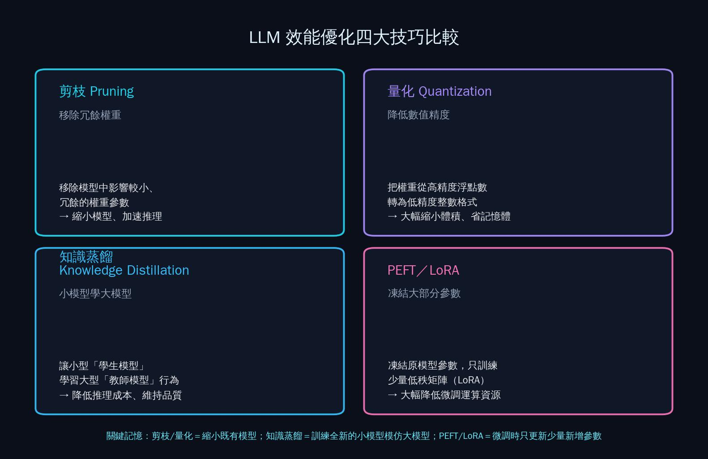
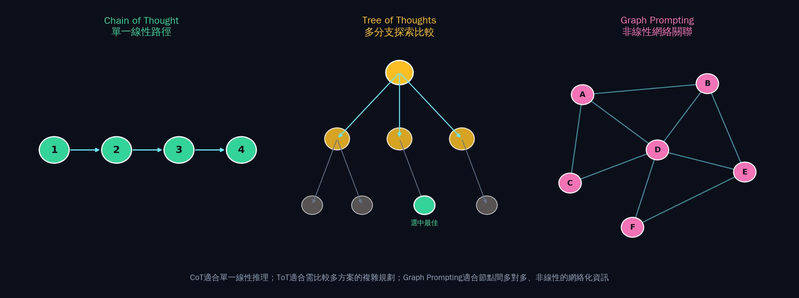

  

<h1 align="center">📓 第六章 iPAS考古題精析｜生成式AI</h1>

對應教材：CH6（6-1 ~ 6-4）　｜　題庫來源：114年第四次、115年第一～三次，共4屆　｜　81題完整解析（正式教材範圍）

※ 教材未收錄的進階補充主題（RAG、AI Agent/MCP/A2A、Low-Code/No-Code、上下文工程，共43題）將另外獨立成「補充章節」。

---

## 📖 本章使用說明

- 與前五章相同的格式：每題列出完整題幹與四個選項，✅標示正解，逐選項解析對錯原因。
- **6-2 LLM簡介是全考卷單一子單元題量最大者（64題）**，拆成多個子題群方便分批演練。
- 🔗 標示可延伸閱讀連結；📌 標示口訣型重點提醒。

---

## 6-1　生成式人工智慧簡介（5題）

### 〔114年第四次・第一科・Q22〕
> 關於變分自編碼器（Variational Autoencoder, VAE）的運作流程，下列何者敘述最為正確？

- (A) 解碼器的任務是將低維壓縮向量分類為不同類別
- (B) 編碼器將輸入資料轉換為可視化圖像以利模型學習
- (C) ✅ 編碼器將資料轉換為潛在空間表示，解碼器再重建資料
- (D) 編碼器利用最大邊際機率對資料進行異常點偵測

**逐選項解析**
（呼應課程第2章2-4-B學過的VAE概念）
- **(C) 正確**：VAE的標準運作流程是——**編碼器（Encoder）**把輸入資料壓縮轉換成**潛在空間（Latent Space）**的機率分布表示，再由**解碼器（Decoder）**從這個潛在空間表示**重建**出資料，這正是VAE作為生成模型的核心機制。
- **(A) 錯誤**：解碼器的任務是「**重建**資料」，不是「分類」，把解碼器的功能誤植為分類任務。
- **(B) 錯誤**：編碼器是把資料轉換成**潛在空間的向量表示**（通常是低維度的數值向量），不是轉換成「可視化圖像」，這個敘述誤解了編碼器輸出的本質。
- **(D) 錯誤**：VAE的核心目的是**生成**資料（透過潛在空間重建），不是用「最大邊際機率」做異常點偵測，這是把VAE的核心用途與其他技術（如SVM的邊際概念）混淆了。

### 〔114年第四次・第二科・Q15〕
> 某客服自動回應系統希望根據不同客戶群體調整回覆風格。在兼顧即時性與效果的前提下，下列哪一種方案最適合？

- (A) 直接微調預訓練模型針對每個客戶群體分別訓練不同風格模型
- (B) ✅ 利用控制變量（Control Tokens）或風格標籤在同一模型內動態調整風格
- (C) 利用生成對抗網路（GAN）生成不同風格文本，並透過人工篩選最終答案
- (D) 採用規則式替換方法，替換回覆詞彙以符合不同風格要求

**逐選項解析**
- **(B) 正確**：題目要求「**兼顧即時性與效果**」——使用控制變量（Control Tokens）或風格標籤，能讓**同一個**模型在推論時**動態**依據不同標籤輸出不同風格，不需要為每個客群訓練獨立模型，也不需要額外的人工篩選環節，是效率與效果兼顧的最佳方案。
- **(A) 錯誤**：為「每個客戶群體」都分別訓練獨立的風格模型，成本與維運複雜度極高，不符合「即時性」的效率要求（每次新增客群都要重新訓練一個模型）。
- **(C) 錯誤**：先用GAN生成多種風格文本，再「人工篩選」最終答案，這個流程涉及人工介入，會拖慢回應速度，不符合「即時性」的要求。
- **(D) 錯誤**：規則式詞彙替換方式較為死板、缺乏彈性，很難真正呈現出「風格」上細膩的差異（不只是換詞彙，還涉及語氣、句式等整體風格），效果通常不如模型內建的動態風格調整機制。

### 〔114年第四次・第二科・Q20〕
> 某醫院正在規劃一個AI專案，目的是協助醫師從胸腔X光影像中判斷是否存在肺炎徵兆，團隊卻誤將生成式AI模型運用於影像診斷。下列哪一項最可能成為主要風險？

- (A) 模型在生成報告時語句流暢，但僅在文字表達上有差異，對診斷結果沒有重大影響
- (B) 模型若資料不足，僅會降低生成報告的完整性，而非影響判斷病灶的正確性
- (C) 模型偏向生成內容而非分類，但此差異僅影響效率，不會造成誤診風險
- (D) ✅ 模型可能生成與實際影像不符的診斷結論，導致誤判並引發醫療與法律風險

**逐選項解析**
（呼應課程第15、16週學過的「鑑別式AI做判斷、生成式AI做輔助」分工概念）
- **(D) 正確**：「判斷是否存在肺炎徵兆」本質上是一個**判斷/分類**任務，應該用**鑑別式AI**處理；如果誤用**生成式AI**模型，生成式AI的本質是「產生看似合理的內容」，而非「基於嚴謹判斷依據做出診斷」，因此可能生成**與實際影像內容不符**、卻語句流暢、看似專業的診斷結論（即幻覺現象），這種「看起來合理但實際錯誤」的內容在醫療場景中極度危險，會直接導致誤判並引發醫療與法律風險。
- **(A) 錯誤**：這句話嚴重低估了風險——「僅在文字表達上有差異」完全忽略了生成式AI可能捏造**與實際影像不符**的診斷結論這個核心風險，不是單純的文字表達問題。
- **(B) 錯誤**：這句話同樣低估風險——資料不足不會「僅」降低報告完整性，反而更可能導致生成式AI產生錯誤或憑空捏造的判斷內容，直接影響病灶判斷的正確性。
- **(C) 錯誤**：「差異僅影響效率」完全誤判了問題的嚴重性——用錯技術類型（生成式vs.鑑別式）在醫療診斷這種高風險場景中，影響的是**診斷正確性與病患安全**，不是單純的效率問題。

### 〔115年第二次・第二科・Q17〕
> 某律師事務所因業務量快速成長，正在評估導入生成式AI工具以減輕律師的行政負擔，請問下列哪一項最符合生成式AI目前在法律實務中的主要應用？

- (A) ✅ 快速爬梳大量相關判例、協助起草合約初稿並標記文件中的潛在風險條款
- (B) 根據案件事實與法條自動做出判決建議，並作為法官裁決依據直接採用
- (C) 在正式庭審中代替律師進行言詞答辯，並即時調整辯護策略
- (D) 分析嫌疑人的歷史行為模式，預測其未來可能再犯的時間與地點供執法單位參考

**逐選項解析**
- **(A) 正確**：目前生成式AI在法律實務中務實、成熟的應用，是扮演**輔助**角色——協助律師快速**爬梳**大量判例資料、**起草**合約初稿、**標記**潛在風險條款，這些都是能顯著減輕律師行政負擔、同時風險可控（最終仍由律師審核把關）的應用方式。
- **(B) 錯誤**：「自動做出判決建議並**直接作為**法官裁決依據採用」，這種完全取代人類專業判斷、且直接影響司法裁決的用法，目前遠遠超出生成式AI技術的成熟度與可信賴程度，且涉及嚴重的究責與倫理風險，不是「目前」的主要應用方式。
- **(C) 錯誤**：「在正式庭審中代替律師進行言詞答辯」同樣是完全取代專業人員角色的高風險應用，目前的生成式AI技術與法律規範都不支持這種完全自主的法庭代理應用。
- **(D) 錯誤**：「預測嫌疑人再犯時間地點」涉及嚴重的預測性執法倫理爭議（可能構成不當的標籤化與歧視），且技術可靠度與法律授權都存在高度爭議，不是生成式AI「目前」在法律實務中被廣泛採用的主流應用。

📌 **重點提醒**：這3題（Q20醫療影像、Q17法律應用）共同驗證了同一個核心治理原則——**生成式AI適合擔任「輔助草擬、初步整理、風險標記」的角色，不適合直接取代需要嚴謹判斷依據、且錯誤代價極高的專業決策（診斷、判決、辯護）**，這個原則會在後面6-2、補充章節反覆出現。

### 〔115年第三次・第二科・Q6〕
> 某精密機械製造廠計劃開發一套智慧生產排程系統，希望採用Low-Code平台縮短開發時程。然而，系統核心需實作企業多年累積的專屬排程演算法，且演算法需依不同生產條件進行大量客製化調整。若僅考量Low-Code平台原生能力，下列何者最可能成為開發上的限制？

- (A) 平台通常不支援與既有ERP或MES系統整合，因此需重新建置所有資料
- (B) ✅ 平台主要提供通用元件與流程設計能力，若涉及高度複雜且企業專屬的演算法，通常仍需自行撰寫程式碼客製化或搭配傳統程式開發
- (C) 平台無法依據企業識別需求調整介面版面配置，且不支援甘特圖或儀表板等圖表呈現
- (D) 平台開發完成的應用程式僅支援單一使用者操作，無法提供多部門協同作業與動態權限控管機制

**逐選項解析**
（呼應課程第16週學過的Low-Code限制概念）
- **(B) 正確**：Low-Code平台的核心價值是提供**通用**的元件與流程設計能力，加速一般性應用的開發，但當需求涉及**企業專屬、高度複雜的客製化演算法**（如題目描述多年累積的專屬排程邏輯）時，這種高度特化的邏輯通常超出平台原生元件的涵蓋範圍，仍然需要**額外撰寫程式碼**或搭配傳統開發方式才能實現，這正是Low-Code平台在處理高度客製化需求時的典型限制。
- **(A) 錯誤**：多數現代Low-Code平台其實**支援**與常見ERP/MES系統的整合（透過API或現成連接器），「不支援整合、需重新建置所有資料」的敘述過於武斷，不是Low-Code平台最核心、最普遍的限制。
- **(C) 錯誤**：多數Low-Code平台其實**支援**基本的介面客製化與常見圖表元件（甘特圖、儀表板），這不是題目情境（複雜排程演算法客製化）最核心的限制點。
- **(D) 錯誤**：多數Low-Code平台其實**支援**多使用者協同作業與權限管理功能，這個敘述誇大了平台的限制，且與題目強調的「專屬排程演算法客製化」核心問題點無關。

## 6-2　大型語言模型（LLM）簡介（64題）

**這是全考卷單一子單元題量最大者**，拆成11個子題群：**A.效能優化與部署架構（12題）｜B.RAG與微調技術選型（9題）｜C.上下文工程與記憶機制（6題）｜D.Agentic AI與工具呼叫（7題）｜E.Token Economics與成本評估（4題）｜F.生成參數與提示技巧延伸（7題）｜G.AI程式碼助手（4題）｜H.安全防護與資安（3題）｜I.模型規模效應與評測（6題）｜J.推理深度與動態路由（3題）｜K.幻覺與可信度（1題）**。

### 6-2-A　效能優化與部署架構（12題）

 
🖼️ 剪枝／量化／知識蒸餾／PEFT——四種LLM效能優化技巧的核心差異

### 〔114年第四次・第一科・Q27〕
> 在大型Transformer模型的效能優化過程中，常見的方法之一是「剪枝（Pruning）」。下列哪一項最符合該方法的核心概念？

- (A) 將模型中所有權重按比例縮小，使其值更接近零，以降低計算量
- (B) ✅ 移除模型中影響較小或冗餘的部分權重參數，以減少模型大小並提升推理效率
- (C) 在訓練時僅更新部分權重而將其他權重凍結，從而減少需要調整的參數數量
- (D) 根據注意力分數動態跳過處理部分輸入Token，以減少每次前向傳播的計算

**逐選項解析**
- **(B) 正確**：剪枝的核心概念就是**移除**（而非只是縮小）模型中**影響較小或冗餘**的權重參數，這是課程第15週學過的LLM效能優化技巧，透過刪除不重要的連結來縮小模型、加速推理。
- **(A) 錯誤**：「按比例縮小所有權重使其接近零」描述的比較接近**權重衰減（Weight Decay）**或正則化的概念，不是剪枝——剪枝是**直接移除**特定參數，不是全面縮小數值。
- **(C) 錯誤**：「訓練時僅更新部分權重、凍結其他權重」描述的是**參數高效微調（PEFT）**的概念（後面Q2會考），不是剪枝——剪枝是對**已訓練好**的模型做**結構性移除**，不是訓練階段的參數凍結策略。
- **(D) 錯誤**：「根據注意力分數動態跳過部分Token」描述的是一種**稀疏注意力（Sparse Attention）**機制，屬於另一種不同的效能優化技巧，不是剪枝的核心概念。

### 〔114年第四次・第一科・Q50〕
> 某雲端服務公司計畫將大型語言模型部署於線上系統，並以批次推論（Batch Inference）方式處理每日上百萬筆用戶請求。下列哪一項通常不會被視為批次推論階段的主要難題？

- (A) ✅ 如何確保訓練語料的涵蓋性與標註品質，以避免模型偏差影響輸出
- (B) 當批次規模增大時，如何降低推論延遲並保持即時回應能力
- (C) 在推論過程中，有效管理與分配龐大的輸入資料量以避免資源壅塞
- (D) 在叢集環境中精確安排推論任務，以提升GPU/TPU等硬體資源的利用率

**逐選項解析**
- **(A) 為不會被視為，正確答案**：「訓練語料涵蓋性與標註品質」是模型**訓練階段**的問題，不是**推論（部署運行）階段**的難題——模型此時已經訓練完成，批次推論階段關注的是「怎麼有效率地運行既有模型」，不是「訓練資料好不好」的問題，這是時間階段不同導致的答非所問。
- **(B)、(C)、(D) 錯誤（其實都是批次推論的真實難題）**：延遲與即時回應的平衡、龐大輸入資料的管理分配、硬體資源利用率的排程優化，都是批次推論**部署運行階段**實際會遇到的技術挑戰。

### 〔114年第四次・第二科・Q35〕
> 在即時客服系統的效能測試中，若針對延遲測試（Latency Testing）進行評估，下列哪一項指標最能反映系統是否符合用戶即時互動需求？

- (A) AI模型在同一分鐘內可完成的回覆訊息數量
- (B) ✅ 客戶從輸入問題到收到第一個完整回應所需的時間
- (C) 客服系統能連續提供服務的運行時長
- (D) AI產生回答時用詞的多樣性與表達創意程度

**逐選項解析**
（呼應課程第16週學過的吞吐量vs延遲概念）
- **(B) 正確**：延遲測試（Latency Testing）衡量的核心指標就是「**從發出請求到收到回應**所需的時間」，這正是使用者感受到的即時互動體驗，完全對應延遲測試的定義。
- **(A) 錯誤**：「同一分鐘內可完成的回覆數量」是**吞吐量（Throughput）**指標，衡量系統整體處理量，不是單次互動的延遲感受，這是第16週學過的吞吐量與延遲兩個不同效能維度的辨析。
- **(C) 錯誤**：「連續提供服務的運行時長」是**穩定性/可用性**指標（如系統多久當機一次），不是延遲指標。
- **(D) 錯誤**：用詞多樣性是**內容品質**的指標，與「反應速度」的延遲測試完全無關。

### 〔115年第一次・第一科・Q23〕
> 在AI推論服務架構設計中，「批次推論」與「即時推論」常依任務特性選擇不同機制。下列關於兩者特性的敘述何者最正確？

- (A) 批次推論通常以同步請求方式回傳結果，即時推論則多採非同步機制以提升吞吐量
- (B) ✅ 批次推論多用於延遲容忍度較高的大規模資料處理，通常以吞吐量最佳化為優先；即時推論則著重於請求回應時間的穩定性與低延遲特性
- (C) 批次推論因計算資源需求高，僅適用於影像類模型；即時推論則主要應用於結構化資料模型
- (D) 即時推論為確保回應速度，通常限制為單筆資料輸入；批次推論則可支援同步多筆資料即時回傳

**逐選項解析**
- **(B) 正確**：**批次推論**適合**不急著馬上拿到結果**（延遲容忍度高）的大規模資料處理場景，優化重點在於**吞吐量**（單位時間能處理多少資料）；**即時推論**則是使用者在等待回應（如客服對話），優化重點在於**低延遲、回應穩定性**，兩者的設計目標剛好對應不同的任務特性需求。
- **(A) 錯誤**：這句話把批次與即時推論的同步/非同步機制描述搞反了或過度簡化，不符合兩者實際運作特性的核心差異（核心差異在於「吞吐量優先」vs.「延遲優先」，不是單純的同步非同步問題）。
- **(C) 錯誤**：批次推論與即時推論的適用性不是以「影像類」或「結構化資料模型」這種資料類型來區分，而是以「延遲容忍度」與「任務急迫性」來決定，這個敘述的分類依據錯誤。
- **(D) 錯誤**：即時推論不一定「限制為單筆資料輸入」，批次推論也不是「同步多筆即時回傳」（批次推論的精神正是犧牲即時性換取整體效率），這個敘述的技術描述有誤。

### 〔115年第一次・第一科・Q25〕
> 在LLM的推論服務中，常透過請求批次處理（Batching）來提升系統效能。關於Batching機制的影響，下列敘述何者最正確？

- (A) ✅ Batching可提升加速器資源使用效率並增加整體吞吐量，但在部分情境下可能對單筆請求延遲造成影響
- (B) Batching主要用於加快單筆請求回應時間
- (C) Batching的效益主要來自降低記憶體使用量，對於吞吐量與延遲表現影響有限
- (D) Batching在低併發請求下，仍能明顯提升系統效能

**逐選項解析**
- **(A) 正確**：Batching（把多筆請求打包一起處理）能讓GPU等加速器的運算資源被更充分利用，提升整體**吞吐量**，但這也意味著**單一筆**請求可能需要**等待**與其他請求一起被打包處理，因此在某些情境下反而會**增加單筆請求的延遲**，這是Batching機制「提升整體效率、但可能犧牲個別即時性」的真實權衡。
- **(B) 錯誤**：這句話講反了——Batching的目的是提升**整體吞吐量**，不是加快**單筆**請求的回應時間，單筆請求反而可能因為等待批次組成而延遲。
- **(C) 錯誤**：Batching的核心效益是**吞吐量提升**（透過更有效率地利用平行運算資源），不是「降低記憶體使用量」，這個敘述的因果關係錯誤。
- **(D) 錯誤**：在**低併發**（同時請求量少）的情況下，很難湊齊足夠的請求組成有效的批次，Batching的效益在低併發情境下其實**有限**，不是「仍能明顯提升」。

### 〔115年第一次・第二科・Q2〕
> 在進行LLM企業專屬知識的Fine-tuning時，若內部GPU運算資源與記憶體嚴重受限，下列哪一種參數高效微調（PEFT）技術最能在維持模型效能的前提下，顯著降低需更新的參數數量？

- (A) 知識蒸餾（Knowledge Distillation）
- (B) 提示詞工程（Prompt Engineering）
- (C) 梯度凍結（Gradient Freezing）
- (D) ✅ 低秩適配（Low-Rank Adaptation, LoRA）

**逐選項解析**
- **(D) 正確**：LoRA是目前最主流、最具代表性的PEFT技術——它**凍結**原始模型的絕大部分參數，只額外訓練少量的**低秩矩陣**參數，這樣就能用遠少於全量微調的參數更新量，達到接近全量微調的效果，完全對應題目「顯著降低需更新的參數數量」且「維持模型效能」的雙重要求。
- **(A) 錯誤**：知識蒸餾是**壓縮模型規模**的技術（讓小模型學習大模型行為），不是「微調」既有大模型的技術，用途不同。
- **(B) 錯誤**：提示詞工程完全**不涉及**模型參數的訓練或更新，是在推論階段透過輸入設計引導輸出，與「微調」的概念（調整模型參數）完全不同。
- **(C) 錯誤**：「梯度凍結」是PEFT的**廣泛概念類別**之一（凍結大部分參數只訓練少數），但題目問的是**具體、最能代表**PEFT技術的方法名稱，LoRA是這個題目情境下更精確、更具名稱代表性的正解，梯度凍結是較模糊的通用描述。

### 〔115年第一次・第二科・Q10〕
> 某企業建置RAG系統支援內部知識查詢，隨使用量提升，發現回覆品質穩定，但推論延遲與運算成本逐漸增加。若採用知識蒸餾，下列敘述何者最為合理？

- (A) 將檢索資料轉換為結構化規則以取代模型
- (B) 僅透過增加檢索文件數量改善效能
- (C) 停用生成模型以避免延遲問題
- (D) ✅ 使小型模型學習大型模型行為，以降低推論成本

**逐選項解析**
- **(D) 正確**：知識蒸餾的標準定義——讓**小型**「學生模型」學習**大型**「教師模型」的行為模式，在**維持回覆品質**（題目要求）的同時，用更小的模型降低推論延遲與運算成本，完全對應題目情境的需求。
- **(A) 錯誤**：把檢索資料轉換成「結構化規則」取代模型，是完全不同的技術路線（規則式系統），不是知識蒸餾的做法，也會犧牲生成式回覆的彈性。
- **(B) 錯誤**：增加檢索文件數量只會讓檢索與處理的資料量**更多**，反而可能讓延遲與成本問題**更嚴重**，與題目要「降低」延遲成本的目標相反。
- **(C) 錯誤**：直接停用生成模型會讓整個RAG系統失去生成回覆的能力，這是因噎廢食的做法，不是知識蒸餾的精神（知識蒸餾是「換成更小的生成模型」，不是「完全不生成」）。

### 〔115年第一次・第二科・Q17〕
> 某企業提供LLM API服務，需支援高併發請求與流量波動，同時要求服務不中斷並具備故障容忍能力。若以高可用性與可擴展性為主要設計原則，下列哪一種部署方式較為適當？

- (A) 採用單一高效能虛擬機集中部署，以提升資源使用效率
- (B) ✅ 建立多個模型服務實例並透過負載分散機制提供服務
- (C) 將推論任務改由用戶端設備分擔，以降低伺服器負載壓力
- (D) 使用FTP協議傳輸請求與回應，以減少服務通訊負擔

**逐選項解析**
- **(B) 正確**：「高可用性」「可擴展性」「故障容忍」「高併發」——這些需求的標準解法就是建立**多個服務實例**，搭配**負載平衡（Load Balancing）**機制分散流量，當某個實例故障時其他實例還能繼續服務（故障容忍），流量增加時也能水平擴展（可擴展性），這是雲端服務架構設計的標準最佳實務。
- **(A) 錯誤**：**單一**虛擬機集中部署正是「高可用性」的**反面**——單一節點一旦故障，整個服務就會中斷，完全沒有故障容忍能力，也難以應對流量高峰的擴展需求。
- **(C) 錯誤**：把推論任務丟給用戶端設備處理並不現實（用戶端設備效能參差不齊，且大型LLM推論通常需要專用的伺服器級運算資源），也無法保證服務品質的一致性。
- **(D) 錯誤**：FTP是檔案傳輸協定，不是設計來處理API請求/回應這種即時互動通訊的協定，用FTP處理LLM API服務不符合實務做法，是明顯錯誤的技術選擇。

### 〔115年第一次・第二科・Q43〕
> 某金融服務公司規劃導入生成式AI，基於內部控制與治理要求，考慮將LLM建置於公司可管理環境，而非直接採用外部雲端服務。下列何者最能合理說明此部署決策的潛在優勢？

- (A) 有助提升模型回覆穩定性並降低隨機性影響
- (B) ✅ 可降低敏感資料需傳輸至外部服務的風險
- (C) 可直接減少模型訓練與維運所需資源投入
- (D) 可避免模型輸出偏差與幻覺問題

**逐選項解析**
（呼應第一章1-4-B、1-4-F學過的私有化部署概念）
- **(B) 正確**：把模型建置在「公司可管理環境」（私有化部署），最直接、最核心的優勢就是**資料不需要傳輸到外部第三方服務**，降低敏感資料外洩的風險，這與金融業「內部控制與治理要求」的核心考量完全對應。
- **(A) 錯誤**：模型部署在本地或雲端，與模型輸出的「隨機性」高低沒有直接關聯——隨機性主要取決於生成參數（如溫度）設定，不是部署位置。
- **(C) 錯誤**：私有化部署通常需要企業自行投入更**多**的訓練、維運資源與人力（不像使用外部雲端服務那樣「免維運」），這句話講反了私有化部署在資源投入上的實際取捨。
- **(D) 錯誤**：模型的輸出偏差與幻覺問題，與模型**本身的訓練品質與技術架構**有關，不會因為「部署在公司可管理環境」就自動避免，部署位置與模型輸出品質是不同層面的議題。

### 〔115年第一次・第二科・Q46〕
> 某金融監理機構規劃導入生成式AI協助分析申報文件與監理報告，系統需處理大量涉及企業敏感資料與未公開資訊。主管機關明確要求「資料安全與法規遵循必須優先於導入速度與成本考量」。下列哪一種策略最為適當？

- (A) 採用雲端大型語言模型API，並透過資料遮罩與加密機制降低外洩風險
- (B) 導入開源模型進行私有化部署，以兼顧成本彈性與模型可控性
- (C) ✅ 自行訓練並私有化部署模型，同時建立存取控管與稽核機制
- (D) 先驗證模型效益，再逐步補強合規與資安架構

**逐選項解析**
（呼應課程第16週學過的「治理措施優先於效率」的判斷邏輯）
- **(C) 正確**：題目已經明確設定「**資料安全與法規遵循必須優先於**導入速度與成本考量」這個最高原則——自行訓練並**私有化部署**，是從架構源頭就確保資料完全不外流的最高規格做法，搭配存取控管與稽核機制，完全對應「安全與合規優先」的最高標準要求，即使這樣做速度較慢、成本較高，也符合題目設定的優先順序。
- **(A) 錯誤**：使用**雲端**API，代表敏感資料仍然需要傳輸到外部服務（即使有遮罩加密），與題目「資料安全優先」的最高標準相比，風險依然存在，不是最適當的選擇。
- **(B) 錯誤**：「兼顧成本彈性」這個考量的優先順序，與題目明確要求「資料安全與法規遵循**必須優先於**...成本考量」的設定矛盾——題目已經說了成本不是優先考量重點，選項卻還在強調成本彈性。
- **(D) 錯誤**：「先驗證效益、再逐步補強合規」意味著一開始並沒有把合規與資安放在第一位，這正好違反題目「安全法規必須**優先**」的核心要求（呼應第一章學過的「合規應從一開始就內建，而非事後補強」原則）。

### 〔115年第三次・第一科・Q44〕
> 某軟體公司計劃開發手機App，需在沒有網路的環境下於手機本機端（邊緣裝置）執行微型LLM提供即時語音翻譯服務。考量記憶體容量限制與電池續航力，工程師建議在部署前先對模型進行模型量化（Quantization）處理。關於此作法的預期效益與影響，下列敘述何者最正確？

- (A) 經過量化處理後的模型，執行時必須即時連回雲端伺服器進行校正，否則手機端將無法獨立運作
- (B) 能在完全不影響模型原本輸出品質的前提下壓縮模型體積，並降低記憶體需求
- (C) 模型量化後會自動在邊緣裝置上動態增加參數數量，藉此彌補精度降低所帶來的能力損失
- (D) ✅ 能大幅減少模型檔案體積與記憶體佔用量，並加速本機推論回應，但模型輸出品質可能會受到輕微影響

**逐選項解析**
- **(D) 正確**：模型量化的核心機制是把模型參數從**高精度數值格式**（如32位元浮點數）轉換成**低精度格式**（如8位元整數），這樣能大幅**縮小模型體積、降低記憶體佔用**、加速推論運算，完全符合邊緣裝置的資源限制需求；但因為數值精度降低，模型輸出品質**可能會受到輕微影響**（這是量化技術眾所皆知的取捨），這個敘述完整且準確地描述了量化的效益與代價。
- **(A) 錯誤**：量化後的模型應該能在**離線**（不需連網）情況下獨立運作，這正是題目情境「沒有網路的環境」下需要邊緣裝置獨立運行的核心需求，如果還要連回雲端校正就完全違背了邊緣部署的初衷。
- **(B) 錯誤**：「完全不影響模型原本輸出品質」過於理想化——量化涉及數值精度的降低，通常都會對輸出品質造成**一定程度**的影響（即使影響很小），宣稱「完全不影響」是不準確的誇大敘述。
- **(C) 錯誤**：量化的目的是**縮小**模型規模，不會「動態增加參數數量」，這個敘述與量化技術的基本原理矛盾。

### 〔115年第二次・第一科・Q44〕
> 某金融集團評估將LLM導入客服與風控系統，採用如120B參數等級的超大型語言模型以確保回應品質。下列何者最能說明企業在正式環境部署超大型語言模型時，最需要優先考量的因素？

- (A) 模型參數量龐大，導致每次輸出結果差異極大，難以符合金融業對回應一致性的要求
- (B) 超大型模型無法支援批次處理，在高併發的客服場景下將造成嚴重的服務瓶頸
- (C) ✅ 推理延遲較高且運算資源消耗龐大，每次請求成本遠高於小型模型，需在模型效能與營運成本之間審慎權衡
- (D) 模型會依任務複雜度自動調整運算資源配置，因此不需特別考量推理成本

**逐選項解析**
- **(C) 正確**：超大型模型（如120B參數）的核心現實挑戰，就是**推理延遲較高、運算資源消耗龐大**，導致**每次請求的成本遠高於**小型模型，企業在正式環境部署時，必須在「模型效能表現」與「營運成本」之間做審慎的權衡取捨，這是超大型模型部署最直接、最現實的考量因素。
- **(A) 錯誤**：模型參數量大小與「輸出結果差異極大」（一致性問題）沒有必然關聯——輸出一致性主要取決於生成參數設定（如溫度），不是參數量本身的問題，這個敘述的因果關係錯誤。
- **(B) 錯誤**：超大型模型**依然可以**支援批次處理（批次處理是推論服務架構層面的技術，與模型參數量大小是不同的技術議題），這個敘述誇大且不準確。
- **(D) 錯誤**：模型**不會**「自動調整運算資源配置」來自動優化推理成本，推理成本是需要企業**主動**評估與管理的現實問題，「不需特別考量推理成本」的敘述完全錯誤，也與題目要問的核心考量因素相反。

### 6-2-B　RAG與微調技術選型（9題）

本題群是全考卷「RAG vs. Fine-tuning該選哪個」的完整總複習，核心口訣：**知識頻繁更新、需要來源可追溯 → RAG；語氣風格、固定格式、穩定行為模式 → Fine-tuning；兩者也可以合併使用，各自負責不同任務**。

### 〔114年第四次・第二科・Q17〕
> 某公司部署結合Fine-tuning與RAG的語言模型系統作為內部文件助理。系統需同時確保回覆語氣一致、能即時查詢每日新增文件、維持效能穩定，並避免頻繁重新訓練。下列哪一種策略最合適？

- (A) 每週重新Fine-tune模型，將新文件整合進模型知識，逐步取代RAG模組
- (B) 完全依靠基礎模型與RAG，不進行Fine-tune，僅透過提示設計控制語氣
- (C) 每日進行增量Fine-tune，讓模型即時學習新文件內容，避免依賴檢索
- (D) ✅ 保留語氣相關Fine-tuning，僅透過檢索系統更新文件內容，不頻繁改動模型

**逐選項解析**
- **(D) 正確**：這題精準示範Fine-tuning與RAG的**分工搭配**——「語氣一致」這種**穩定、不常變動**的行為模式適合用Fine-tuning訓練固定下來；「每日新增文件」這種**頻繁更新**的知識則交給RAG的檢索系統處理，不需要為了更新文件內容就頻繁重新訓練模型，完全符合題目「避免頻繁重新訓練」的要求。
- **(A) 錯誤**：「每週重新Fine-tune、逐步取代RAG」違反「避免頻繁重新訓練」的要求，且用Fine-tuning處理**頻繁更新**的文件內容，成本高昂又沒有必要。
- **(B) 錯誤**：「僅透過提示設計控制語氣」雖然可行，但通常不如Fine-tuning訓練出來的語氣**穩定一致**，題目強調「回覆語氣一致」，用Fine-tuning處理語氣是更穩固的做法。
- **(C) 錯誤**：「每日增量Fine-tune」明顯違反「避免頻繁重新訓練」的核心要求，成本與維運複雜度都過高。

### 〔114年第四次・第二科・Q18〕
> 某客服系統在回覆「訂單取消政策」時，即使生成溫度固定為0.6，回覆品質仍常出現差異。調查顯示，檢索到的政策內容有時是最新版本，有時則是過時文件，此外Prompt約束不足，微調語料也有模糊描述。若要優先改善品質波動，應先解決下列哪一項問題？

- (A) 調整溫度參數，降低生成隨機性
- (B) 加強Prompt設計，限制模型表達方式
- (C) 優化微調語料，減少含糊描述
- (D) ✅ 提升檢索系統品質，確保取得的政策內容正確且最新

**逐選項解析**
- **(D) 正確**：題目列出了好幾個可能的問題（溫度、Prompt、微調語料、檢索內容），但只有「**檢索到的政策內容有時是過時文件**」這個問題，會直接導致**事實內容本身錯誤**（回答依據的政策版本不對），這是**最根本、最優先**該解決的問題——其他因素（溫度、Prompt、微調語料模糊）頂多影響表達方式的細微差異，但如果連依據的政策內容本身都是錯的/過時的，答案就會有實質性的錯誤，這比表達方式的差異嚴重得多。
- **(A) 錯誤**：溫度已經**固定**在0.6，且溫度只影響生成的隨機性/多樣性，不會導致「政策內容版本錯誤」這種事實性錯誤，調整溫度無法解決檢索到過時文件的根本問題。
- **(B) 錯誤**：加強Prompt設計或許能改善表達方式，但如果檢索到的**底層資料本身**是過時的，再好的Prompt設計也無法讓模型憑空知道正確答案。
- **(C) 錯誤**：微調語料模糊確實可能造成表達不夠精準，但這不是「品質波動」（有時對有時錯）最主要的原因——**檢索內容不穩定（有時新有時舊）**才是造成回覆品質忽好忽壞、不一致的最直接根源。

📌 **重點提醒**：這題的解題關鍵是**分辨「表達方式問題」與「事實內容問題」哪個更根本**——溫度、Prompt、微調語料模糊，頂多影響「怎麼說」；但檢索到過時文件，會直接影響「說的內容對不對」，永遠優先處理**事實內容正確性**的問題。

### 〔114年第四次・第二科・Q48〕
> 某開發團隊在建置企業內部知識檢索系統時，選擇採用多向量檢索器（Multi-vector Retriever），下列何者為協助提升系統查詢的完整性與精準度的主要方式？

- (A) ✅ 支援同時處理多種資訊表示，提升跨文本型態的檢索效果
- (B) 透過多向量壓縮與共享權重方式，降低檢索過程的運算與儲存成本
- (C) 以切分並過濾文件片段，減少上下文長度帶來的Token負擔
- (D) 透過調整生成階段的溫度參數，使模型在回覆時更穩定一致

**逐選項解析**
- **(A) 正確**：多向量檢索器的核心設計，是能針對**同一份文件的不同面向**（例如摘要向量、詳細內容向量、關鍵字向量等多種表示方式）**同時**建立多個向量表示，這樣檢索時能從**多種角度**匹配查詢意圖，提升跨不同文本型態、不同表達方式的檢索完整性與精準度。
- **(B) 錯誤**：多向量檢索器的設計目的是**提升檢索效果**（多角度表示），不是「降低運算儲存成本」——事實上，維護多個向量表示通常會**增加**儲存與運算成本，這個敘述的因果方向錯誤。
- **(C) 錯誤**：切分過濾文件片段是**Chunking**（前面第五章學過的概念）的功能，不是多向量檢索器的核心特色。
- **(D) 錯誤**：調整生成階段的溫度參數是**生成階段**的設定，與**檢索階段**的多向量檢索器技術完全是不同環節的技術，答非所問。

### 〔115年第一次・第二科・Q26〕
> 某支付平台為強化洗錢行為檢測，計劃導入生成式AI輔助分析可疑交易模式。該平台擁有大量歷史交易記錄和已知洗錢案例資料，希望AI能自動生成可疑交易的特徵描述報告。下列哪一種生成式AI技術最適合此需求？

- (A) 使用Midjourney生成交易流程圖像
- (B) 採用Few-shot Learning訓練圖像識別模型
- (C) ✅ 運用RAG檢索增強生成技術結合歷史案例資料庫
- (D) 直接使用ChatGPT的基礎模型進行分析

**逐選項解析**
- **(C) 正確**：平台**擁有大量歷史交易記錄和已知洗錢案例資料**——這是現成的、有價值的內部知識庫，運用RAG技術**結合**這個歷史案例資料庫進行檢索增強生成，能讓AI依據**真實、具體**的歷史案例產生更準確、更有依據的特徵描述報告，完全善用了平台既有的資料資產。
- **(A) 錯誤**：Midjourney是**影像生成**工具，題目需求是產生「**特徵描述報告**」（文字內容），不是生成圖像，用途完全不對應。
- **(B) 錯誤**：Few-shot Learning訓練**圖像識別模型**，但題目的洗錢行為檢測分析的是**交易資料**（數值/文字型），不是影像辨識任務，技術類型選錯了。
- **(D) 錯誤**：「直接使用ChatGPT的基礎模型」沒有**結合平台自己擁有的歷史案例資料庫**，等於浪費了平台既有的寶貴資料資產，生成的報告也不會具備平台特定的歷史案例依據，容易產生較通用、不夠精準的內容。

### 〔115年第一次・第二科・Q31〕
> 某有機農場累積十年病蟲害防治紀錄文件，希望建立AI助手，能根據農民描述的作物症狀，快速提供防治建議和歷史案例。下列哪一種技術最適合？

- (A) 直接使用ChatGPT的預訓練知識回答農業問題
- (B) 將所有文件內容加入ChatGPT的系統提示詞中
- (C) ✅ 採用RAG技術，將農場文件建立向量資料庫，結合大語言模型生成回答
- (D) 使用少樣本學習，在提示詞中提供3-5個病害案例

**逐選項解析**
與上一題（洗錢檢測）是同一核心邏輯的不同產業應用版本——企業擁有**大量、專屬**的既有知識文件時，RAG是最適合善用這些資料的技術。
- **(C) 正確**：「**十年**累積的病蟲害防治紀錄文件」是龐大的專屬知識庫，用RAG技術建立**向量資料庫**，讓LLM在回答時能檢索**最相關**的歷史案例與防治方法，是最能完整運用這批珍貴資料、同時提供精準且有依據回答的技術架構。
- **(A) 錯誤**：ChatGPT的**預訓練**知識是通用的網路知識，不包含這個農場**專屬**十年累積的病蟲害防治經驗，無法回答具有農場特定情境依據的問題。
- **(B) 錯誤**：「將**所有**文件內容加入系統提示詞」在實務上不可行——十年累積的文件量通常會**遠遠超過**模型的上下文長度限制，無法把全部內容都塞進提示詞中。
- **(D) 錯誤**：少樣本學習只能提供**3-5個**範例，遠遠無法涵蓋十年累積的**完整**病蟲害案例資料庫，資訊涵蓋範圍嚴重不足。

### 〔115年第三次・第一科・Q50〕
> 某金控公司計劃導入「美股即時分析AI助理」，須同時滿足：第一，回覆須遵循固定的合規格式與專業口吻；第二，能提供當日最新股價及財報等即時更新資訊。下列何者最為正確？

- (A) 對第二項需求，採用Fine-tuning比RAG更合適，因為可持續將最新資料微調至模型權重，以避免模型產生事實幻覺
- (B) 針對第一項需求，採用RAG比Fine-tuning更合適，因為RAG可將合規規範文件檢索後提供模型參考，使模型自然維持固定格式
- (C) ✅ 針對第二項需求，採用RAG較為合適，因為每日更新的股價與財報若持續透過Fine-tuning維護，難以兼顧時效性與維護成本
- (D) 針對第一項需求，採用Fine-tuning較為合適，因為微調能改變模型對特定知識的記憶，無法影響模型的輸出格式與口吻

**逐選項解析**
這題是把「固定格式口吻→Fine-tuning；即時更新資訊→RAG」這組核心口訣，用四個選項的正確/錯誤配對完整測試一次。
- **(C) 正確**：股價與財報是**每日**（甚至更高頻率）變動的資訊，若靠Fine-tuning持續把最新資料微調進模型權重，維護成本極高且時效性永遠跟不上真實市場變化，RAG能即時檢索最新資料，完全對應「時效性」與「維護成本」的雙重考量。
- **(A) 錯誤**：這句話正好講反了——**即時更新**的股價財報資訊，用Fine-tuning持續微調反而**難以兼顧時效性**（訓練需要時間、無法做到真正即時），RAG才是處理這類頻繁更新資訊的合適技術。
- **(B) 錯誤**：「固定的合規格式與口吻」這種**穩定、不常變動**的行為模式，應該用**Fine-tuning**訓練固定下來效果更好更穩定，而不是靠RAG檢索規範文件「自然維持」格式——RAG擅長的是**知識內容**的檢索，不是穩定**行為模式/口吻**的訓練，這個配對用反了。
- **(D) 錯誤**：這句話的前半段「Fine-tuning適合處理固定格式口吻」的判斷方向是對的，但後半段「無法影響模型的輸出格式與口吻」卻自相矛盾——**微調正是能夠**改變模型的輸出風格與格式的技術手段，這句話的後半段陳述與前半段的推薦方向互相矛盾，因此整體敘述不成立。

📌 **重點提醒**：把本題群的核心口訣再次強化——**「語氣、格式、口吻」這種穩定行為模式 → Fine-tuning；「即時更新的事實性知識」→ RAG**，這是CH6-2最重要、出現頻率最高的核心判斷邏輯。

### 〔115年第三次・第二科・Q13〕
> 某溫室農場已收集大量害蟲影像資料，並建立害蟲種類及對應防治方法的知識庫。農場希望建置AI系統，除了能辨識害蟲種類，還能依據知識庫提供最新防治建議，並能引用知識來源以降低生成不實資訊的風險。下列何者為最適合的系統架構？

- (A) 採用具備影像理解能力的多模態LLM，將害蟲影像及相關知識內容一併提供給模型，由模型一次完成辨識與防治建議
- (B) ✅ 以電腦視覺模型辨識害蟲種類，再透過RAG檢索知識庫，最後由LLM根據檢索內容產生防治建議
- (C) 以電腦視覺模型辨識害蟲種類，再交由LLM依預訓練知識直接產生防治建議，不再查詢農場知識庫
- (D) 將農場知識庫用於微調LLM，使模型直接學習防治知識，推論時不再檢索知識庫

**逐選項解析**
這題巧妙結合了「電腦視覺辨識」＋「RAG知識檢索」兩種技術的分工搭配。
- **(B) 正確**：這是最合理的**任務分工**架構——「辨識害蟲**種類**」是影像辨識任務，交給**電腦視覺模型**專門處理（比多模態LLM一次完成更精準專業）；「提供防治建議並**引用來源降低不實資訊風險**」則需要**RAG**檢索知識庫（確保建議有具體來源依據，不是LLM憑空生成），兩個技術各司其職，且RAG的檢索機制正好對應題目「引用知識來源」的明確要求。
- **(A) 錯誤**：讓多模態LLM「一次完成」辨識與建議，雖然技術上可行，但**沒有明確的知識庫檢索與來源引用機制**，難以保證「引用知識來源、降低不實資訊風險」這個題目明確要求的功能。
- **(C) 錯誤**：「不再查詢農場知識庫」直接違反題目要求「依據知識庫提供最新防治建議」，只依賴LLM預訓練知識無法引用農場自己專屬的知識來源，也無法確保建議內容是「最新」的。
- **(D) 錯誤**：用微調讓模型「直接學習」防治知識、「不再檢索知識庫」，同樣無法做到「引用知識來源」的要求（微調後的知識已經內化到模型權重中，無法像RAG一樣明確指出「這個建議來自哪一份知識庫文件」），且知識庫若持續更新，微調需要不斷重新訓練，不符合效率。

### 〔115年第二次・第一科・Q50〕
> 某企業已部署預訓練LLM作為內部知識問答系統，用於查詢人資、財務與法遵規範。由於公司內規每月滾動更新，管理層要求系統在文件更新後必須立即反映最新內容，不能等待模型重新訓練。下列哪一項評估最為正確？

- (A) 採用Fine-tuning較為適合，只要定期將更新後的內規文件加入訓練資料，模型便能即時反映最新規範內容
- (B) ✅ 採用RAG較為適合，將更新後的文件同步至外部知識庫，模型即可在不重新訓練的情況下立即查詢最新內容
- (C) 採用Fine-tuning較為適合，因為模型經過內規語料訓練後，回應品質會優於透過RAG生成的答案
- (D) 兩者皆可達成需求，差異僅在於建置成本高低，與系統能否即時反映更新內容無關

**逐選項解析**
- **(B) 正確**：題目的核心要求是「**立即**反映最新內容，**不能等待**重新訓練」——RAG架構只需要把更新後的文件**同步至外部知識庫**，模型就能立即查詢到最新內容，完全**不需要重新訓練**模型本身，這正是RAG相較Fine-tuning在「即時性」上的關鍵優勢，精準對應題目要求。
- **(A) 錯誤**：「定期將文件加入訓練資料」意味著**需要重新訓練**才能反映更新，這與題目「不能等待模型重新訓練」的明確要求直接矛盾。
- **(C) 錯誤**：這句話沒有回應題目最核心的「**即時性**」要求，即使Fine-tuning後的回應品質可能在某些情況下較好，但無法滿足「立即反映更新、不等待重新訓練」的硬性條件，答非所問。
- **(D) 錯誤**：兩者的差異**不僅是成本高低**，更關鍵的是**能否即時反映更新內容**這個題目最核心的功能性需求——RAG能做到「不重新訓練就即時更新」，Fine-tuning則做不到，這是本質性的功能差異，不只是成本問題。

### 〔115年第二次・第二科・Q48〕
> 某企業欲導入AI知識助理系統，需具備：員工可查詢內部規範與流程文件、回答需具可追溯來源、資料會頻繁更新、系統需降低模型重新訓練成本。下列哪一種架構最適合？

- (A) 直接微調LLM
- (B) ✅ 使用RAG架構
- (C) 使用純生成AI，不連接外部資料
- (D) 使用規則式專家系統

**逐選項解析**
本題群的總結性題目，把RAG的四大優勢（知識查詢、可追溯來源、頻繁更新、降低重訓成本）一次全部列出。
- **(B) 正確**：題目列出的四項需求——**查詢內部文件**（RAG的核心檢索功能）、**可追溯來源**（RAG能明確指出答案依據哪份文件）、**資料頻繁更新**（RAG只需更新外部知識庫、不用重新訓練）、**降低重新訓練成本**（RAG的核心優勢）——每一項都精準對應RAG架構的特性，是本題群所有考點的完整總結。
- **(A) 錯誤**：微調需要**重新訓練**才能反映文件更新，與「資料頻繁更新」「降低重新訓練成本」兩項需求直接衝突。
- **(C) 錯誤**：「不連接外部資料」的純生成AI，無法查詢企業**內部**規範文件，也無法提供「可追溯來源」的答案依據（純生成內容是模型自己產生的，沒有明確的文件出處）。
- **(D) 錯誤**：規則式專家系統需要**人工撰寫大量規則**（呼應第一章1-1學過的專家系統知識工程瓶頸問題），面對「頻繁更新」的文件內容，規則維護成本極高，且缺乏生成式AI的語言彈性與理解能力。

### 6-2-C　上下文工程與記憶機制（6題）

呼應課程第16週補充章節學過的上下文工程概念，這裡完整延伸考核心目的、矛盾資訊處理、表格資料處理、長對話遺忘現象、以及Titans記憶架構。

### 〔114年第四次・第二科・Q9〕
> 在導入生成式AI的應用規劃中，上下文工程（Context Engineering）的核心目的為何？

- (A) 縮短模型訓練時間
- (B) ✅ 優化提示與上下文
- (C) 增加模型參數數量
- (D) 優化Fine-tuning正確率

**逐選項解析**
- **(B) 正確**：上下文工程的核心目的，就是系統化管理與**優化**LLM生成回應時能參考的**提示與上下文資訊**（對話歷史、檢索結果、工具輸出等），確保這些資訊的品質、相關性與呈現方式，讓模型能產生更準確的回應，這正是第16週學過的核心定義。
- **(A)、(C)、(D) 錯誤**：縮短訓練時間、增加參數量、優化微調正確率，都是**模型訓練**層面的議題，與上下文工程「管理推論時輸入資訊」的核心定義不同層次——上下文工程發生在**推論階段**，不涉及模型訓練本身的調整。

### 〔114年第四次・第二科・Q10〕
> 某公司在導入生成式AI協助撰寫內部報告時，測試人員刻意在輸入的上下文中放入互相矛盾的資訊（例如：同一位員工在不同段落被描述為「入職三年」與「入職五年」）。在這種情況下，最常見的模型行為會是什麼？

- (A) 永遠選擇第一段資訊作為答案依據
- (B) ✅ 可能生成幻覺或隨機採信其中一方的內容
- (C) 拒絕回答，並要求提供更一致的輸入
- (D) 自動判斷並只選擇正確的資訊

**逐選項解析**
（呼應課程第16週學過的上下文工程要避免矛盾資訊）
- **(B) 正確**：當上下文中存在**互相矛盾**的資訊時，LLM並沒有內建「自動判斷哪個是正確答案」的能力，最常見的行為是**不穩定地**採信其中一方（可能這次選A、下次選B），或甚至產生**幻覺**（生成一個兩者都不是的新答案），這正是上下文工程要極力避免矛盾資訊的原因。
- **(A) 錯誤**：模型**不會**有固定「永遠選擇第一段」的規律行為，這是不準確的技術描述，模型的選擇通常較不可預測。
- **(C) 錯誤**：LLM通常**不會主動拒絕回答**並要求輸入更一致——大多數LLM會嘗試根據給定的（即使矛盾的）上下文生成一個回應，而不是停下來要求澄清。
- **(D) 錯誤**：模型**沒有**「自動判斷哪個資訊正確」的能力——它沒有外部驗證機制可以確認「入職三年」還是「入職五年」才是事實，只能依賴上下文本身的資訊，這正是矛盾資訊會造成問題的根本原因。

### 〔115年第一次・第二科・Q14〕
> 某企業導入LLM分析內部報表，使用者經常提供Excel匯出的表格資料。測試時發現，模型對原始表格解析效果不穩定。為提升模型理解與回應品質，下列哪一種上下文工程作法較為適當？

- (A) ✅ 將表格內容轉換為結構化JSON或Markdown table
- (B) 在維持原始表格呈現方式下，補充欄位與數據說明
- (C) 將表格資料隨機切割後分段輸入
- (D) 直接提供原始表格內容以保留完整資訊

**逐選項解析**
- **(A) 正確**：LLM本質上處理的是**文字序列**，Excel原始格式（尤其是複雜的合併儲存格、多層標題等）對模型來說**難以穩定解析**其欄位對應關係，轉換成**結構化的JSON或Markdown表格格式**，能讓資料的欄位與數值關係更清晰明確地呈現給模型，這是提升模型理解表格資料穩定性最直接有效的上下文工程做法。
- **(B) 錯誤**：「維持原始表格呈現方式」沒有解決題目已經指出的核心問題——「模型對**原始**表格解析效果不穩定」，單純補充說明文字無法改變原始格式本身難以解析的根本問題。
- **(C) 錯誤**：隨機切割表格資料可能會**破壞**表格中欄位與數值之間本來的對應關係（例如把同一列的欄位切散），反而讓模型更難正確理解資料結構。
- **(D) 錯誤**：「直接提供原始內容」正是題目已經指出**效果不穩定**的做法本身，沒有做任何改善，答非所問。

### 〔115年第三次・第一科・Q38〕
> 某企業建置長時間對話的客服機器人，發現當對話回合數持續增加、上下文變得很長時，即使對話內容仍未超過模型可支援的上下文長度上限，模型仍常「忘記」或答錯先前提及的內容，回覆準確度明顯下降。下列關於此現象的敘述，何者最正確？

- (A) ✅ 上下文越長，模型擷取與利用關鍵資訊的能力可能下降，因此容易忽略先前的核心內容
- (B) 上下文越長，模型會自動建立索引並優先檢索較早的對話內容，因而無法引用先前資訊
- (C) 上下文越長，模型在推論時會逐漸改變其原有的模型參數設定，因而導致記憶混亂
- (D) 只要對話內容未超過模型可支援的上下文長度，就不會出現遺漏先前資訊的情形

**逐選項解析**
這題點出一個很重要但容易被忽略的現象——**「沒有超過上下文長度上限」不代表模型就能完美利用所有資訊**。
- **(A) 正確**：即使技術上還沒超過上下文長度的硬性上限，隨著上下文**越來越長**，模型從中**擷取與利用關鍵資訊**的能力實際上會逐漸下降（這種現象有時被稱為「Lost in the Middle」，模型對中間段落的資訊掌握度容易減弱），因此容易忽略先前提及的核心內容，導致回覆準確度下降，這是真實存在的模型限制現象。
- **(B) 錯誤**：模型**不會**「自動建立索引並優先檢索較早內容」，這不是LLM實際的運作機制，是虛構的技術描述。
- **(C) 錯誤**：模型的**參數**在推論階段是**固定**的，不會因為對話進行而「逐漸改變」，這個敘述違反了LLM推論時參數不變的基本原理。
- **(D) 錯誤**：這正是題目要打破的**錯誤迷思**——題目明確指出「即使對話內容仍未超過模型可支援的上下文長度上限」，依然會出現「忘記」先前內容的現象，代表「沒超過上限＝不會遺漏資訊」這個假設本身就是錯誤的。

📌 **重點提醒**：這題破解一個常見的誤解——**「上下文長度沒超過上限」不等於「模型能完美記住並利用所有輸入資訊」**，隨著上下文增長，模型對資訊的關注與利用能力本身就可能下降，這也是為什麼上下文工程（精簡、結構化呈現資訊）如此重要的原因。

### 〔115年第二次・第二科・Q18〕
> 某律師事務所導入AI合約審查系統，協助律師快速檢視商業合約中的關鍵條款。系統架構師在設計上下文時最優先考量應為何？

- (A) 強化模型的創意生成能力
- (B) 儘量壓縮上下文長度以降低Token成本
- (C) 優先提升模型回應速度
- (D) ✅ 優先保留原文逐字精確性

**逐選項解析**
- **(D) 正確**：合約審查是**高風險、高精確度要求**的法律應用場景，條款的**逐字精確性**至關重要（法律文件中，用詞的細微差異可能有完全不同的法律效力），因此在設計上下文時，最優先的考量應該是**確保原文內容不失真、不被過度簡化或摘要**，這是法律應用場景最核心的品質要求。
- **(A) 錯誤**：合約審查需要的是**精確**分析，不是「創意生成能力」，這兩者的訴求方向不同，創意反而可能是法律應用中要避免的風險（不應該讓模型「自由發揮」解讀合約條款）。
- **(B) 錯誤**：「儘量壓縮上下文長度以降低成本」可能會犧牲條款的**完整性與精確性**，與題目強調的法律應用場景「精確性優先」的核心考量相沖突——成本考量不應該淩駕於法律內容的準確性之上。
- **(C) 錯誤**：回應速度雖然重要，但在合約審查這種**錯誤代價極高**的場景中，準確性與精確性應該優先於速度考量。

### 〔115年第二次・第二科・Q23〕
> 某公司開發一個AI助理，能長期記住使用者的重要資訊，並在後續對話中加以利用。系統設計採用Titans架構的Memory as Context（MAC）機制，希望模型在回應時能同時參考目前對話與過去記憶。請問在此設計下，長期記憶最可能是下列哪一種使用方式？

- (A) 將記憶模組整合進模型內部，讓每一層都使用記憶資訊
- (B) 利用記憶調整模型的注意力強弱，使部分內容被優先關注
- (C) ✅ 將記憶整理成重點內容，與目前輸入一起提供給模型作為額外參考
- (D) 不使用記憶模組，而是單純增加模型可處理的文字長度

**逐選項解析**
（本題屬於較新穎的時事型技術題，考的是Titans架構MAC機制的運作原理）
- **(C) 正確**：「Memory **as Context**」這個名稱本身就點出了核心機制——把長期記憶整理成重點內容，當作**上下文（Context）的一部分**，與當前的對話輸入**一起**提供給模型參考，這正是「以記憶作為上下文」的字面意義與運作方式，模型不需要修改內部架構，只需要把記憶內容當作額外的輸入資訊。
- **(A) 錯誤**：「整合進模型內部、讓每一層都使用」描述的是一種**更深層的架構整合**方式（記憶模組嵌入模型內部運算），與「Memory **as Context**」（記憶作為外部輸入的上下文）這個명稱所暗示的機制不同——MAC的精神是把記憶當作輸入層級的上下文，不是模型內部架構的改動。
- **(B) 錯誤**：「調整注意力強弱」描述的是另一種可能的記憶整合方式（類似記憶影響注意力機制的權重），但與「Memory as **Context**」（記憶作為上下文輸入）的字面定義不同，這個選項描述的是不同的技術路線。
- **(D) 錯誤**：「不使用記憶模組，單純增加文字長度」完全**沒有使用**題目描述的Titans MAC記憶機制，這個選項否定了記憶模組的存在，與題目情境（採用Titans架構的MAC機制）矛盾。

### 6-2-D　Agentic AI、Solution Graph與工具呼叫（7題）

呼應課程第13、16週學過的AI Agent運作邏輯，這裡深入考Solution Graph的搜尋策略、主要作用，以及Multi-agent系統設計、Tool Calling的意義、AutoSkill框架。

### 〔114年第四次・第二科・Q11〕
> Agentic AI在解決方案圖譜（Solution Graph）上尋找最佳解決路徑時，通常會使用什麼樣的搜尋策略？

- (A) ✅ 使用廣度優先、深度優先或最佳優先等演算法進行探索
- (B) 每一步都隨機選擇動作，反覆嘗試直到找到一條可行路徑
- (C) 只執行事先假定的一條路徑，失敗就停止
- (D) 完全依靠LLM一次性推斷最優完整路徑

**逐選項解析**
- **(A) 正確**：Solution Graph本質上是一個**圖結構**（第二章2-1-C學過的定義：以節點和連結表示問題解決步驟），要在圖結構上找最佳路徑，自然會運用電腦科學中經典的圖搜尋演算法——**廣度優先（BFS）、深度優先（DFS）、最佳優先（Best-First Search）**等，這些是系統化探索圖結構尋找最佳解的標準方法。
- **(B) 錯誤**：「每一步隨機選擇」是沒有效率、不具系統性的做法，不是Agentic AI在圖結構上尋找最佳路徑的合理策略。
- **(C) 錯誤**：「只執行一條路徑、失敗就停止」缺乏探索多種可能性的彈性，不符合圖搜尋演算法應有的系統性探索精神。
- **(D) 錯誤**：「完全依靠LLM一次性推斷」忽略了Solution Graph本身的圖結構特性——既然已經建構了圖結構，就應該運用圖搜尋演算法系統化地探索，而不是單純依賴LLM的一次性直覺判斷。

### 〔114年第四次・第二科・Q16〕
> 在建置多代理大型語言模型（Multi-agent LLMs）系統時，如果沒有清楚定義每個代理的任務啟動條件和角色分工，最可能出現什麼問題？

- (A) 回覆內容前後不連貫，系統邏輯斷裂
- (B) 不同代理的答案互相衝突，無法判斷最終決策
- (C) 系統陷入無限對話循環，導致資源耗盡
- (D) ✅ 多個代理重複做同樣的任務，造成效率低落

**逐選項解析**
- **(D) 正確**：如果沒有**清楚定義**每個代理的任務**啟動條件和角色分工**，最直接、最常見的問題就是多個代理**不知道彼此的職責邊界**，導致重複處理**同樣**的任務（例如兩個代理都去查詢同一筆訂單資訊），造成資源浪費與效率低落，這是角色分工不明確最直觀的後果。
- **(A)、(B)、(C) 錯誤**：邏輯斷裂、答案衝突、無限循環，都是**可能**發生的問題，但相較於「角色分工不清」這個根本原因最直接對應的後果——**重複做同樣的任務**（因為每個代理都不清楚自己該不該接手、也不知道別的代理是否已經處理），是更直接、更典型的症狀。

### 〔114年第四次・第二科・Q49〕
> 在Agentic AI的架構中，解決方案圖譜（Solution Graph）常被用來輔助代理的任務執行，其主要作用為何？

- (A) 透過圖形結構完全取代大型語言模型的推理，讓代理只依靠圖演算法完成任務
- (B) 僅用於保存代理的輸出結果，方便後續檢視與審計，而不影響實際推理流程
- (C) 將代理限制在既定流程內，避免其產生偏離設計腳本的行為
- (D) ✅ 作為代理在執行過程中的參考框架，用於組織決策步驟並支援任務推理

**逐選項解析**
- **(D) 正確**：Solution Graph的主要作用，是作為代理執行任務時的**參考框架**——把複雜任務的決策步驟組織成結構化的圖形，**支援**（而非取代）代理的推理過程，讓代理能依循這個框架逐步規劃並執行任務，這是Solution Graph最核心、最完整的定位描述。
- **(A) 錯誤**：Solution Graph是**輔助**LLM推理的工具，不是要「完全取代」LLM的推理能力，代理仍然需要LLM進行實際的判斷與生成，圖結構只是提供組織框架。
- **(B) 錯誤**：Solution Graph不只是「事後保存輸出結果」的被動記錄工具，它**主動參與並影響**代理執行任務**過程中**的決策步驟規劃，不是單純的審計記錄功能。
- **(C) 錯誤**：Solution Graph的目的不是要「限制代理只能死板地照既定腳本走」，而是提供一個**彈性的規劃框架**支援推理，過度強調「限制、避免偏離」會誤解Solution Graph作為推理輔助工具的靈活定位。

### 〔115年第三次・第二科・Q11〕
> 某企業導入AI Agent處理跨部門簽核流程。系統在開始執行前，會先建立一份解決方案圖，作為後續執行的依據，再由AI Agent完成整個簽核流程。相較於直接要求AI一次產生最終簽核結果，此設計方式最主要的優點為何？

- (A) ✅ 因為解決方案圖可引導AI將推理過程分階段規劃與執行，並逐步驗證各階段結果，有助於降低推理缺乏依據、遺漏上下文或產生幻覺的風險
- (B) 因為解決方案圖會自動糾正大型語言模型在各步驟產生的錯誤資訊，確保最終答案可靠無誤
- (C) 因為有了解決方案圖，大型語言模型不再直接處理自由文本，而只處理結構化資料，因而能完全避免產生虛構內容
- (D) 因為解決方案圖已預先定義所有推理結果，因此AI僅需依圖執行即可，不需再進行推理

**逐選項解析**
- **(A) 正確**：相較於「一次性」直接要求AI產生最終結果（容易因為任務複雜而遺漏重要資訊或產生幻覺），先建立Solution Graph能引導AI把推理過程**拆解成多個階段**，並且能在每個階段**逐步驗證**中間結果是否合理，這種分階段、可驗證的設計，能有效降低推理缺乏依據、遺漏上下文或產生幻覺的風險，這是Solution Graph相較「一次性生成」最核心的優點。
- **(B) 錯誤**：Solution Graph本身**不會自動糾正**錯誤資訊——它只是提供推理的框架結構，並不具備自動偵測與修正錯誤的機制，「確保最終答案可靠無誤」的說法過於誇大絕對。
- **(C) 錯誤**：即使有了Solution Graph，LLM在**每個節點/步驟**的具體推理與生成，依然涉及**自由文本**的處理與生成，並不是「完全不再處理自由文本」，而且也不能「完全避免」虛構內容的產生（只能降低風險，不是完全消除）。
- **(D) 錯誤**：Solution Graph提供的是**步驟框架**，不是「預先定義所有推理**結果**」——AI Agent依然需要在每個步驟中進行**實際的推理與判斷**，不是單純依照固定劇本「執行」而已，這個選項過度簡化了AI Agent在框架內仍需主動推理的角色。

### 〔115年第二次・第二科・Q41〕
> 某軟體顧問公司正在為客戶規劃Agentic AI專案管理系統，用於協助AI代理自主完成跨部門任務協調。團隊採用Solution Graph作為任務與決策的結構表示，並由LLM負責推理與行動生成。請問下列何者最能說明LLM與Solution Graph之間的關係？

- (A) ✅ LLM可根據問題進行推理，產生任務步驟與其關聯，並據此協助建構Solution Graph作為後續行動規劃依據
- (B) LLM主要擅長生成自然語言內容，對於結構化任務關係的建構能力有限，通常不參與Solution Graph的形成
- (C) Solution Graph主要由系統依既定流程與規則生成，LLM不參與其結構建構，僅提供輔助資訊
- (D) LLM主要負責人機對話與回應生成，並不參與任務規劃或Solution Graph的建立

**逐選項解析**
這題與前面幾題略有不同視角——前面幾題問的是「Solution Graph如何輔助LLM」，這題反過來問「LLM如何參與建構Solution Graph」。
- **(A) 正確**：LLM不只是**使用**Solution Graph做推理的被動角色，它同時也能**主動參與、協助建構**Solution Graph本身——透過分析問題，LLM可以推理出任務應該拆解成哪些步驟、步驟之間有什麼關聯，並據此**產生**Solution Graph的結構，兩者是**互相搭配、雙向協作**的關係，而不是單方面的使用關係。
- **(B) 錯誤**：這句話低估了LLM的能力——LLM在**任務規劃與結構化推理**方面同樣具備相當強的能力（正是題目所述的「由LLM負責推理與行動生成」），不是「僅擅長自然語言生成、無法參與結構建構」。
- **(C) 錯誤**：題目已經明確說明「並由LLM負責推理與行動生成」，這個選項卻說「LLM不參與其結構建構」，與題目描述的系統設計直接矛盾。
- **(D) 錯誤**：同樣與題目描述矛盾——題目說LLM「負責推理與行動生成」，這正是任務規劃與Solution Graph建立過程中的核心角色，不是「不參與任務規劃」。

### 〔115年第三次・第二科・Q17〕
> 許多生成式AI應用平台提供工具（Tools）或工具呼叫（Tool Calling）功能。這些功能主要是為了彌補大型語言模型的哪一項先天限制？

- (A) ✅ LLM本質為機率預測模型，無法直接取得即時資訊、執行高精度數值運算，或呼叫外部工具與系統完成特定任務
- (B) LLM的上下文視窗容量有限，必須透過外部工具來動態增加模型單次可處理的最大Token上限
- (C) LLM本身無法輸出結構化資料格式（如JSON），必須仰賴外部工具進行二次轉譯與程式碼排版
- (D) 工具可直接更新模型權重，使模型永久具備新的知識與能力，而無須重新訓練模型

**逐選項解析**
（呼應第五章5-F學過的Function Calling概念）
- **(A) 正確**：LLM的本質是**機率預測模型**——依據訓練資料學到的模式「預測下一個最可能的詞」，它本身**沒有**取得即時資訊（如當前股價）、進行精確數值運算（如複雜的財務計算）、或直接操作外部系統（如修改訂單）的能力，Tool Calling正是為了彌補這些先天限制，讓模型能透過呼叫外部工具/API取得即時資料或執行實際操作。
- **(B) 錯誤**：工具呼叫功能**不會**動態增加模型的上下文視窗容量——上下文長度是模型架構本身的限制，與是否有工具呼叫功能是不同的技術議題。
- **(C) 錯誤**：現代LLM其實**具備**輸出結構化格式（如JSON）的能力，這不是需要靠外部工具彌補的核心限制，這個敘述不準確。
- **(D) 錯誤**：工具呼叫**不會**「直接更新模型權重」——呼叫外部工具只是在**推論階段**取得額外資訊或執行動作，不涉及修改模型本身的參數，這個敘述誤解了工具呼叫的運作機制。

### 〔115年第二次・第一科・Q46〕
> AutoSkill框架的主要目標是什麼？

- (A) 建立一個降低對大型語言模型依賴的自動化系統
- (B) 透過持續更新模型參數來提升任務表現
- (C) ✅ 將重複的互動經驗轉化為可重複使用的明確技能模組
- (D) 透過檢索外部知識來改善模型回應品質

**逐選項解析**
（呼應第五章5-B學過的Skill概念——AutoSkill可視為Skill模組化概念的自動化延伸）
- **(C) 正確**：AutoSkill框架的核心目標，是把AI Agent在執行任務過程中**重複出現**的互動經驗與操作模式，**自動**轉化整理成**可重複使用**的明確技能模組（類似第五章學過的Skill概念），這樣下次遇到類似任務時，就能直接調用已經整理好的技能，不需要每次都從頭推理，提升效率與一致性。
- **(A) 錯誤**：AutoSkill的目標不是要「降低對LLM的依賴」，而是要**更有效地組織與重複利用**LLM在任務執行過程中累積的經驗，兩者的核心訴求不同。
- **(B) 錯誤**：AutoSkill關注的是**經驗與技能的模組化整理**，不是「持續更新模型參數」，不涉及模型訓練層面的調整。
- **(D) 錯誤**：「透過檢索外部知識改善回應品質」描述的是**RAG**的核心概念，不是AutoSkill聚焦「把互動經驗轉化為可重複使用技能模組」的核心目標。

### 6-2-E　Token Economics與成本評估（4題）

這組題目涉及實際的成本計算，務必動筆算過一遍才能真正掌握，也考「哪些項目該不該算進Token Economics/TCO分析範圍」的判斷。

### 〔115年第一次・第二科・Q25〕
> 某機構計畫導入生成式AI旅遊資訊服務對話系統自動生成多語言對話。目前每月需人工翻譯600則訊息，每則成本50元；若改用ChatGPT API，每則訊息需2000 Tokens，Token成本0.8元/1000 Tokens，但需額外投入系統整合費用20萬元。關於ROI評估，下列何者最為正確？

- (A) ✅ 每月節省成本29,040元，系統整合成本約7個月回收
- (B) 每月節省成本30,000元，系統整合成本約7個月回收
- (C) 每月節省成本28,040元，系統整合成本約8個月回收
- (D) 每月節省成本25,000元，系統整合成本約8個月回收

**逐選項解析**
實際動手計算一次：
- **人工翻譯成本**：600則 × 50元/則 = **30,000元/月**
- **ChatGPT API成本**：600則 × 2,000 Tokens/則 = 1,200,000 Tokens/月；1,200,000 ÷ 1,000 × 0.8元 = **960元/月**
- **每月節省成本**：30,000元 − 960元 = **29,040元/月**
- **回收期**：200,000元（整合費用）÷ 29,040元/月 ≈ **6.88個月，約7個月**

- **(A) 正確**：計算結果完全對應——每月節省29,040元，約7個月回收，這是唯一數字完全正確的選項。
- **(B) 錯誤**：節省30,000元的計算**忘記扣除**API本身的960元成本，直接把人工成本全部當作節省金額，計算不完整。
- **(C) 錯誤**：28,040元與8個月的計算數字有誤差，不符合正確計算結果。
- **(D) 錯誤**：25,000元與8個月同樣是計算錯誤的數字，偏離正確答案較大。

📌 **重點提醒**：這類ROI計算題務必**實際動手算一遍**，常見陷阱是「忘記扣除新方案本身的成本」（只看到人工成本被省下，忘記新方案也有costs）或「四捨五入方式不同導致的些微誤差」，建議看到此類題目先在草稿紙上完整列出計算式再檢查選項。

### 〔115年第一次・第二科・Q28〕
> 某市政府交通局計劃導入生成式AI技術自動生成公車到站時間預測的文字報告，每日需處理約50萬筆交通資料並生成1000份報告。在評估導入成本時，團隊希望進行Token Economics分析。下列何者不屬於Token Economics的考量範圍？

- (A) 每次API呼叫所需的輸入Token數量
- (B) 生成報告內容所消耗的輸出Token費用
- (C) ✅ AI模型訓練階段使用Token數量所需的GPU記憶體成本
- (D) 模型推理過程中的Token使用量統計

**逐選項解析**
- **(C) 為不屬於，正確答案**：Token Economics分析的核心範圍是**推論（使用）階段**的Token使用量與費用（呼叫API時的輸入輸出Token成本），**模型訓練階段**的GPU記憶體成本屬於**模型開發/訓練**層面的成本，是完全不同的成本類別，不屬於「Token Economics」（使用階段的Token經濟分析）的考量範圍。
- **(A)、(B)、(D) 錯誤（其實都屬於Token Economics範圍）**：輸入Token數量、輸出Token費用、推論過程的Token使用量統計，都是使用生成式AI服務時，直接與**Token計費**相關的核心考量項目。

### 〔115年第三次・第二科・Q40〕
> 某市政府環保局計劃導入生成式AI系統，自動分析空氣品質監測報告並產生通知文件。每月需處理約500份監測報告，每份通知約2,000字。僅考慮AI生成通知文件所輸出的Token成本，忽略輸入Token與其他費用。若每1,000個Token收費0.02美元，且平均每字約需1.5個Token，下列何者最接近每月的Token成本？

- (A) ✅ 每月約需30美元的Token成本
- (B) 每月約需60美元的Token成本
- (C) 每月約需90美元的Token成本
- (D) 每月約需120美元的Token成本

**逐選項解析**
實際動手計算一次：
- **每月總字數**：500份 × 2,000字/份 = 1,000,000字/月
- **每月總Token數**：1,000,000字 × 1.5 Tokens/字 = 1,500,000 Tokens/月
- **每月Token成本**：1,500,000 ÷ 1,000 × 0.02美元 = **30美元/月**

- **(A) 正確**：計算結果完全對應每月約30美元。
- **(B)、(C)、(D) 錯誤**：分別是60、90、120美元，都是計算過程中某個環節出錯（例如漏乘或多乘某個係數）所得到的錯誤數字，與正確計算結果不符。

### 〔115年第二次・第二科・Q47〕
> 某物流公司計劃導入生成式AI來預測交通流量並優化配送路線，預期每月處理500萬筆路況資料。在進行成本效益評估時，下列何者不屬於TCO（Total Cost of Ownership）分析中的直接成本考量？

- (A) 模型推理過程中API呼叫所產生的Token使用費用
- (B) 為支援即時路況分析所需的雲端運算與儲存資源成本
- (C) ✅ 導入系統後因配送效率提升所帶來的燃油與車輛維運成本下降
- (D) 為模型訓練與優化所投入的GPU運算資源與相關基礎設施成本

**逐選項解析**
- **(C) 為不屬於，正確答案**：「因配送效率提升所帶來的燃油與維運成本**下降**」是導入系統後產生的**效益（Benefit）**，是**節省下來的成本**，屬於效益評估的範疇（ROI分析中的「報酬」部分），而不是TCO（**擁有**這套系統本身需要付出的**直接成本**）的考量範圍——TCO關注的是「為了擁有並運行這套系統，你要花多少錢」，不是「這套系統幫你省了多少錢」，兩者是成本效益分析中**相對**的兩個概念，不能混為一談。
- **(A)、(B)、(D) 錯誤（其實都屬於TCO的直接成本）**：API使用費用、雲端運算儲存成本、模型訓練與基礎設施成本，都是為了**擁有並運行**這套AI系統所需要**直接支付**的成本項目，完全符合TCO分析的核心範疇。

📌 **重點提醒**：TCO（總體擁有成本）分析的核心原則——**只計算「擁有這個系統要花多少錢」的直接與間接成本，不要把「系統帶來的效益/節省」也算進TCO裡**，效益評估是TCO之外、另一個獨立的分析面向（兩者合起來才能算出完整的投資報酬率ROI）。

### 6-2-F　生成參數與提示技巧延伸辨析（7題）

這組題目做最後一輪的提示工程與微調技巧細節辨析，特別是「少樣本提示 vs. 少樣本微調」「溫度參數」「情境設定提示」等容易混淆的概念。

### 〔115年第三次・第二科・Q3〕
> 某保險公司客服中心每日需處理約八千通線上客服對話，且累積了三年份、經主管審核通過的優質應答紀錄。技術團隊希望AI在所有對話中都能穩定維持相同的語氣與回覆格式，同時盡量壓低單次對話的處理成本與回應延遲。下列何種做法最為合理？

- (A) 少樣本提示（Few-Shot Prompting）
- (B) 檢索增強生成（RAG）
- (C) ✅ 微調（Fine-Tuning）
- (D) 思維鏈提示（Chain-of-Thought Prompting）

**逐選項解析**
呼應本節6-2-B學過的核心口訣——「穩定的語氣格式」適合Fine-tuning。
- **(C) 正確**：題目要求「**穩定維持**相同的語氣與回覆格式」，且擁有**三年份、經審核通過**的高品質應答紀錄可作為訓練資料——用這批資料進行Fine-tuning，能讓模型**內化**這種穩定的語氣格式，且微調後的模型在**推論時**不需要額外的長篇提示詞或檢索步驟，反而能**降低單次對話的處理成本與延遲**（相較於Few-shot提示每次都要帶入範例、或RAG每次都要檢索，微調後的模型直接生成即可）。
- **(A) 錯誤**：Few-shot Prompting每次都需要在提示詞中**帶入範例**，這會**增加**每次請求的Token數量，反而提高處理成本與延遲，與題目「壓低成本與延遲」的要求相反。
- **(B) 錯誤**：RAG適合處理**知識內容頻繁更新**的情境，但題目的訴求是「語氣與格式穩定一致」，這不是知識檢索的問題，RAG也會增加檢索步驟的延遲。
- **(D) 錯誤**：思維鏈提示是用於**提升推理透明度**的技巧，與題目要求的「語氣格式穩定＋降低成本延遲」的訴求不符。

### 〔115年第三次・第二科・Q15〕
> 某品牌行銷人員使用生成式AI撰寫新品廣告文案。在相同提示詞及相同模型下，多次生成的文案內容幾乎完全相同，缺乏創意與多樣性。人員在不修改提示詞內容及模型版本的情況下，調整了一項生成設定，使相同提示詞每次都能產生不同風格的文案。請問人員最可能調整了下列何者？

- (A) 最大Token數（Max Tokens）
- (B) 文案生成速度（Speed）
- (C) ✅ 溫度參數（Temperature）
- (D) 上下文視窗（Context Window）

**逐選項解析**
- **(C) 正確**：溫度參數（Temperature）正是控制生成**隨機性/多樣性**的關鍵設定——溫度越高，模型輸出的隨機性越大，即使是相同提示詞，每次生成的內容也會有更多變化，這正是題目描述「調整後，相同提示詞每次都能產生不同風格文案」的直接對應設定，也呼應前面第四章4-4-A學過的「降低溫度提升一致性」的相反應用（這裡是要提高多樣性，所以是提高溫度）。
- **(A) 錯誤**：最大Token數是限制輸出**長度**的參數，與生成內容的多樣性/隨機性無關。
- **(B) 錯誤**：生成速度是效能層面的參數，不會影響生成**內容本身**的多樣性。
- **(D) 錯誤**：上下文視窗是模型能處理的輸入長度上限，與單次生成的多樣性設定無關。

### 〔115年第三次・第二科・Q31〕
> 某保險公司導入LLM協助客服回覆保單相關問題。工程師撰寫提示詞時，先要求模型：「請扮演一位具有15年保險理賠經驗的資深客服專員，以專業且具同理心的語氣回答客戶問題，並避免使用艱澀的保險術語。」接著再提供客戶問題。請問上述使用的提示詞技巧稱為下列何者？

- (A) 思維鏈提示（Chain-of-Thought Prompting）
- (B) ✅ 情境設定提示（Context Prompting，即角色扮演提示Role Prompting的延伸）
- (C) 零樣本提示（Zero-Shot Prompting）
- (D) 少樣本提示（Few-Shot Prompting）

**逐選項解析**
- **(B) 正確**：「請扮演一位**具有15年經驗**的資深客服專員」——這是明確賦予模型**特定身分、情境與行為準則**（專業口吻、避免術語）的提示技巧，即課程第15週學過的**角色扮演提示（Role Prompting）**在此題被稱為「情境設定提示」，核心精神一致：透過設定情境與身分，引導模型的回應風格。
- **(A) 錯誤**：CoT要求模型「逐步展開推理過程」，題目沒有要求模型展示推理步驟，只是設定角色身分與語氣，不是CoT。
- **(C) 錯誤**：雖然題目沒有提供範例（技術上屬於零樣本），但零樣本提示是一個**較廣泛**的分類（沒有範例就是零樣本的一種），而題目的核心技巧特色在於**明確設定角色情境**，用更精確的「情境設定/角色扮演提示」來描述更貼切，這是題目要考的重點技巧名稱。
- **(D) 錯誤**：題目沒有提供任何具體的問答**範例**，不符合少樣本提示的定義。

### 〔115年第二次・第二科・Q26〕
> 在大型語言模型的提示詞設計中，下列何者不是基於思維鏈（Chain-of-Thought）推理所發展而來？

- (A) ReAct prompting
- (B) Tree-of-Thought
- (C) Self-consistency
- (D) ✅ Zero-shot Learning

**逐選項解析**
- **(D) 為不是，正確答案**：Zero-shot Learning（零樣本學習）是一個**獨立**於CoT發展脈絡的概念——零樣本學習的核心精神是「不需要範例就能完成任務」，這與CoT「要求逐步展開推理過程」的核心精神是**不同的技術脈絡**，零樣本學習甚至在CoT概念出現之前就已經存在，不是從CoT衍生發展而來的技巧。
- **(A)、(B)、(C) 錯誤（其實都是從CoT發展而來的技巧）**：ReAct（推理+行動交替）、Tree-of-Thought（多分支推理路徑探索）、Self-consistency（產生多個推理路徑後選擇最一致的答案），這三者都是在CoT「逐步推理」的核心概念基礎上，進一步延伸發展出的進階提示策略，都帶有「展開推理步驟」的核心精神。

### 〔115年第二次・第二科・Q33〕
> 某教育科技公司開發AI作文批改系統，希望模型依照教師評分邏輯給予回饋。工程師在每次送出批改請求前，在提示中附上固定的三組已由教師批改完成的學生作文範例，讓模型參考後再對新作文進行評分。請問工程師採用的是下列哪一種技術？

- (A) 微調（Fine-Tuning）
- (B) 零樣本提示（Zero-Shot Prompting）
- (C) ✅ 少樣本提示（Few-Shot Prompting）
- (D) 檢索增強生成（RAG）

**逐選項解析**
- **(C) 正確**：「每次送出請求前**附上固定三組**已批改範例讓模型參考」——這正是少樣本提示的標準操作方式：在提示詞中提供具體範例，引導模型模仿範例的評分邏輯與格式，完全對應題目描述。
- **(A) 錯誤**：微調是**訓練階段**把資料整合進模型參數，而題目描述的是**每次請求都在提示詞中附上**範例（推論階段的操作），不涉及訓練模型本身，這是Few-shot Prompting與Fine-tuning最根本的差異（是否修改模型參數）。
- **(B) 錯誤**：題目明確提供了「三組」範例，不符合零樣本（不提供範例）的定義。
- **(D) 錯誤**：題目描述的是提供**固定的評分範例**引導模型模仿，不是檢索外部知識庫的機制，不是RAG。

### 〔115年第二次・第二科・Q34〕
> 某新創公司開發AI客服系統，由於產品剛上線，目前僅能蒐集到少量的標準問答範例。技術團隊希望在資料有限的情況下，仍能有效提升模型回應品質，並評估不同方法對開發成本與彈性的影響。請問下列對少樣本提示與少樣本微調（Few-shot Fine-tuning）的比較，何者最為正確？

- (A) 樣本數量極少時只能採用少樣本提示，少樣本微調在此情況下必然發生過擬合而無法使用
- (B) ✅ 少樣本微調需留意過擬合風險；少樣本提示無需額外訓練即可提升部分表現
- (C) 兩者本質相同，差異僅在於例子提供的時機
- (D) 採用夠強大的預訓練模型後，兩種方法皆已無實質效益，不需額外考量

**逐選項解析**
這題把「少樣本提示（Few-shot Prompting）」與「少樣本微調（Few-shot Fine-tuning）」這組容易混淆的名詞做最終辨析。
- **(B) 正確**：這句話精準點出兩者的**核心特性與風險差異**——**少樣本微調**是用少量資料**實際調整模型參數**，樣本數太少時確實容易讓模型**過擬合**（記住這幾個範例的細節，而非學到一般化的規律），需要特別留意這個風險；**少樣本提示**則完全**不需要額外訓練**（不修改模型參數），只是在推論時提供範例引導，就能立即提升部分表現，這是兩者在「是否訓練」與「風險特性」上最核心的差異。
- **(A) 錯誤**：「少樣本微調**必然**發生過擬合而**無法使用**」過於武斷絕對——少樣本微調確實有過擬合風險，但透過適當的技術手段（如正則化、早停等）依然**可以**在小樣本情況下謹慎使用，不是「必然無法使用」。
- **(C) 錯誤**：兩者的**本質完全不同**——少樣本提示不修改模型參數（推論階段的技巧），少樣本微調則是**實際訓練調整模型參數**（訓練階段的技巧），這是根本性的技術差異，不只是「提供時機」的差別。
- **(D) 錯誤**：即使使用強大的預訓練模型，兩種方法在**特定領域客製化**（如題目的客服系統）上依然有其**實質效益**——強大的通用預訓練模型不代表已經完美掌握特定企業/產品的專屬情境，這個敘述過度否定了兩種技巧的實務價值。

### 〔114年第四次・第二科・Q22〕
> 一家顧問公司使用生成式AI協助撰寫數據分析報告。雖然模型在測試中表現優異，但其生成的報告多半僅遵循固定段落結構，替換數值或關鍵詞即可完成，卻未能展現針對不同專案的多樣化推理與分析。下列何者為造成這種現象的最合理解釋？

- (A) 模型在生成過程中缺乏對字體與排版的優化能力，因此無法展現分析邏輯
- (B) 測試資料涵蓋過多統計圖表，導致模型無法專注於文字內容的多樣化表達
- (C) ✅ 模型過度依賴訓練語料中的常見報告範式，導致生成結果以樣板化結構取代真正的推理
- (D) 模型因無法正確辨識報告中的頁碼與標題層級，才出現樣板化的結果

**逐選項解析**
呼應第二章2-2-E學過的「模式崩潰」概念，本題描述的是文字生成領域中類似「內容單一化、缺乏多樣性」的現象，但原因解釋略有不同角度。
- **(C) 正確**：這種「多半遵循固定段落結構、替換數值關鍵詞即可完成」的現象，最合理的解釋是模型**過度依賴**訓練資料中最**常見**的報告寫作範式（因為這類範式在訓練語料中出現頻率最高、最「安全」），導致生成結果傾向於套用**樣板化結構**，而不是針對每個專案的具體情境進行真正深入的分析與推理。
- **(A) 錯誤**：字體與排版是**視覺呈現**層面的問題，與「推理內容是否多樣化」這種**內容深度**層面的問題完全無關，是答非所問的干擾選項。
- **(B) 錯誤**：題目沒有描述「統計圖表過多」這個因素，這是無關的干擾敘述。
- **(D) 錯誤**：頁碼與標題層級的辨識問題屬於**格式解析**層面，與生成內容「是否僅套用固定範式、缺乏深入推理」的核心問題不同層次。

### 6-2-G　AI程式碼助手（4題）

這組題目考的是對GitHub Copilot、ChatGPT、Claude等主流AI程式碼輔助工具**運作原理與能力邊界**的正確認知。

### 〔114年第四次・第二科・Q13〕
> 關於GitHub Copilot，下列敘述何者正確？

- (A) GitHub Copilot基於程式碼片段查詢工具，透過後端搜尋大型程式碼資料庫提供建議
- (B) GitHub Copilot僅適用於GitHub上的開源專案，無法在私有程式碼庫或本地環境中提供程式碼補全建議
- (C) GitHub Copilot利用靜態分析技術分析程式碼，根據邏輯流程推導下一步應寫的程式碼
- (D) ✅ GitHub Copilot由OpenAI的Codex模型提供技術支援，可即時在開發者編輯程式碼時給出整行或整個函式建議

**逐選項解析**
- **(D) 正確**：GitHub Copilot的技術基礎是**OpenAI的Codex模型**（基於GPT架構訓練的程式碼生成模型），能在開發者編輯程式碼的**當下即時**提供建議，範圍可以是單行、多行甚至整個函式，這是Copilot實際的技術原理與功能描述。
- **(A) 錯誤**：Copilot**不是**單純的「查詢工具、搜尋資料庫」，而是基於**生成式語言模型**根據上下文**生成**（而非查詢既有資料庫比對）程式碼建議，這是完全不同的技術原理。
- **(B) 錯誤**：Copilot可以在**私有程式碼庫與本地開發環境**中使用（只要有安裝擴充套件），不是「僅適用於GitHub開源專案」，這個敘述過度限縮了Copilot的適用範圍。
- **(C) 錯誤**：Copilot的核心技術是**生成式語言模型**（依據上下文預測最可能的程式碼），不是傳統的「靜態分析技術」（靜態分析是不執行程式碼、透過解析程式碼結構找出潛在問題的技術，與生成式建議是不同的技術路線）。

### 〔115年第一次・第二科・Q18〕
> 關於ChatGPT、Anthropic Claude、GitHub Copilot等AI程式碼輔助工具的運作原理，下列敘述何者正確？

- (A) ✅ 這些工具基於大型語言模型，經由大量程式碼與文本訓練，透過預測下一個符號來生成程式碼，但不保證產生程式碼的正確性
- (B) GitHub Copilot會在提供程式碼建議前執行並驗證該程式碼，確保其執行結果正確無誤
- (C) Anthropic Claude的程式碼建議並非即時生成，而是從事先整理的已知解答資料庫中檢索而得
- (D) ChatGPT內建完整的編譯器，可在輸出程式碼前自動編譯並更正所有語法與邏輯錯誤

**逐選項解析**
- **(A) 正確**：這幾個工具的共通運作原理，都是基於**大型語言模型**，透過訓練學到的模式**預測下一個最可能的符號（Token）**來逐步生成程式碼——這是機率預測的本質，因此**不能保證**生成的程式碼一定正確，這是所有生成式AI程式碼工具共同的根本限制（呼應本節Q17學過的「LLM本質為機率預測模型」）。
- **(B) 錯誤**：Copilot**不會**在提供建議前先「執行並驗證」程式碼——它是基於預測生成建議，不涉及實際執行測試，因此無法保證輸出結果一定正確無誤，這正是(A)提到的核心限制。
- **(C) 錯誤**：Claude的程式碼建議是**即時生成**（基於語言模型的預測機制），不是從「事先整理的已知解答資料庫」中檢索，這個敘述誤解了生成式模型的運作方式（把它誤植為類似查表的檢索系統）。
- **(D) 錯誤**：ChatGPT**沒有**內建完整編譯器能自動編譯並更正所有錯誤——它依然只是基於語言模型生成程式碼文字，不保證語法或邏輯完全正確，這個敘述誇大了工具的能力。

### 〔115年第二次・第二科・Q20〕
> 某開發團隊使用AI程式設計助手開發資料管線系統時，發現生成的Python資料處理套件呼叫方式已是舊版API，與最新官方文件不符，導致部分功能執行失敗。應導入何種技術，使系統能在推理過程中即時存取並導入最新外部文件內容，以確保生成結果符合最新API規範？

- (A) 模型微調（Fine-tuning），將最新文件資料重新訓練進模型權重，讓模型永久記住最新API
- (B) 知識蒸餾（Knowledge Distillation），將大型文件資料庫壓縮為輕量化的專用小型模型
- (C) 提示詞快取（Prompt Caching），將常用文件內容快取於提示中，使模型可重複使用既有資訊並降低延遲
- (D) ✅ 透過MCP（Model Context Protocol）工具整合，讓模型在推理時即時存取並整合最新的外部文件內容

**逐選項解析**
（呼應課程第16週學過的MCP概念——讓AI Agent標準化存取外部工具與資料源，包括GitHub程式碼庫）
- **(D) 正確**：題目要求「**推理過程中即時存取**並導入**最新**外部文件內容」——這正是MCP的核心價值：透過標準化協定，讓模型在推論時能**即時**連接並讀取外部最新的資料源（如最新的API官方文件），確保生成結果符合最新規範，完全對應題目需求。
- **(A) 錯誤**：微調需要**重新訓練**才能讓模型「記住」新API規範，但API文件經常更新，若每次更新都要重新訓練，不僅成本高昂，也**無法做到「即時」**，違反題目的核心要求。
- **(B) 錯誤**：知識蒸餾的目的是**壓縮模型規模**，與「即時存取最新外部文件」的需求完全無關，用途不對應。
- **(C) 錯誤**：提示詞快取是把**已經取得**的內容快取起來重複使用以**降低延遲**，但題目的問題是文件本身**已經過時**（API版本不對），快取舊內容並不能解決「取得最新內容」的根本問題，快取的重點在於效能優化而非取得新資訊。

### 〔115年第二次・第二科・Q32〕
> 某市政府交通局委託系統商開發公車到站預測系統，開發團隊想導入AI程式設計助手（如GitHub Copilot、Cursor）來加速開發進度。下列關於AI程式設計助手的敘述，何者最正確？

- (A) AI程式設計助手可依需求文件自動產生完整系統架構與程式碼，不用再進行人工調整即可上線
- (B) AI程式設計助手主要提供語法與片段建議，對於跨模組邏輯與系統設計的理解仍有限
- (C) ✅ AI程式設計助手能根據程式碼上下文與註解提供智慧化建議，但生成內容仍需開發者審查與測試後採用
- (D) AI程式設計助手通常依賴雲端模型運作，在部分受限環境中部署可能受限

**逐選項解析**
- **(C) 正確**：這是對AI程式設計助手能力邊界最平衡、最準確的描述——它們**能**根據程式碼上下文與註解提供**智慧化**（而不只是死板語法補全）的建議，這是它們真正的價值所在；但生成的內容**仍需要**開發者**審查與測試**才能安心採用（呼應Q18學過的「不保證正確性」核心限制），這是目前業界對這類工具最務實、最正確的認知態度。
- **(A) 錯誤**：「不用人工調整即可上線」過度誇大了工具能力——即使是複雜系統的架構設計與整合測試，仍然高度仰賴人工的專業判斷、調整與驗證，AI助手目前無法做到「全自動、零人工介入」上線。
- **(B) 錯誤**：這句話低估了現代AI程式設計助手的能力——像GitHub Copilot、Cursor這類工具，實際上**已經具備**理解**跨模組邏輯與系統設計**上下文的能力（能參考整個專案的程式碼脈絡提供建議），不是「僅提供語法片段建議」這麼侷限。
- **(D) 錯誤**：雖然許多AI程式設計助手確實依賴雲端模型，但這個選項的敘述**沒有觸及**題目情境（市政府交通局系統開發）中最核心、最需要被提醒的關鍵原則——相較於(C)完整平衡地描述能力與限制，(D)只談部署環境限制這個相對次要的技術細節，不是「最正確」的核心敘述。

### 6-2-H　安全防護與資安（3題）

呼應第一章1-4-E學過的提示注入概念，這裡延伸考Guardrails防護機制的設計原則，以及「越獄（Jailbreak）」這個新的攻擊變化型。

### 〔115年第三次・第二科・Q39〕
> 在將開源的大語言模型應用於實際商業產品時，為降低模型產生敏感或不當內容的風險，下列哪一項安全防護措施最為合理且可行？

- (A) 信任開源模型出廠時已完成安全對齊，在產品端無須再對其輸入輸出進行任何監控
- (B) 採取嚴格的關鍵字阻擋，禁止使用者輸入任何涉及政治或宗教等爭議話題，以求徹底杜絕不當輸出
- (C) 為了達到零風險，系統產生的每一筆AI回覆都必須先交由人工逐件審核通過後，才能呈現給使用者
- (D) ✅ 於模型前後端部署獨立的安全防護網（Guardrails）監控機制，即時攔截並過濾有害輸入，並在模型產生不當內容時進行阻斷或拒答

**逐選項解析**
（呼應第一章1-4-E學過的多層防禦架構概念）
- **(D) 正確**：這是最**合理且可行**的做法——在模型的**前端（輸入）**與**後端（輸出）**都部署獨立的Guardrails監控機制，即時攔截有害輸入、過濾不當輸出，這種雙層防護架構既能有效降低風險，又不會犧牲系統的**自動化效率**（不需要每筆都靠人工），是業界實務上兼顧安全與效率的標準做法。
- **(A) 錯誤**：「完全信任」開源模型出廠已完成的安全對齊，「無須再監控」是過於天真且危險的做法——任何模型都可能被誘導產生不當內容（尤其是開源模型的安全對齊程度可能不如商業模型嚴謹），完全不設防護是不負責任的產品設計。
- **(B) 錯誤**：用**關鍵字阻擋**「禁止任何涉及政治或宗教話題」過於粗暴武斷——這種做法不僅無法真正防範所有不當內容（使用者可以換句話說繞過關鍵字），還會**誤傷**大量正常、合理的討論需求（例如課程若涉及歷史政治議題的正當討論），犧牲了系統的實用性。
- **(C) 錯誤**：「每一筆都交由人工逐件審核」在**大規模商業產品**場景下**完全不具備可行性**——這會嚴重拖慢回應速度、大幅增加人力成本，違反了「合理且可行」這個題目要求的核心條件。

### 〔115年第三次・第二科・Q43〕
> 某線上教育平台的AI助教系統，其系統提示詞規定AI僅能回答課程相關問題，不得提供與課程無關的內容。某學生透過多次追問、情境設計與誘導式提問，使AI逐漸偏離原設定，開始回答與課程完全無關的問題。整個過程中，學生僅透過與AI的對話內容進行互動，未利用任何外部文件、網頁或第三方內容夾帶指令。請問此案例最符合下列何種情況？

- (A) 少樣本提示（Few-Shot Prompting）
- (B) AI幻覺（Hallucination）
- (C) 資料外洩（Data Leakage）
- (D) ✅ 越獄（Jailbreak）

**逐選項解析**
這題延伸了第一章1-4-E學過的提示注入概念家族，介紹另一個新的攻擊變化型「越獄」。
- **(D) 正確**：「越獄（Jailbreak）」是指攻擊者透過**精心設計的對話技巧**（多次追問、情境設計、誘導式提問），**逐步**讓AI偏離原本系統提示詞設定的限制與行為準則，這與題目描述的過程完全吻合——注意題目特別強調「**僅透過與AI的對話內容**互動，未利用任何外部文件」，這是越獄與**間接**提示注入（第五章5-F學過，透過外部內容夾帶指令）的關鍵區別：越獄是**純粹透過對話本身**、用技巧一步步瓦解限制，而不是靠外部夾帶的內容。
- **(A) 錯誤**：少樣本提示是提供範例引導模型輸出格式的技巧，與「誘導模型偏離安全限制」的攻擊行為完全無關。
- **(B) 錯誤**：AI幻覺是模型**自行**產生不實或捏造內容的現象，不是**被使用者刻意誘導**偏離設定限制的行為，兩者的成因（自發 vs. 被誘導）不同。
- **(C) 錯誤**：資料外洩通常指**敏感資料**（如訓練資料、系統提示詞內容）被洩漏出去，題目描述的是AI「**回答與課程無關的問題**」，不是洩漏特定敏感資料，性質不同。

📌 **重點提醒（提示注入攻擊家族總複習）**：**直接提示注入＝使用者直接輸入指令覆蓋系統設定；間接提示注入＝惡意指令藏在外部內容中，模型讀取時被動觸發；越獄（Jailbreak）＝透過多輪對話技巧（追問、情境設計、誘導）逐步瓦解模型的安全限制**，三者的共通點都是想讓AI做「不該做的事」，差異在於**攻擊的具體手法與媒介**。

### 〔114年第四次・第二科・Q46〕
> 某智慧工廠導入生成式AI，協助產線工程師即時產生維修指引與操作建議。下列哪一項並非團隊在系統設計中加入Guardrails（防護機制）的主要目的？

- (A) 檢查工程師輸入內容，避免觸發錯誤或危險需求
- (B) 過濾與驗證AI輸出的維修指引，確保符合安全標準
- (C) 確保生成的操作建議符合法規與產業安全規範
- (D) ✅ 完整重建並追蹤AI模型的全部推理過程

**逐選項解析**
- **(D) 為並非主要目的，正確答案**：「完整重建並追蹤AI模型的**全部推理過程**」描述的比較接近**可解釋性（XAI）**或**模型可觀測性（Observability）**的目標，而不是Guardrails（防護機制）的核心目的——Guardrails的重點在於**輸入輸出的把關過濾**（防止危險/不當內容），不是要「完整重建模型內部的推理邏輯」，這是兩個不同性質的技術目標。
- **(A)、(B)、(C) 錯誤（其實都是Guardrails的主要目的）**：檢查輸入避免危險需求、過濾驗證輸出符合安全標準、確保建議符合法規產業規範，這三項都正是Guardrails防護機制在高風險應用場景（如工廠維修指引）中要達成的核心目的——從輸入到輸出的全流程安全把關。

### 6-2-I　模型規模效應、評測與遷移學習（6題）

呼應第一章1-4-F學過的LLM評測基準（MMLU等），這裡延伸考模型規模與效能的關係、過擬合資料增強、遷移學習應用。

### 〔114年第四次・第一科・Q24〕
> 在保持GPT-OSS模型架構不變的前提下，如果將模型參數量從20億提升至120億，並假設有足夠的訓練資料支撐，下列敘述何者最正確？

- (A) 模型參數增加會線性提升效能，且即使訓練資料不變也不會遇到瓶頸
- (B) 參數越多模型推理越快，因為每層可以並行計算更多參數
- (C) ✅ 較大的參數量能提升模型的表達能力與預測效能，但需足夠訓練資料支持
- (D) 增加參數量不影響記憶體使用，只會影響計算速度

**逐選項解析**
- **(C) 正確**：較大的參數量確實能提升模型的**表達能力**（能學習更複雜的模式）與**預測效能**，但這個效益是**有前提條件**的——必須要有**足夠的訓練資料**支撐，否則參數再多，模型也可能因為資料不足而無法真正發揮出應有的能力（甚至可能過擬合），題目本身也特別強調「假設有足夠的訓練資料支撐」這個前提，這正是選項(C)成立的關鍵。
- **(A) 錯誤**：「線性提升效能」且「即使訓練資料不變也不會遇到瓶頸」過於絕對樂觀——實務上參數增加帶來的效能提升通常不是簡單的線性關係，且如果訓練資料不足，增加參數依然會遇到效能瓶頸甚至負面效果。
- **(B) 錯誤**：參數越多，通常意味著**運算量越大**，推理速度**反而會變慢**（不是變快），這個敘述與實際情況相反。
- **(D) 錯誤**：增加參數量**會顯著影響記憶體使用量**（更多參數需要更多記憶體儲存），這個敘述明顯與基本常識矛盾。

### 〔114年第四次・第二科・Q43〕
> 在評估大型語言模型，例如7B、13B、175B參數規模時，模型規模對基準測試（Benchmark）結果的影響，下列哪一種說法最為恰當？

- (A) 小模型在正確調整下能超越大模型，因此模型大小並不重要
- (B) 大模型在多數情境下表現較好，但在特定任務上略遜於小模型
- (C) 模型規模與基準測試結果完全無關，影響主要來自測試設計
- (D) ✅ 模型越大，Benchmark結果可能提升，但幅度取決於訓練數據品質與資源配置

**逐選項解析**
與上一題（Q24）是同一核心概念的延伸——模型規模與效能的關係不是絕對的、單一因素決定的。
- **(D) 正確**：這是最平衡、最貼近實務現況的敘述——模型規模增加**通常**（不是絕對）能帶來Benchmark表現的提升，但提升的**幅度**會受到**訓練資料品質**與**資源配置**（如訓練方法、計算資源分配）等其他因素影響，不是單純「越大就一定越好」的簡單線性關係。
- **(A) 錯誤**：「模型大小並不重要」過於武斷——雖然小模型透過良好調整確實可能在某些任務上表現不錯，但這不代表「模型大小不重要」，規模依然是影響模型能力上限的重要因素之一。
- **(B) 錯誤**：這句話雖然部分合理（確實存在特定任務小模型表現較好的情況），但相較(D)完整點出「幅度取決於訓練資料品質與資源配置」這個更核心的影響因素，(B)的描述不夠完整全面。
- **(C) 錯誤**：「完全無關」是明顯錯誤的絕對化敘述——模型規模與Benchmark表現之間**確實存在關聯**（雖然不是唯一決定因素），不能說「完全無關」。

### 〔115年第一次・第一科・Q20〕
> 某團隊訓練影像分類模型，發現模型在訓練資料上的準確率達98%，但在測試資料上僅有72%。若團隊希望提升模型對新資料的適應能力，並增加訓練資料的多樣性，下列何者最適合？

- (A) 增加模型的深度與參數量，使模型學習更多細節
- (B) ✅ 對訓練影像進行旋轉、翻轉等隨機變化
- (C) 提高訓練速度，使模型更快完成學習
- (D) 僅保留模型表現較好的訓練資料

**逐選項解析**
題目描述的「訓練98% vs. 測試72%」是典型的**過擬合**症狀，且題目明確要求「增加訓練資料的多樣性」。
- **(B) 正確**：對訓練影像進行**旋轉、翻轉**等隨機變化，正是**資料增強（Data Augmentation）**的標準技巧——透過對既有影像做各種變換，人工**增加訓練資料的多樣性**，讓模型學習到更具泛化性的特徵，而不是死記訓練集中特定角度/樣態的影像，這正好對應題目「增加訓練資料多樣性、提升對新資料適應能力」的雙重要求。
- **(A) 錯誤**：增加模型深度與參數量，只會讓模型**更容易記住**訓練資料的細節（甚至讓過擬合問題**更嚴重**），與題目要解決「測試表現差」（過擬合）的訴求方向相反。
- **(C) 錯誤**：提高訓練速度與「過擬合、資料多樣性不足」的問題完全無關，答非所問。
- **(D) 錯誤**：「僅保留表現較好的資料」反而會**減少**資料的多樣性（篩選掉多樣化的樣本），與題目要求「增加訓練資料多樣性」的目標完全相反。

### 〔115年第一次・第一科・Q49〕
> 某AI科技公司在工業缺陷檢測領域已有成熟的辨識產品經驗。現欲與新客戶合作開發類似產品的表面瑕疵檢測系統，但因新產品量產不久，標註樣本極為稀少且專家標註成本高昂。在不大幅增加標註預算的前提下，下列哪一種做法最能利用該公司既有的技術優勢來提升模型表現？

- (A) 增加模型參數規模，使模型具備更強表達能力
- (B) 透過資料增強擴展影像變化，以提升模型穩定性
- (C) 重新蒐集大量影像並進行完整人工標註
- (D) ✅ 採用遷移學習（Transfer Learning），利用既有預訓練模型進行調整

**逐選項解析**
- **(D) 正確**：題目關鍵字是「該公司**已有成熟的**工業缺陷檢測**辨識產品經驗**」＋「標註樣本稀少、不想大幅增加標註預算」——遷移學習正是為此設計：把公司**既有**（在其他類似瑕疵檢測任務上）訓練好的模型知識，**遷移**到新產品的檢測任務上進行**微調**，不需要從零開始蒐集大量新標註資料，完全善用了公司既有的技術資產，同時符合「不大幅增加標註預算」的限制條件。
- **(A) 錯誤**：增加參數規模不會直接解決「標註樣本稀少」的問題，且沒有利用到公司「既有技術優勢」（既有模型知識）這個題目強調的關鍵資源。
- **(B) 錯誤**：資料增強雖然有幫助，但這個做法沒有**善用**公司「既有成熟辨識產品經驗」這個核心優勢——遷移學習能更直接地把既有的知識遷移過來，比單純資料增強更能利用公司的技術資產。
- **(C) 錯誤**：「重新蒐集大量影像並完整人工標註」直接違反題目「不大幅增加標註預算」的限制條件。

### 〔115年第二次・第二科・Q38〕
> 某使用者在操作ChatGPT時，要求系統「產生一張簡報架構圖」。模型隨即輸出一段具有固定語法規則的結構化文字（例如可用來描述流程或架構的標記語言），並可進一步渲染為圖表。請問此能力最主要源自模型在預訓練階段大量接觸下列哪一類型的資料？

- (A) 大量不同風格的繪畫與平面設計作品
- (B) 大量文件與文章內容
- (C) 大量表格資料與半結構化報表
- (D) ✅ 大量程式碼與結構化標記語言文本

**逐選項解析**
- **(D) 正確**：模型輸出「具有**固定語法規則的結構化文字**」（例如Mermaid語法這類標記語言，可再渲染成圖表）——這種能力來自於模型在預訓練階段大量接觸**程式碼**與各種**結構化標記語言**（如HTML、Markdown、Mermaid、SVG語法等）文本，學會了這些語法規則的模式，才能生成符合特定語法規範、可被程式解析渲染的結構化內容。
- **(A) 錯誤**：繪畫與平面設計作品是**影像資料**，模型輸出的是**文字語法**（標記語言），不是直接生成圖像本身，兩者的資料型態與生成內容不符。
- **(B) 錯誤**：一般文件與文章內容是**自然語言散文**，與「具有固定語法規則」的結構化標記語言在格式特性上截然不同，不是這種能力的主要來源。
- **(C) 錯誤**：表格與半結構化報表雖然也具有一定結構，但與「可渲染成圖表的標記語言語法」（如流程圖、架構圖的語法規則）在格式與用途上並不完全相同，程式碼與標記語言文本才是更直接對應的資料來源。

### 〔115年第二次・第二科・Q39〕
> 某研究團隊希望評估大型語言模型在不同學科領域的整體理解能力，包含法律、醫學、數學與歷史等，並要求模型在未見過的題型中仍能正確推理與作答。下列何者最符合此類評測設計的核心概念？

- (A) 單一領域專業知識記憶測驗
- (B) ✅ 多領域、多任務之語言理解能力評估
- (C) 對話流暢度與語言生成品質測試
- (D) 資料檢索準確率評估

**逐選項解析**
（呼應第一章1-4-F學過的MMLU評測基準概念）
- **(B) 正確**：「**不同學科領域**（法律、醫學、數學、歷史）」「**整體理解能力**」「**未見過的題型**仍能正確推理」——這正是MMLU（Massive Multitask Language Understanding）這類**多領域、多任務**綜合評測基準的核心設計理念，測試模型是否具備跨領域的通用理解與推理能力，而不是針對單一領域的死記硬背。
- **(A) 錯誤**：題目明確要求評估「**不同學科領域**」的**整體**能力，不是「單一領域」的記憶測驗，範圍描述不符。
- **(C) 錯誤**：對話流暢度與語言生成品質，是評估**語言表達層面**的指標，不是評估「跨學科知識理解與推理能力」這種**知識廣度與深度**層面的評測設計。
- **(D) 錯誤**：資料檢索準確率是評估**RAG系統**檢索能力的指標，與評估模型**本身**的跨領域理解推理能力是不同的評測目標與設計方向。

### 6-2-J　推理深度與動態路由（3題）

這組題目考的是較新穎的LLM架構設計概念——思考預算（Thinking Budget）、模型路由（Model Routing）、動態推理深度調整。

### 〔115年第三次・第二科・Q18〕
> 某企業讓AI代理處理複雜法律合約分析，為提升分析品質與邏輯準確度，工程師決定提高模型可使用的思考預算（Thinking Budget）。此項調整通常會帶來下列何種權衡（Trade-off）？

- (A) 增加模型產生幻覺的機率
- (B) 縮減模型單次可讀取的上下文視窗
- (C) 降低回覆的創意與多樣性
- (D) ✅ 可能增加回應延遲與推理運算成本

**逐選項解析**
- **(D) 正確**：思考預算（Thinking Budget）是指允許模型在給出最終答案前，花費**更多運算資源**進行內部推理思考的機制——提高思考預算，模型能「想得更久、更深入」，理論上能提升複雜任務的分析品質，但這個「想更久」的代價，就是**回應時間變長（延遲增加）**與**運算成本上升**，這是思考預算調整最直接、最核心的權衡取捨。
- **(A) 錯誤**：提高思考預算的目的正是要**提升**推理品質、**降低**錯誤，通常不會直接**增加**幻覺機率，這個因果方向與思考預算的設計初衷相反。
- **(B) 錯誤**：思考預算與**上下文視窗大小**（模型能讀取多少輸入內容）是不同的技術參數，調整思考預算不會直接影響上下文視窗的容量。
- **(C) 錯誤**：思考預算的調整是關於**推理過程的深度**，與**創意/多樣性**（通常由溫度參數控制）是不同的技術維度，兩者沒有直接關聯。

### 〔115年第三次・第二科・Q19〕
> 某保險公司導入兩種LLM：第一種回應速度快、成本較低；第二種推理能力較強，但運算成本較高。為兼顧回覆品質與整體營運成本，技術團隊希望系統自動判斷每次使用者請求應由哪一個模型處理。下列哪一種架構設計最能達成此需求？

- (A) 負載平衡，依據各模型伺服器目前的運算負載與網路流量分配請求
- (B) 規則式分流，依預先設定的固定條件（例如關鍵字或問題類別）將請求分派至指定模型
- (C) 提示詞工程，透過系統提示詞要求使用者先選擇問題類型，再依選擇結果決定使用的模型
- (D) ✅ 模型路由（Model Routing），先讓模型判斷問題特性，再將請求分派至適合的模型處理

**逐選項解析**
- **(D) 正確**：題目要求系統能**自動判斷**（不需要使用者自行選擇，也不是單純依固定規則）每次請求該用哪個模型處理，模型路由的核心設計正是——先用一個（通常較輕量的）判斷機制**分析請求的問題特性**（複雜度、任務類型），再**動態**分派給最適合處理該請求的模型（簡單問題給便宜快速的模型、複雜問題給強大但昂貴的模型），完全對應題目「自動判斷、兼顧品質與成本」的雙重需求。
- **(A) 錯誤**：負載平衡的判斷依據是**伺服器運算負載與流量**，不是**問題本身的特性**（簡單或複雜），這是純粹的系統效能負載考量，無法確保「品質與成本兼顧」（可能把複雜問題分給不擅長的模型，只因為它當下負載較低）。
- **(B) 錯誤**：規則式分流依賴**預先設定的固定條件**（如關鍵字），這種靜態規則缺乏彈性，可能無法準確判斷問題的真實複雜度（有些複雜問題不一定包含特定關鍵字），不如模型路由的動態判斷精準。
- **(C) 錯誤**：題目明確要求系統**自動判斷**，「要求使用者先選擇問題類型」把判斷責任丟給使用者，不符合「自動」的核心要求，也增加了使用者的操作負擔。

### 〔115年第二次・第二科・Q22〕
> 某保險公司導入具備延伸推理（Extended Thinking）功能的推理型語言模型，用於處理理賠申請的合規審查。簡單案件只需快速比對幾項條款，複雜案件需要多層次的法規詮釋與過往案例比對。產品負責人希望系統能依案件複雜度自動調整模型的推理深度，以在品質與成本之間取得最佳平衡。此需求最核心涉及的系統設計概念是什麼？

- (A) 針對不同案件調整模型的溫度參數，以控制回應的隨機性與多樣性
- (B) 針對複雜案件改用參數規模更大的模型版本，以確保推理品質
- (C) ✅ 依案件複雜度動態設定模型在推理過程中可使用的最大思考資源上限（如Token預算），以平衡推理深度與成本效率
- (D) 在提示詞中增加更多說明與範例內容，以提升模型對複雜案件的理解能力

**逐選項解析**
與Q18（思考預算）是同一核心概念的情境延伸應用。
- **(C) 正確**：「依案件複雜度**動態設定**推理資源上限（思考預算/Token預算）」正是延伸推理功能的核心設計概念——簡單案件給較少的思考資源（快速比對即可），複雜案件給較多的思考資源（深入的多層次分析），這種**動態調整**推理深度的機制，正是在品質與成本之間取得最佳平衡的關鍵設計。
- **(A) 錯誤**：溫度參數控制的是輸出的**隨機性/多樣性**，與「推理深度」（花多少資源去思考分析）是不同的技術維度，無法達成題目要求的動態平衡品質與成本的需求。
- **(B) 錯誤**：「針對複雜案件改用更大模型」是**切換不同模型**的做法（類似Q19的模型路由概念），而題目問的是**同一個**推理型模型**內部**如何動態調整推理深度的機制，不是切換模型版本，這個選項的技術路線不同。
- **(D) 錯誤**：在提示詞中增加更多說明與範例，是**提示工程**的做法，屬於**輸入端**的調整，與「模型內部推理過程中動態調整思考資源」的核心概念不同，且無法針對「每個案件的複雜度」做到真正動態、精準的資源分配。

### 6-2-K　幻覺與可信度（1題）

### 〔115年第三次・第二科・Q41〕
> 某醫療機構導入AI用藥諮詢輔助系統，系統在提供用藥建議後，皆會附上其引用的醫學文獻來源。院方主管認為：「只要系統附有引用文獻，代表該次回覆內容一定完全正確。」資訊室主任則向院方說明這個看法並不完全正確。請問資訊室主任最可能提出下列何種說明？

- (A) 標註文獻來源的主要目的在於降低系統運算成本，因此是否提供來源與答案可信度無關
- (B) ✅ 標註來源僅能提高答案的可追溯性，讓醫護人員可自行查核依據，但無法保證AI在產生回覆時未誤解文獻內容或引用錯誤
- (C) 標註文獻來源可讓系統自動將這些文獻納入模型重新訓練，因此回覆內容會隨使用次數逐漸提升準確性
- (D) 系統只要標註文獻來源，即表示該次回覆內容已完成院內專科醫師審核，可直接作為正式醫療處置建議

**逐選項解析**
這題精準點出一個常見但危險的誤解——「有引用來源」不等於「內容一定正確」，呼應RAG技術降低（而非消除）幻覺的精神。
- **(B) 正確**：標註引用來源的真正價值，是提高答案的**可追溯性**——讓醫護人員能**自行查核**AI的回答依據是否合理，但這**不能保證**AI在閱讀理解與引用文獻的過程中，**不會誤解**文獻內容或**引用錯誤**（例如張冠李戴、斷章取義、或誤解劑量單位），有引用來源只是提供了「查核的可能性」，不是「內容正確的保證」，這正是資訊室主任要向院方澄清的核心觀念。
- **(A) 錯誤**：標註文獻來源的主要目的是**提升可信度與可追溯性**，不是「降低運算成本」，這個敘述完全誤解了引用來源機制的設計目的。
- **(C) 錯誤**：系統標註引用來源，**不會自動**觸發「重新訓練」機制——模型的訓練與推論時引用文獻是完全不同的技術環節，這個敘述誤解了系統的運作方式，也不符合「回覆準確性會隨使用次數提升」這種缺乏根據的樂觀假設。
- **(D) 錯誤**：「附有引用文獻」與「已完成院內專科醫師審核」是**完全不同**的兩件事——AI引用文獻是系統自動化的技術功能，不等於已經過人類專業醫師的實質審核，把兩者劃上等號，可能導致醫療機構在沒有真正人工把關的情況下，誤把AI建議直接當作正式醫療處置依據，這是相當危險的錯誤認知。

📌 **重點提醒**：這題與RAG「降低幻覺」的精神一致但更進一步——**RAG／引用來源機制能降低幻覺風險、提高可追溯性，但不能100%消除幻覺、也不保證內容完全正確**，在醫療、法律等高風險領域，「有引用來源」永遠只是**輔助查核的工具**，不能取代人類專業判斷的最終把關，這也呼應本章6-1學過的「生成式AI適合輔助草擬，不適合直接取代專業決策」的核心治理原則。

---

### 6-2-L　強化微調 RFT（2題）

補充2題關於強化微調（Reinforcement Fine-tuning, RFT）的核心概念，與6-2-F學過的少樣本微調、SFT做完整的微調技術家族總複習。

### 〔115年第一次・第二科・Q40〕
> 某企業導入LLM進行客服自動化，並已透過Fine-Tuning學習企業標準問答範例，但在實務運作中仍出現回應策略未符合服務優先順序及語氣與品牌風格不一致的情況，因此技術團隊建議再導入Reinforcement Fine-tuning（RFT）機制進行優化，其主要目的為何？

- (A) 擴展模型的知識涵蓋範圍與資料記憶能力
- (B) ✅ 透過reward訊號調整模型回應策略與行為偏好
- (C) 提升模型推論速度與降低回應延遲
- (D) 降低prompt設計複雜度並取代訓練流程

**逐選項解析**
- **(B) 正確**：RFT的核心機制，是透過**reward（獎勵）訊號**引導模型優化其**回應策略與行為偏好**（例如更符合服務優先順序、語氣風格更一致），這正是強化學習「依據獎勵訊號調整行為」的精神應用在微調階段，用來解決標準Fine-tuning無法完全解決的**行為偏好精細調校**問題。
- **(A) 錯誤**：RFT的目的不是「擴展知識涵蓋範圍」，這比較接近持續預訓練或RAG的目的，RFT聚焦的是**行為策略**的優化，不是知識廣度的擴增。
- **(C) 錯誤**：RFT與**推論速度/延遲**無關，這是效能優化技巧（如剪枝、量化）要解決的問題，不是RFT的目的。
- **(D) 錯誤**：RFT本身**就是一種訓練流程**，不是用來「取代訓練流程」或「降低Prompt設計複雜度」的技術，這個敘述誤解了RFT的定位。

### 〔115年第二次・第二科・Q15〕
> 某新創公司希望針對特定醫療診斷任務微調語言模型，但受限於資料取得困難，目前僅收集到少量已標註的診斷病例。在標註資料極為有限的條件下，強化微調（RFT）相較於監督式微調（SFT）最主要的優勢為何？

- (A) RFT需仰賴大量高品質標註資料進行訓練，因此在資料有限時仍能維持較佳穩定性
- (B) ✅ RFT透過獎懲回饋機制引導模型優化，對大量標註資料的依賴相對較低，較適用於資料有限的情境
- (C) RFT與SFT在資料需求上本質相同，主要差異僅在訓練效率，資料量不影響兩者適用性
- (D) RFT可直接從未標註的診斷資料中自動產生正確標註，因此在資料有限時可完全取代SFT

**逐選項解析**
- **(B) 正確**：RFT透過**獎懲回饋機制**（而不是像SFT那樣需要大量「正確答案」的標註資料）來引導模型優化，這種機制對**大量標註資料的依賴程度相對較低**，因此在題目描述「標註資料極為有限」的情境下，RFT相較SFT更具優勢，能在資料稀缺的條件下依然有效改善模型表現。
- **(A) 錯誤**：這句話講反了——RFT對大量高品質標註資料的依賴程度**較低**（這正是它相較SFT的優勢所在），不是「需仰賴大量標註資料」，這個敘述與RFT的核心特性矛盾。
- **(C) 錯誤**：RFT與SFT在**資料需求本質上有明顯差異**（SFT需要大量標註的正確答案對；RFT依賴獎懲回饋機制），不是「本質相同、僅差在訓練效率」，這個敘述低估了兩者機制上的根本差異。
- **(D) 錯誤**：RFT**不能**「直接從未標註資料自動產生正確標註」，它依然需要某種形式的獎懲回饋訊號來源（可能來自人類回饋、規則判斷或獎勵模型），不是憑空生成標註，也不是要「完全取代」SFT（實務上兩者常搭配使用，如同課程第15週學過的RLHF流程）。

## 6-3　生成式AI之提示工程（11題）

呼應課程第15週的提示工程八大策略，本節延伸到更進階的Graph Prompting、APE限制、以及AI輔助開發方式的完整辨析，拆成3個子題群。

### 6-3-A　Graph Prompting與APE進階技術（4題）

 
🖼️ CoT／ToT／Graph Prompting 三種推理策略的結構差異——本題群4題的核心對照

### 〔114年第四次・第二科・Q4〕
> 某社交平台嘗試結合自動提示工程（APE）與圖提示（Graph Prompting），讓AI協助分析使用者之間的互動關係。下列何者為最可能遇到的挑戰？

- (A) ✅ 圖結構轉換為文字提示時，可能導致部分關聯資訊遺失
- (B) APE在圖資料上無法產生任何提示內容
- (C) 圖轉文字後能完整保留所有上下文，對推理不造成影響
- (D) Graph Prompting僅能處理線性路徑，限制多分支探索

**逐選項解析**
- **(A) 正確**：社群網絡的互動關係本質上是**圖結構**（節點與邊的複雜網絡），而LLM處理的是**文字序列**，把圖結構「攤平」轉換成文字提示時，圖中節點之間**多對多、非線性**的關聯資訊，很容易在轉換過程中遺失或被簡化，這是圖資料轉文字提示時的根本挑戰。
- **(B) 錯誤**：APE並非「無法」在圖資料上產生提示內容，只是轉換過程存在資訊遺失的風險，這個敘述過於武斷否定。
- **(C) 錯誤**：這句話正好講反了——圖轉文字**正是會遺失**部分上下文關聯資訊，不是「完整保留」，這是題目要考的核心挑戰本身。
- **(D) 錯誤**：Graph Prompting的設計初衷正是為了處理**非線性、多分支**的複雜關係結構（這也是它相對於CoT的優勢，見後面Q40），「僅能處理線性路徑」的敘述與Graph Prompting的核心特性相反。

### 〔114年第四次・第二科・Q5〕
> 在超長上下文任務中使用自動提示工程（APE）時，可能面臨的最大限制是什麼？

- (A) 迭代優化難以因應上下文的不斷變動，導致調整失效
- (B) 模型的記憶容量有限，無法完整保留所有長篇資訊
- (C) 提示內容難以有效分解，無法支援複雜任務拆解
- (D) ✅ 回饋機制通常僅針對局部片段，難以全面評估最終輸出品質

**逐選項解析**
（呼應課程第16週學過的APE概念——搜尋與評估提示的成本隨上下文長度增加而急遽上升）
- **(D) 正確**：APE的自動優化機制依賴**回饋**來判斷提示是否有效，但在超長上下文任務中，回饋機制往往只能針對**局部片段**進行評估（難以一次評估整個超長輸出的品質），導致APE難以針對「整體輸出品質」進行全面性的優化調整，這是APE在超長上下文情境下最核心的限制。
- **(A) 錯誤**：這個敘述雖然聽起來合理，但不是APE在超長上下文任務中「**最大**」的限制——真正的核心瓶頸在於回饋評估的局部性，而非單純的「上下文變動導致調整失效」。
- **(B) 錯誤**：「模型記憶容量有限」是**模型架構本身**的限制（如上下文窗口大小），不是APE**方法本身**的限制，這個選項混淆了模型限制與提示工程方法限制的層次。
- **(C) 錯誤**：APE本身具備任務分解的能力，「無法支援複雜任務拆解」的敘述與APE的實際設計目的不符，不是其在超長上下文任務中的核心限制。

### 〔114年第四次・第二科・Q40〕
> 在生成式AI的提示工程中，Graph Prompting在處理複雜關係資料時，為何通常比Chain-of-Thought（CoT）更有效？

- (A) Graph Prompting幾乎不需要推理，只依靠圖結構即可得出結論
- (B) Graph Prompting僅需單次提示，即可避免多輪推理的誤差累積
- (C) Graph Prompting的生成速度通常更快，因此效率更高
- (D) ✅ Graph Prompting能捕捉非線性結構與上下文關聯，適合處理網絡化資訊

**逐選項解析**
- **(D) 正確**：CoT是**線性**的逐步推理策略（一步接著一步），而Graph Prompting能以**圖結構**呈現資料，捕捉**非線性、多對多**的複雜關聯（如社群網絡、多重依賴關係），當資料本身具有**網絡化、非線性**的結構特性時，Graph Prompting能比線性的CoT更完整地呈現與利用這些複雜關聯，這正是Graph Prompting相對於CoT的核心優勢。
- **(A) 錯誤**：Graph Prompting依然需要模型進行推理，只是推理的**依據結構**是圖而非線性鏈，「幾乎不需要推理」的敘述誇大且不準確。
- **(B) 錯誤**：Graph Prompting的優勢不在於「單次提示」，而在於**結構呈現的完整性**（非線性關聯），這個選項的描述沒有觸及核心優勢所在。
- **(C) 錯誤**：Graph Prompting的優勢重點不在於**速度效率**，而在於**能否正確捕捉複雜關聯資訊**這個品質層面的優勢，速度不是題目所問的核心原因。

### 〔115年第一次・第二科・Q36〕
> 某連鎖零售企業使用生成式AI協助規劃門市補貨策略，需同時考量庫存水位、促銷活動、區域銷售差異與物流限制等多項彼此相關的因素。AI雖能逐步說明推論過程，但對多條件之間的相互影響掌握不足，導致建議結果偶有偏差。若希望透過提示工程改善此問題，下列哪一種策略最為適合？

- (A) Chain of Thought，要求模型逐步展開推論
- (B) Tree of Thoughts，增加多種推論路徑探索
- (C) ✅ Graph Prompting，以結構化方式呈現條件與關聯
- (D) Zero-shot Prompting，避免範例影響模型判斷

**逐選項解析**
與上一題（Q40）是同一核心概念的情境應用版本。
- **(C) 正確**：題目點出問題核心是「**多條件之間的相互影響掌握不足**」——庫存、促銷、區域銷售、物流限制這幾個因素彼此**交織關聯**（不是單純的線性先後關係），Graph Prompting能用結構化的圖形方式呈現這些條件之間的複雜關聯，讓模型更好地掌握多因素交互影響的全貌，正是對應此問題的最適合策略。
- **(A) 錯誤**：題目已經說明「AI**雖能逐步說明推論過程**」——代表CoT這種線性逐步推理的能力已經具備，問題不在於「不會逐步推理」，而在於「無法掌握多條件的相互關聯」，CoT無法解決這個結構性的問題。
- **(B) 錯誤**：ToT擅長「探索多種可能方案並比較」，但題目的核心問題是「多條件**相互影響**掌握不足」，這更需要**呈現關聯結構**的方法（Graph Prompting），而非單純探索多條路徑。
- **(D) 錯誤**：Zero-shot Prompting不提供範例，這與題目要解決的「多條件關聯掌握不足」問題完全無關，甚至可能因為缺乏引導而讓問題更嚴重。

---

### 6-3-B　Few-shot學習限制與應用（3題）

### 〔114年第四次・第二科・Q41〕
> 在少樣本提示（Few-shot Prompting）僅能提供1-2個範例的情況下，若遇到領域偏移（Domain Shift），下列何者為模型最可能面臨的核心挑戰？

- (A) ✅ 範例數量過少，無法涵蓋新領域的多樣性，導致模型泛化不足
- (B) 範例表徵有限，模型容易依賴單一樣本特性而降低適應力
- (C) 範例覆蓋不足，使模型難以抽取跨領域的穩定模式
- (D) 範例資訊過於稀缺，模型缺乏應對不同輸入情境的能力

**逐選項解析**
這四個選項措辭相似，是很好的細讀辨析練習題——核心問題都圍繞在「範例太少」，但描述的**具體機制**略有不同。
- **(A) 正確**：這題的標準答案聚焦在**「無法涵蓋新領域的多樣性」→「泛化不足」**這個最直接、最核心的因果鏈——範例數量過少（1-2個），本來就不足以代表新領域中各種可能出現的情境變化，這是「領域偏移」情境下最根本的挑戰所在。
- **(B)、(C)、(D) 錯誤（其實描述的都是相似但非核心標準答案的敘述）**：這幾個選項用不同措辭描述類似的「範例太少」問題（依賴單一樣本特性、難以抽取穩定模式、缺乏應對不同情境能力），但都不是官方認定「最核心」的因果描述，這提醒我們在面對相似選項時，要抓住題目問的是「**最**核心」的挑戰，選擇最直接對應「範例數量→涵蓋新領域多樣性→泛化能力」這個邏輯鏈的敘述。

### 〔115年第一次・第二科・Q9〕
> 某企業使用生成式AI進行文字分類，初期僅根據既有業務資料設計少量樣本提示（Few-shot Prompting）。當模型應用至新市場資料時，團隊發現分類結果明顯不穩定，且原先提供的範例並未涵蓋新市場常見的表達方式。依此情境判斷，下列何者最可能為主要原因？

- (A) 模型容易對單一範例產生過度記憶
- (B) ✅ 少量範例難以涵蓋新情境的資料差異
- (C) Prompt設計無法引導模型擷取共通特徵
- (D) 模型推理能力不足以完成分類任務

**逐選項解析**
與上一題是同一核心概念的情境應用版本，且題目本身已經明白點出原因。
- **(B) 正確**：題目已經明確說「原先提供的範例**並未涵蓋**新市場常見的表達方式」——這正是「少量範例難以涵蓋新情境資料差異」的直接體現，題目幾乎是把答案寫在題幹裡了。
- **(A) 錯誤**：題目沒有描述「模型對單一範例過度記憶」的現象，這是無關的干擾描述。
- **(C) 錯誤**：題目的問題根源在於「範例**沒有涵蓋**新市場的表達方式」，不是「Prompt設計方式」的問題（即使Prompt設計再好，範例本身沒有涵蓋新情境，依然無法解決問題）。
- **(D) 錯誤**：題目沒有提到模型推理能力本身不足的問題，問題根源明確指向範例的代表性不足，不是模型能力問題。

### 〔115年第三次・第二科・Q21〕
> 某企業希望AI產生ESG永續報告，但不同部門提供的資料格式差異很大。為提升AI產出的一致性，團隊提供過去三份經審核通過的ESG報告，要求AI依循其章節安排、用詞風格及呈現方式完成新報告。此作法主要運用了何種提示策略？

- (A) Zero-Shot Prompting
- (B) Role Prompting
- (C) ✅ Few-Shot Prompting
- (D) Self-Consistency Prompting

**逐選項解析**
- **(C) 正確**：提供「**過去三份**經審核通過的ESG報告」作為範例，要求AI**依循**其章節安排、用詞風格完成新報告——這正是少樣本提示（Few-shot Prompting）的標準應用：提供具體範例，讓模型模仿範例的格式與風格。
- **(A) 錯誤**：Zero-shot是**不提供**任何範例直接下指令，但題目明確提供了三份範例報告，不符合零樣本提示的定義。
- **(B) 錯誤**：Role Prompting是賦予AI特定身分角色（如「你是一位資深顧問」），題目沒有強調身分設定，而是強調「依循範例格式」，更符合Few-shot的定義。
- **(D) 錯誤**：Self-Consistency Prompting是一種讓模型針對同一問題產生**多個推理路徑**、再從中選出最一致答案的技巧，與題目「依循既有範例格式完成報告」的做法不同。

---

### 6-3-C　提示設計原則與框架辨析（4題）

### 〔115年第三次・第二科・Q8〕
> 某企業開發客服郵件自動回覆AI助理，在單一提示詞中同時加入角色設定、回覆格式、語氣限制、安全規範及多項工作流程要求，並要求模型完成多步驟任務後再產生回覆。測試時發現模型偶爾忽略部分限制條件，或未能一致遵循所有指令。從提示工程的角度來看，最可能的原因為何？

- (A) 外部RAG系統檢索延遲過高，導致模型在生成時忽略了提示詞內容
- (B) 模型部署環境的運算資源不足，導致部分推理請求失敗或回應逾時
- (C) ✅ 單一提示詞包含過多不同層級且彼此競爭的指令，降低模型同時遵循所有要求的一致性
- (D) 溫度參數（Temperature）設定過高，增加模型輸出變異性，使回覆較難維持一致格式

**逐選項解析**
- **(C) 正確**：題目描述「**同時**加入角色設定、回覆格式、語氣限制、安全規範及**多項**工作流程要求」——把過多不同層級、甚至可能**互相競爭**的指令塞進單一提示詞中，模型在同時兼顧所有要求時難免顧此失彼，這是提示設計上「指令過載」的典型問題，正確的做法應該考慮拆解成多個步驟或使用提示鏈（Prompt Chaining）分階段處理。
- **(A) 錯誤**：題目沒有提到RAG系統或檢索延遲的問題，這是無關的干擾選項。
- **(B) 錯誤**：題目描述的問題是「忽略部分限制條件、未能一致遵循指令」，這是**指令遵循**的品質問題，不是運算資源不足導致的**請求失敗**問題，兩者性質不同。
- **(D) 錯誤**：雖然溫度參數確實會影響輸出變異性，但題目描述的核心問題是**指令複雜度過高**導致的遵循不一致，而非單純的隨機性問題，溫度調整不是這裡的根本原因。

### 〔115年第三次・第二科・Q12〕
> 某企業評估三種AI輔助軟體開發方式：
> **甲**：工程師設計與優化提示詞結構，使AI穩定產生符合需求的程式片段，工程師自行完成整合與測試
> **乙**：使用者以自然語言描述應用程式需求，由AI生成及修改程式碼，並透過多輪對話調整逐步完成Prototype
> **丙**：使用某平台內建的模組功能，並撰寫少量程式碼進行開發

- (A) 甲：Vibe Coding；乙：Prompt Engineering；丙：No-Code
- (B) ✅ 甲：Prompt Engineering；乙：Vibe Coding；丙：Low-Code
- (C) 甲：Agentic Coding；乙：Low-Code；丙：Prompt Engineering
- (D) 甲：Low-Code；乙：Agentic Coding；丙：Prompt Engineering

**逐選項解析**
（本題屬於時事型記憶題，考的是幾種AI輔助開發模式的正確定義配對）
- **(B) 正確**：
  - **甲**：工程師**設計優化提示詞結構**、產生程式片段——這正是**Prompt Engineering**（提示工程）在程式開發情境的應用，重點在於精心設計提示詞來獲得穩定的程式碼輸出。
  - **乙**：使用者用**自然語言描述需求**，AI生成修改程式碼，透過**多輪對話**逐步完成——這正是**Vibe Coding**的定義：使用者不深入寫程式細節，而是透過持續的自然語言互動「感覺式」地引導AI完成應用開發。
  - **丙**：使用平台**內建模組功能**、搭配**少量程式碼**——這正是**Low-Code**的定義：大部分功能靠平台內建元件完成，只需少量客製化程式碼補充。
- **(A)、(C)、(D) 錯誤**：都把三種開發方式的定義配對錯誤，例如把「多輪對話逐步完成」誤配成Low-Code，或把「內建模組+少量程式碼」誤配成No-Code（No-Code應該是完全不需要寫程式碼，與丙描述的「撰寫少量程式碼」不符）。

📌 **重點提醒（AI輔助開發模式辨析口訣）**：**Prompt Engineering＝精心設計提示詞獲得程式碼；Vibe Coding＝自然語言多輪對話逐步完成應用；Low-Code＝平台內建元件+少量程式碼；No-Code＝完全不寫程式碼，純視覺化操作**。

### 〔115年第三次・第二科・Q28〕
> 某工廠導入生成式AI協助分析設備異常。工程師發現，若直接要求AI一次判斷故障原因，經常出現誤判。於是改在同一個提示詞中要求AI逐步分析感測器資料、設備警示紀錄及異常現象，再推論故障原因並提出檢修建議。上述作法屬於下列何種提示工程技術？

- (A) ✅ 思維鏈提示（Chain-of-Thought Prompting）
- (B) 零樣本提示（Zero-Shot Prompting）
- (C) 少樣本提示（Few-Shot Prompting）
- (D) 檢索增強生成（RAG）

**逐選項解析**
- **(A) 正確**：要求AI「**逐步**分析感測器資料、設備警示紀錄及異常現象，**再**推論故障原因」，這正是思維鏈提示（CoT）的標準應用——要求模型按部就班展開推理步驟，而不是直接跳到結論，藉此降低直接判斷可能產生的誤判風險。
- **(B) 錯誤**：零樣本提示是不提供範例直接下指令的技巧，與「要求逐步分析」的推理引導方式不同——事實上題目原本「直接要求AI一次判斷」的做法反而比較接近零樣本提示的問法，正是因為這樣容易誤判，才改用CoT逐步分析。
- **(C) 錯誤**：題目沒有提供任何範例，不是少樣本提示的應用。
- **(D) 錯誤**：RAG涉及外部知識檢索，題目描述的是**推理步驟的設計**（如何要求模型思考），不是檢索外部資料的機制。

### 〔115年第三次・第二科・Q29〕
> 某連鎖餐廳開發AI代理協助處理顧客訂位需求。設計人員要求AI Agent在查詢訂位系統前，先分析顧客需求並決定查詢策略，再呼叫訂位系統查詢；每次取得查詢結果後，AI Agent皆需重新判斷是否需要查詢其他時段，或直接回覆可訂位的時間。請問設計人員採用的是下列哪一種框架概念？

- (A) ✅ Reasoning and Acting（ReAct）
- (B) Retrieval-Augmented Generation（RAG）
- (C) Prompt Chaining
- (D) Zero-Shot Prompting

**逐選項解析**
- **(A) 正確**：ReAct框架的核心精神，就是讓模型在**推理（Reasoning）**與**行動（Acting）**之間**交替反覆**——先思考策略（推理）→ 採取行動（查詢系統）→ 根據結果**重新判斷**下一步該怎麼做（再次推理）→ 再次行動，這種「思考-行動-再思考-再行動」的循環模式，完全對應題目描述的AI Agent運作方式（先決定查詢策略→查詢→再判斷是否需要繼續查詢或回覆結果）。
- **(B) 錯誤**：RAG是檢索外部知識庫輔助生成，題目描述的重點是**推理與行動的交替循環決策**，不是單純的知識檢索機制。
- **(C) 錯誤**：Prompt Chaining是把任務拆解成**固定順序**的多個提示步驟依序執行，但題目強調的是**動態、反覆**判斷「是否需要查詢其他時段」，這種依情況彈性決定下一步行動的特性，更符合ReAct的動態推理-行動循環，而非固定順序的提示鏈。
- **(D) 錯誤**：零樣本提示與題目描述的「推理-行動交替循環」機制完全無關。

---

## 6-4　AI圖片生成與提示工程（1題）

### 〔115年第二次・第二科・Q21〕
> 某企業導入生成式影像AI工具以提升商品圖片處理效率，並允許使用者以自然語言描述編輯需求。下列何者最不屬於該類工具之典型功能範疇？

- (A) 依指令移除圖片中不需要的物件並修補背景
- (B) 依指令調整商品影像之光影與色彩風格
- (C) 依指令將影像中特定元素替換為其他物件
- (D) ✅ 依圖像內容自動判斷商品銷售數據並生成分析報表

**逐選項解析**
- **(D) 為最不屬於，正確答案**：「判斷商品**銷售數據**並生成**分析報表**」屬於**資料分析**的範疇，與「生成式影像AI工具」核心的**影像編輯生成**功能（移除物件、調整色彩、替換元素）完全是不同性質的任務——銷售數據不是從「圖像內容」就能直接判斷出來的資訊，這個選項混淆了影像編輯工具與商業資料分析工具的功能範疇。
- **(A)、(B)、(C) 錯誤（其實都屬於典型功能）**：移除物件修補背景、調整光影色彩風格、替換影像元素，都是生成式影像AI工具（如Photoshop的生成式填充功能）常見的典型應用功能，完全符合「以自然語言描述編輯需求」的工具定位。

---

## 📊 本章統計總覽（正式教材範圍）

| 小節 | 子題群 | 題數 |
|---|---|---|
| 6-1 生成式人工智慧簡介 | | **5題** |
| 6-2 大型語言模型（LLM）簡介 | A.效能優化與部署架構 | 12題 |
| | B.RAG與微調技術選型 | 9題 |
| | C.上下文工程與記憶機制 | 6題 |
| | D.Agentic AI與工具呼叫 | 7題 |
| | E.Token Economics與成本評估 | 4題 |
| | F.生成參數與提示技巧延伸辨析 | 7題 |
| | G.AI程式碼助手 | 4題 |
| | H.安全防護與資安 | 3題 |
| | I.模型規模效應、評測與遷移學習 | 6題 |
| | J.推理深度與動態路由 | 3題 |
| | K.幻覺與可信度 | 1題 |
| | L.強化微調RFT | 2題 |
| | **6-2 小計** | **64題** |
| 6-3 生成式AI之提示工程 | A.Graph Prompting與APE進階技術 | 4題 |
| | B.Few-shot學習限制與應用 | 3題 |
| | C.提示設計原則與框架辨析 | 4題 |
| | **6-3 小計** | **11題** |
| 6-4 AI圖片生成與提示工程 | | **1題** |
| **全章合計（正式教材範圍）** | | **81題** |

> 教材未收錄的進階補充主題（RAG、AI Agent/MCP/A2A、Low-Code/No-Code、上下文工程，共43題）已依約定另外獨立成《補充章節》。

◆ END OF CHAPTER 06（正式教材範圍） ◆　｜　接下來：補充章節（第16週對應之進階新興主題）

