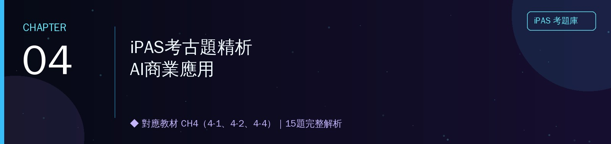

<h1 align="center">📕 第四章 iPAS考古題精析｜AI商業應用</h1>

對應教材：CH4（4-1、4-2、4-4）　｜　題庫來源：114年第四次、115年第一～三次，共4屆　｜　15題完整解析

※ 4-3行銷科技與4-5個案分析（客戶分群），考古題中無獨立對應題目，故本章不收錄。

---

## 📖 本章使用說明

- 與前三章相同的格式：每題列出完整題幹與四個選項，✅標示正解，逐選項解析對錯原因。
- 本章題量不大，但情境橫跨物流、金融科技、電商客服，是CH1~CH3技術概念在商業情境中的綜合應用，適合作為前三章的複習銜接。

---

## 4-1　人工智慧與商業應用（2題）

### 〔114年第四次・第二科・Q30〕
> 某大型物流公司計畫導入AI系統，以改善客服與配送作業的效率。專案團隊規劃了以下四個步驟，請問正確的執行順序為何？
> 1. 建立符合公司服務流程的AI對話邏輯與應答範本　2. 明確定義導入AI的目標並設定關鍵績效指標（KPI）　3. 蒐集與清理過往客服紀錄與配送相關資料　4. 評估並選擇合適的AI技術供應商或開源方案

- (A) ✅ 2 → 3 → 4 → 1
- (B) 3 → 2 → 1 → 4
- (C) 2 → 1 → 3 → 4
- (D) 1 → 4 → 3 → 2

**逐選項解析**
- **(A) 正確**：企業導入AI專案的合理邏輯順序是——先**明確目標與KPI**（2，確立為什麼要做、怎麼衡量成功），再**蒐集清理資料**（3，準備訓練素材），接著**評估選擇技術方案**（4，決定用什麼工具/供應商），最後才**建立實際的對話邏輯與應答範本**（1，落地執行細節）。這個順序符合「先定義目標，再準備資料，再選技術，最後才做細節設計」的專案管理常識——如果一開始沒有明確目標就先蒐集資料或選技術，很容易做白工或選錯方向。
- **(B) 錯誤**：把「蒐集資料」放在「定義目標」之前，等於還不知道要解決什麼問題就先蒐集資料，可能蒐集到不對的資料或方向錯誤。
- **(C) 錯誤**：把「建立對話邏輯」（步驟1，屬於落地執行細節）排在「蒐集資料」與「選擇技術方案」之前，順序邏輯不合理——都還沒選定技術方案、沒有訓練資料，要怎麼建立對話邏輯？
- **(D) 錯誤**：把「建立對話邏輯」放在第一步，「定義目標KPI」放在最後，完全顛倒了「先確立目標、再落地執行」的合理專案順序。

📌 **重點提醒**：AI導入專案步驟排序題的核心邏輯——**先定義目標（為什麼做、怎麼衡量）→ 再準備資料 → 再選技術方案 → 最後才是落地執行細節**，這個順序符合一般專案管理的常識性邏輯，遇到類似排序題可以先用這個大原則篩選。

### 〔115年第二次・第二科・Q43〕
> 某製造業導入AI視覺檢測系統，導入前不良品流出率為3%，導入後降至0.4%。系統導入成本為800萬元，預估每年可節省350萬元品質相關成本。請問在評估其投資報酬率（ROI）時，下列何者最符合正確的評估思維？

- (A) 以每年節省350萬估算約2.3年回收期，即可作為完整ROI評估依據
- (B) ✅ 除每年350萬節省外，應同時納入無形效益與隱性成本，進行整體評估
- (C) 因AI導入成效具不確定性，應待產業案例成熟後再進行投資報酬評估
- (D) 不良品流出率由3%降至0.4%，已足以代表投資具高報酬

**逐選項解析**
（呼應課程第16週學過的TCO總體擁有成本概念，這裡延伸到ROI評估的完整性）
- **(B) 正確**：完整的ROI評估不能只看**表面的直接成本節省數字**（350萬），還應該納入**無形效益**（如品牌信譽提升、客訴減少帶來的口碑效益）與**隱性成本**（如維運人力、系統升級、員工教育訓練等），才能得到更全面真實的投資報酬評估，這與第16週學過的TCO精神一致——不能只看題目明列的數字，要考慮容易被忽略的隱藏項目。
- **(A) 錯誤**：只用簡單的回收期計算（成本÷每年節省），忽略了無形效益與隱性成本，不能算是「完整」的ROI評估依據，這正是題目要指出的不完整思維。
- **(C) 錯誤**：題目已經提供了具體的導入前後數據（不良品流出率、成本節省金額），並非「無法評估」，這個選項過度保守且沒有善用已有的評估數據。
- **(D) 錯誤**：不良品流出率大幅下降是**品質面**的改善成效，但「高報酬」是**財務面**的判斷，需要綜合考量投入成本、節省效益與其他隱性因素才能下結論，單看品質改善幅度不能直接等同於「高投資報酬」。

---

## 4-2　金融科技（2題）

### 〔115年第三次・第一科・Q36〕
> 某銀行的信用評分模型須向主管機關說明各項資料對評分結果的影響力。分析師採用排列特徵重要性（Permutation Feature Importance）方法，逐一打亂單一特徵的數值後重新測試模型表現。下列敘述何者最符合此方法判斷特徵重要性的原則？

- (A) 必須先計算該特徵與信用評分結果的線性相關係數，數值越高代表越重要
- (B) 打亂後模型的預測誤差完全不變，代表該特徵對模型越重要
- (C) ✅ 打亂某特徵的數值後，若模型預測誤差增加越多，代表該特徵對模型越重要
- (D) 特徵打亂順序後，必須將模型搭配新資料重新訓練，才能判斷其重要性

**逐選項解析**
（呼應第一章1-4-C學過的XAI方法，這裡延伸另一種特徵重要性評估技巧）
- **(C) 正確**：排列特徵重要性的核心邏輯是——如果打亂某個特徵的數值後，模型預測**誤差大幅上升**，代表模型原本**高度依賴**這個特徵做判斷（拿掉它的正確資訊後模型就亂了），誤差上升越多，代表該特徵越重要；反之若打亂後誤差幾乎不變，代表模型不太依賴這個特徵。
- **(A) 錯誤**：這描述的是**線性相關係數**分析方法，不是排列特徵重要性的運作原理——排列特徵重要性是透過「打亂測試」直接觀察對模型**預測表現**的影響，不需要先計算線性相關係數。
- **(B) 錯誤**：這句話講反了——打亂後誤差**不變**，代表該特徵對模型**不重要**（模型不靠這個特徵也能一樣準），不是「越重要」。
- **(D) 錯誤**：排列特徵重要性的操作精神是**不需要重新訓練模型**——只是把測試資料中某欄位的數值打亂順序，直接餵給**既有**（已訓練好）的模型測試，比較預測誤差的變化，如果每次都要重新訓練模型，會大幅增加計算成本且失去這個方法「快速便利」的優勢。

### 〔115年第二次・第一科・Q4〕
> 某金融科技公司的交易系統，在毫秒等級的時間內持續掃描跨市場價格差異、分析大量即時報價，並自動執行交易指令。系統架構師需確認該系統於即時交易決策中最核心依賴的AI能力。下列何者最能正確說明其核心AI能力？

- (A) 透過自然語言處理技術分析財經新聞語意，作為輔助性市場情緒指標
- (B) ✅ 快速分析龐大市場數據並在極短時間內識別交易機會，驅動自動化交易決策
- (C) 運用生成對抗網路模擬極端市場情境，預先產出各類黑天鵝事件的應對策略
- (D) 透過推薦系統技術，根據投資人歷史交易行為推薦最適合的投資組合標的

**逐選項解析**
- **(B) 正確**：題目關鍵字是「**毫秒等級**」「**持續掃描**跨市場價格差異」「**自動執行**交易指令」——這正是高頻交易系統的核心能力：極短時間內處理龐大數據、識別交易機會並自動決策執行，完全對應題目描述的系統運作方式。
- **(A) 錯誤**：題目描述的系統依賴的是**價格與報價數據**的即時分析，NLP分析財經新聞是「輔助性」指標（選項本身也承認是輔助性），不是題目情境中「最核心依賴」的能力。
- **(C) 錯誤**：GAN模擬極端市場情境是一種**風險情境規劃**工具，與題目描述「毫秒級即時交易決策」的核心運作機制（快速數據分析與自動執行）不是同一回事。
- **(D) 錯誤**：推薦系統是用於**投資組合建議**這種相對長期、非即時的決策支援，與題目描述的「毫秒級」「自動執行交易指令」的高頻交易情境不符。

## 4-4　電子商務（11題）

本節拆成4個子題群：**A. AI Agent與提示工程技術（4題）｜B. 電腦視覺與演算法基礎（2題）｜C. 智慧物流與統計分析（2題）｜D. No-Code限制與模型治理（3題）**。

### 4-4-A　AI Agent與提示工程技術（4題）

### 〔114年第四次・第二科・Q14〕
> 某電商公司導入Agentic AI來處理客服工作。測試發現Agent在回答產品FAQ時經常出錯，且無法幫客戶修改訂單。這種情況最可能是因為缺少下列哪兩項工具或技術？

- (A) API調用（API Calling）＋任務規劃器（Task Planner）
- (B) ✅ 向量資料庫檢索（Vector Retrieval）＋API調用（API Calling）
- (C) 向量資料庫檢索（Vector Retrieval）＋任務規劃器（Task Planner）
- (D) 任務規劃器（Task Planner）＋溫度參數（Temperature）設定

**逐選項解析**
（呼應課程第16週學過的RAG與MCP概念）
- **(B) 正確**：這題其實是把兩個獨立問題**分開對應**——「回答產品FAQ時經常出錯」代表模型缺乏**準確的知識依據**，需要**向量資料庫檢索**（RAG的核心元件，能檢索正確的產品資訊來源）；「無法幫客戶修改訂單」代表Agent沒有**實際執行操作**的能力，需要**API調用**（讓Agent能真正呼叫後端系統執行修改訂單的動作），兩者分別對應「知識不足」與「無法執行動作」這兩個不同的缺陷。
- **(A) 錯誤**：任務規劃器是用來拆解**複雜多步驟**任務的元件，但題目描述的問題是「回答FAQ出錯」（知識問題）與「無法修改訂單」（執行操作問題），比較不是「不會規劃步驟」的問題，用API調用沒錯，但搭配任務規劃器不如向量資料庫檢索更直接對應「FAQ出錯」這個知識缺乏的症狀。
- **(C) 錯誤**：向量資料庫檢索能解決FAQ出錯的問題，但「無法修改訂單」需要的是**執行操作的能力**（API調用），任務規劃器本身不能讓Agent真正「動手」修改訂單資料。
- **(D) 錯誤**：溫度參數是控制生成隨機性的參數，與「無法修改訂單」這種**缺乏執行能力**的問題完全無關。

### 〔114年第四次・第二科・Q26〕
> 某電商平台希望生成的商品描述在風格與用詞上保持一致性，但不需要新增專業知識。下列哪種方法最適合？

- (A) 擴充語料庫並微調模型，使風格統一
- (B) 增加提示詞複雜度，引導模型風格一致
- (C) ✅ 降低生成溫度，以減少隨機性並提升風格一致性
- (D) 使用全連接神經網路對生成結果後期篩選

**逐選項解析**
（呼應課程第15週學過的生成參數概念）
- **(C) 正確**：題目關鍵字是「**不需要新增專業知識**」——只是要讓輸出風格更一致，最直接、成本最低的做法是**降低生成溫度（Temperature）**，溫度越低，模型輸出越趨向於「最可能」的選擇，隨機性降低，風格自然更一致穩定，不需要動用到微調或擴充知識庫這類重量級手段。
- **(A) 錯誤**：微調模型是相對**重量級**的做法，題目已經明說「不需要新增專業知識」，用微調來解決單純的「風格一致性」問題是殺雞用牛刀，成本效益不佳。
- **(B) 錯誤**：增加提示詞複雜度或許有幫助，但不如直接調整溫度參數這個更直接、更輕量的技術手段來得精準有效。
- **(D) 錯誤**：用另一個神經網路做後期篩選，是額外增加系統複雜度的做法，不如直接從生成參數（溫度）源頭控制來得簡單有效。

### 〔114年第四次・第二科・Q39〕
> 在提示工程的應用中，Chain-of-Thought（CoT）與Tree of Thoughts（ToT）各適用於不同的推理情境。
> **情境一**：電商客服助理協助客戶查詢退款流程與相關規範
> **情境二**：活動策劃團隊使用AI規劃多場跨部門行銷活動，需同時考量預算、場地、時程與人力資源，並比較不同方案的可行性

- (A) ✅ 情境一採用CoT，情境二採用ToT
- (B) 情境一採用ToT，情境二採用CoT
- (C) 情境一與情境二都適合CoT
- (D) 情境一與情境二都適合ToT

**逐選項解析**
- **(A) 正確**：**情境一**（查詢退款流程）是**單一、線性**的推理任務——只需要依照既定規範「一步一步」推導出答案，適合用**思維鏈（CoT）**這種線性逐步推理策略；**情境二**（規劃多場活動、需比較不同方案可行性）則需要**同時探索多個可能的方案分支**，並比較各分支的優劣（預算、場地、時程等多重考量交織），這種「需要分支探索、比較多條路徑」的複雜情境，更適合用**思維樹（ToT）**——允許模型同時展開多個推理分支並互相比較評估，而不是單一線性路徑。
- **(B)、(C)、(D) 錯誤**：都沒有正確區分「單一線性推理」（適合CoT）與「需要多方案分支探索比較」（適合ToT）這兩種情境的本質差異。

📌 **重點提醒（CoT vs. ToT辨析口訣）**：**CoT＝一條路走到底的線性推理（適合有明確步驟、單一正確路徑的任務）；ToT＝同時展開多條路徑、比較優劣後選擇最佳方案（適合需要規劃、比較、有多種可行方案的複雜任務）**。

### 〔115年第一次・第二科・Q37〕
> 某電商平台導入生成式AI客服助理。營運需求包含：需即時反映每日更新的促銷活動與商品資訊，同時維持品牌一致的回覆語氣，且企業希望避免因模型重新訓練所造成的成本增加與系統不穩定。下列哪一種技術策略最合理？

- (A) 僅進行Fine-tuning，使模型同時學習品牌語氣與即時促銷內容
- (B) 僅導入RAG更新促銷資訊，期望模型直接從檢索內容學習品牌語氣
- (C) ✅ 透過Prompt Engineering控制回覆風格，並以RAG引入最新商品與活動資訊
- (D) 持續進行增量Fine-tuning，以確保活動資訊同步更新

**逐選項解析**
這題把提示工程、RAG、微調三種不同技術的適用場景做了一次完整整合考題。
- **(C) 正確**：題目有兩個不同性質的需求——「品牌一致語氣」是**相對穩定、不常變動**的風格要求，適合用**提示工程**（在系統提示中設定語氣風格）直接控制；「每日更新的促銷資訊」則是**頻繁變動**的即時內容，適合用**RAG**動態檢索最新資訊，兩者搭配使用，且完全**不需要重新訓練模型**，直接對應題目「避免模型重新訓練造成的成本增加與系統不穩定」的訴求。
- **(A) 錯誤**：用Fine-tuning學習「即時促銷內容」完全不合理——促銷活動每天更新，難道要每天重新微調模型一次？這樣做成本極高且不切實際，也違反題目要避免重新訓練的要求。
- **(B) 錯誤**：「期望模型直接從檢索內容學習品牌語氣」邏輯不通——RAG檢索到的是**促銷資訊內容**，不是「語氣風格」，語氣風格需要靠提示工程另外設定，不能指望RAG檢索的商品資訊本身就能教會模型維持特定的回覆語氣。
- **(D) 錯誤**：「持續進行增量微調」同樣違反題目「避免模型重新訓練所造成的成本增加與系統不穩定」的明確要求。

---

### 4-4-B　電腦視覺與演算法基礎（2題）

### 〔115年第一次・第一科・Q38〕
> 某果園管理公司計畫導入AI系統協助農民判斷蘋果成熟度，透過分析果實特徵資訊，評估成熟狀態並自動判斷採收時機。根據AI應用領域的分類，這個系統主要屬於哪一個應用領域？

- (A) 自然語言處理
- (B) ✅ 電腦視覺
- (C) 語音識別
- (D) 推薦系統

**逐選項解析**
- **(B) 正確**：「分析果實**特徵資訊**」判斷成熟度，這類任務通常是透過分析蘋果的**外觀影像特徵**（顏色、表面紋理等）來判斷，屬於電腦視覺的應用領域。
- **(A)、(C)、(D) 錯誤**：分別是文字語言處理、語音辨識、商品推薦，都與「分析果實外觀影像特徵判斷成熟度」的任務性質無關。

### 〔115年第一次・第一科・Q18〕
> 某電商平台工程師需在已排序的價格清單中，快速定位指定價格是否存在，給定排序後陣列：[3, 8, 14, 19, 21, 27, 33, 45, 52]。若搜尋目標值為27，且採用標準二分搜尋流程，請問最多需要比較幾次即可找到目標？

- (A) 2次
- (B) ✅ 3次
- (C) 4次
- (D) 5次

**逐選項解析**
這題是純粹的演算法計算題，跟AI概念本身無關，但常出現在iPAS考卷中測試基礎程式邏輯能力。
- **(B) 正確**：二分搜尋的操作是每次取中間值比較，逐步縮小搜尋範圍。陣列共9個元素（索引0~8）：
  1. 第1次比較：中間值為索引4，數值21。27>21，所以往右半邊找（索引5~8：27, 33, 45, 52）
  2. 第2次比較：剩餘4個元素，中間值取索引6，數值33（或依取值規則可能是索引5或6，此處以常見的下取整方式：left=5,right=8,mid=(5+8)//2=6，數值33）。27<33，所以往左半邊找（索引5~5：27）
  3. 第3次比較：剩下索引5，數值27，27=27，找到目標！
  
  總共比較3次即可找到目標值27。
- **(A)、(C)、(D) 錯誤**：分別為過少或過多的比較次數，與實際二分搜尋步驟的計算結果不符。

📌 **重點提醒**：二分搜尋的比較次數，理論上最多約為 log₂(陣列長度)，9個元素的陣列，log₂9 ≈ 3.17，因此最多約需4次比較就能確定目標是否存在，本題實際命中只需3次。

---

### 4-4-C　智慧物流與統計分析（2題）

### 〔115年第三次・第一科・Q3〕
> 某物流公司希望導入AI技術，目標是能依據即時交通路況、配送車輛位置及訂單需求，自動計算並決定最佳配送路線與車隊調度策略。下列何者最符合此智慧物流應用所採用的AI技術概念？

- (A) 利用OCR技術，自動辨識並擷取紙本單據上的收件地址以完成系統建檔
- (B) 利用文字探勘技術，分析GPS經緯度數字與車速資料，據此規劃最佳配送路線
- (C) 運用生成式AI技術，分析配送相關文件與服務紀錄，自動生成營運分析報告與改善建議
- (D) ✅ 利用機器學習與路徑優化演算法分析各項即時動態資料，由系統即時且持續優化行車路線與配送調度

**逐選項解析**
- **(D) 正確**：題目要求「**即時**交通路況」「**即時**計算最佳配送路線與調度策略」，機器學習結合路徑優化演算法，能持續分析動態資料並即時優化路線，完全對應題目的核心技術需求。
- **(A) 錯誤**：OCR是用於**紙本文件辨識**（如收件地址擷取），屬於前端資料輸入的技術，與「即時路線規劃與調度」的核心運算需求無關。
- **(B) 錯誤**：文字探勘是分析**文字內容**的技術，但GPS經緯度與車速是**數值型**資料，不是文字資料，用「文字探勘」處理數值資料在技術描述上就不恰當。
- **(C) 錯誤**：生成式AI生成的是**分析報告與建議**，屬於事後的說明性文件，不是「即時計算決定最佳路線」這種即時決策運算的核心技術。

### 〔115年第三次・第一科・Q12〕
> 某電商平台的客服部門統計了本月10,000筆顧客服務評分（滿分100分），發現平均分數為72分，中位數為85分，平均數顯著小於中位數。資料分析師欲初步判斷此評分資料的分配型態，下列敘述何者最合理？

- (A) ✅ 資料呈負偏態分配（左偏），代表多數顧客給予高分，但少數極低評分將平均數大幅拉低
- (B) 資料呈正偏態分配（右偏），代表多數顧客給予低分，但少數極高評分將平均數大幅拉高
- (C) 資料呈標準常態分配，平均數與中位數的些微差異屬於正常的隨機抽樣誤差
- (D) 資料呈均勻分配，各分數區間出現的機率大致相同，因此平均數略低於中位數

**逐選項解析**
（呼應課程第5週學過的偏態分布與平均數/中位數關係）
- **(A) 正確**：當**平均數顯著小於中位數**時，代表資料被少數**極低**的評分拉低了平均值（因為平均數容易被極端值影響，而中位數不受極端值影響），這種「多數集中在高分、少數極端低分拉低平均」的型態，正是**負偏態（左偏）**分配的特徵——偏態的方向是看「拖尾」的方向，左偏代表左側（低分）有一條長尾拖著少數極端值。
- **(B) 錯誤**：正偏態（右偏）的特徵應該是**平均數大於中位數**（少數極高值拉高平均），與題目描述「平均數**小於**中位數」的方向相反。
- **(C) 錯誤**：標準常態分配下，平均數與中位數應該**幾乎相等**（分布對稱），題目中兩者相差13分（72 vs 85）是相當顯著的差距，不能視為隨機誤差，這代表資料明顯不是常態分配。
- **(D) 錯誤**：均勻分配下，平均數與中位數應該也相當接近（大致落在分布中央），不會出現題目描述的顯著落差，這個選項的統計邏輯不成立。

📌 **重點提醒（偏態方向判斷口訣）**：**平均數 > 中位數 → 正偏態（右偏，被少數高值拉高）；平均數 < 中位數 → 負偏態（左偏，被少數低值拉低）**。偏態的英文命名方向以「拖尾」的方向為準，這是統計學中經常混淆的概念，建議直接記住「平均數與中位數的相對大小關係」來快速判斷。

---

### 4-4-D　No-Code限制與模型治理（3題）

### 〔115年第一次・第二科・Q1〕
> 某零售企業導入生成式AI商品推薦系統。測試結果顯示，在購物行為、偏好設定與價格區間相同的情況下，不同客戶族群收到的推薦商品類型仍出現明顯差異，且差異方向不易以既有行銷策略解釋。若在模型架構與推論設定皆未調整情形下，專案目標是優先降低可能的模型偏差風險，下列何者最合理？

- (A) ✅ 重新檢視訓練資料的樣本分布與代表性
- (B) 限制推薦結果僅顯示高銷量商品
- (C) 降低模型參數規模以簡化決策邏輯
- (D) 提高推薦結果的隨機性以增加多樣性

**逐選項解析**
（呼應第一章1-4-D學過的演算法偏見概念）
- **(A) 正確**：「相同條件下不同客戶族群出現明顯差異、且無法用既有行銷邏輯解釋」，這正是**演算法偏見**的典型症狀，而偏見的根源通常來自**訓練資料本身的樣本分布**問題（例如某些客戶族群在訓練資料中的代表性不足或存在偏差），因此優先應該**重新檢視訓練資料**，這是從源頭處理偏差問題的正確做法（呼應第一章學過的「從資料源頭優先於事後補救」的治理邏輯）。
- **(B) 錯誤**：限制只顯示高銷量商品，不僅無法解決偏差的根本問題，反而可能讓推薦更加同質化，犧牲了個人化推薦的價值，答非所問。
- **(C) 錯誤**：題目已明說「模型架構與推論設定皆未調整」，且降低參數規模是**改變模型架構**的做法，不僅違反題目前提，也不必然能解決資料層面造成的偏差問題。
- **(D) 錯誤**：提高隨機性只會讓推薦結果**更不可預測**，不能真正解決「差異方向不易解釋」的偏差根源問題，是治標不治本的做法。

### 〔115年第三次・第二科・Q4〕
> 一家新創電商使用No-Code平台快速建置後台訂單與會員管理系統。隨著業務成長，企業計劃引入AI推薦模型，卻發現該No-Code平台不支援串接外部自訂AI模型，亦無法擴充既有資料模型與介面元件以整合推薦功能。此情境最能反映No-Code在企業成長階段可能面臨的哪一項挑戰？

- (A) 隨著使用人數增加，平台可能因系統效能不足而無法支援大量交易與訂單處理
- (B) 平台因採用雲端架構，無法符合企業對資料備份與資訊安全管理的需求
- (C) 企業需持續投入大量專業程式開發人力，才能維持日常營運與功能更新
- (D) ✅ 企業將受限於平台供應商提供的功能範圍，難以依需求進行高度客製化開發與新技術整合

**逐選項解析**
（呼應課程第16週學過的Low-Code/No-Code治理風險）
- **(D) 正確**：題目描述的核心問題是「**不支援串接外部自訂AI模型**」「**無法擴充**既有資料模型與介面元件」——這正是No-Code平台的典型限制：企業被**侷限在平台供應商預先設計好的功能框架內**，當業務需求超出平台原生支援的範圍（如整合客製化AI模型）時，就難以進行高度客製化的開發與新技術整合，這也是第16週學過的「資料鎖定（Vendor Lock-in）」概念的延伸。
- **(A) 錯誤**：題目沒有提到系統效能或交易處理量的問題，描述的是**功能擴充性**的限制，不是效能問題。
- **(B) 錯誤**：題目沒有提到資料備份或資安管理的問題，這是無關的干擾選項。
- **(C) 錯誤**：這句話恰好講反了No-Code平台的定位——No-Code平台的設計初衷正是**減少**對專業程式開發人力的依賴，題目描述的問題反而是「想要客製化卻無法做到」，不是「需要投入大量開發人力」的問題。

### 〔115年第三次・第二科・Q38〕
> 某電商企業導入AI客服機器人處理客服詢問。上線後發現，當客戶語氣帶有明顯不滿、焦慮或抱怨時，AI客服機器人仍持續以一般問答流程回覆，未依客戶情緒適時調整應對方式或轉由真人客服介入，導致客戶滿意度下降。下列何者最適合作為改善方案？

- (A) 持續增加AI客服機器人的模型參數規模及客服對話訓練資料，希望提升模型辨識情緒語句的能力，而不另外設計情緒偵測或轉接流程
- (B) 將涉及退款、申訴及抱怨等高風險客服情境全面改由真人客服處理，不再由AI客服機器人回覆
- (C) ✅ 在客服對話流程中導入情緒分析（Sentiment Analysis）模組，即時偵測客戶負面情緒，當情緒分數超過預設門檻時，自動轉接真人客服
- (D) 建立客服關鍵字規則，只要偵測到「退款」、「不滿」或「投訴」等字詞，即直接提供真人客服聯絡方式，由客戶自行決定是否改由人工服務

**逐選項解析**
- **(C) 正確**：這是最系統化、也最精準的解法——導入**情緒分析模組**，即時、量化地偵測客戶情緒強度，當情緒分數超過門檻時**自動**轉接真人客服，這樣既能保留AI客服處理一般詢問的效率，又能在客戶情緒真正激動時及時介入，是兼顧效率與客戶體驗的完整解決方案。
- **(A) 錯誤**：單純擴大模型規模與訓練資料，卻「不另外設計情緒偵測或轉接流程」，即使模型理論上「能辨識」情緒，若沒有搭配實際的轉接機制，客戶依然得不到適時的人工介入，沒有真正解決問題。
- **(B) 錯誤**：把所有「涉及退款、申訴、抱怨」的情境**全面**改由真人處理，過於一刀切——並非所有退款/抱怨情境的客戶都情緒激動，這樣做會大幅增加真人客服的負擔，犧牲了AI客服原本的效率優勢，不是精準的解法。
- **(D) 錯誤**：用簡單的**關鍵字規則**判斷，容易有遺漏或誤判（例如客戶沒有明講「不滿」兩字，但語氣已經很不耐煩），不如情緒分析模組能更全面、更精準地量化評估情緒強度，且「由客戶自行決定」也不是主動、即時的介入機制。

---

## 📊 本章統計總覽

| 小節 | 子題群 | 題數 |
|---|---|---|
| 4-1 人工智慧與商業應用 | | **2題** |
| 4-2 金融科技 | | **2題** |
| 4-4 電子商務 | A.AI Agent與提示工程技術 | 4題 |
| | B.電腦視覺與演算法基礎 | 2題 |
| | C.智慧物流與統計分析 | 2題 |
| | D.No-Code限制與模型治理 | 3題 |
| | **4-4 小計** | **11題** |
| **全章合計** | | **15題** |

◆ END OF CHAPTER 04 ◆　｜　下一章：CH5 自然語言處理（第14週對應）

